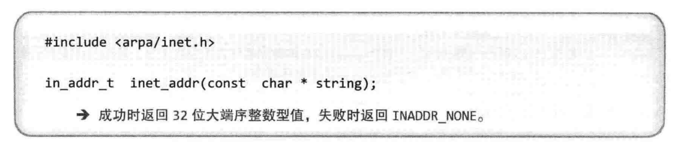
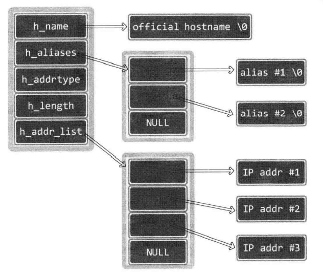
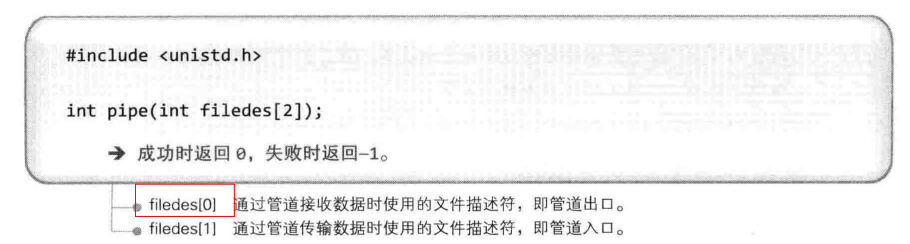
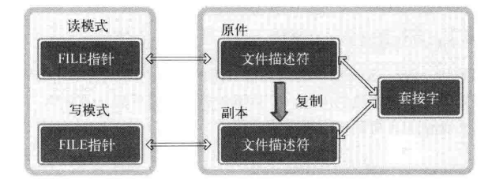
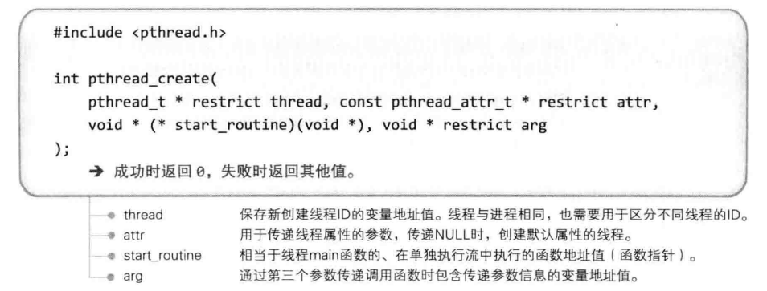
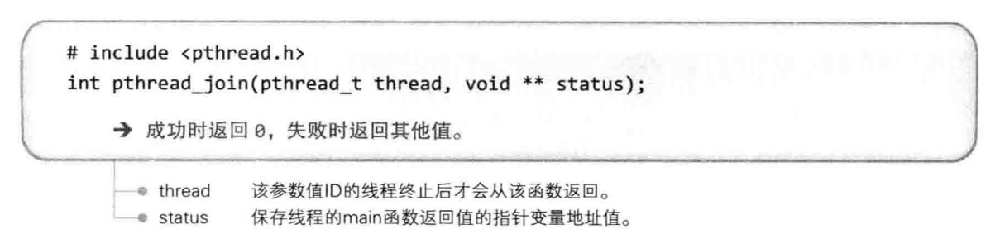
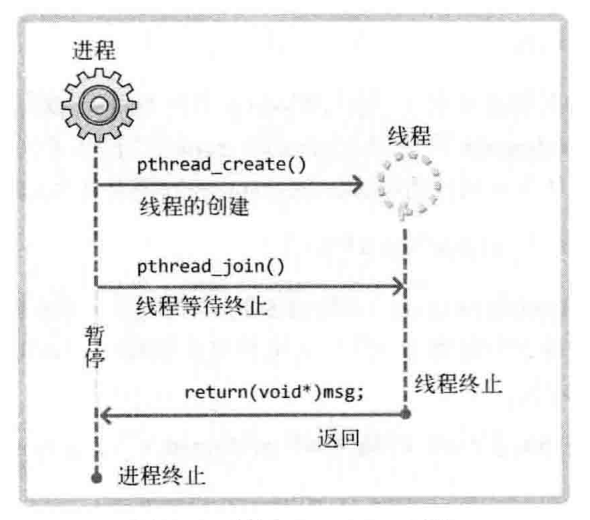

# `TCP/IP` 网络编程

## 第一章: 理解网络编程和套接字

### 理解网络编程和套接字

网络编程就是编写程序使两台连网的计算机相互交换数据。网络编程又称为套接字编程。

套接字大致分为两种，其中，`TCP` 套接字可以比喻成电话机。电话机也是通过固定电话网完成语音数据交换的。因此，我们熟悉的固定电话与套接字实际并无太大区别。

#### 构建接电话套接字

下面利用电话机讲解套接字的创建及使用方法。电话机可以同时用来拨打或接听，但对套接字而言，拨打和接听是有区别的。我们先讨论用于接听的套接字创建过程。

调用 `socket` 函数（安装电话机）时进行的对话:
- 问: 接电话需要准备什么？
- 答: 当然是电话机！

有了电话机才能安装电话，接下来，我们就准备一部的电话机。下列函数创建的就是相当于电话机的套接字。

```c
#include <sys/socket.h>
int socket(int domain, int type, int protocol);
// 成功时返回文件描述符，失败时返回 -1。
```

我们只需购买机器，剩下的安装和分配电话号码等工作都由电信局的工作人员完成。

准备好电话机后要考虑分配电话号码的问题，这样别人才能联系到自己。

调用 `bind` 函数（分配电话号码）时进行的对话:
- 问: 请问您的电话号码是多少？
- 答: 我的电话号码是 `123-1234`。

套接字同样如此。就像给电话机分配电话号码一样（虽然不是真的把电话号码给了电话机），利用以下函数给创建好的套接字分配地址信息（`IP` 地址和端口号）。

```c
#include <sys/socket.h>
int bind(int sockfd, struct sockaddr* myaddr, socklen_t addrlen);
// 成功时返回 0，失败时返回 -1。
```

调用 `bind` 函数给套接字分配地址后，就基本完成了接电话的所有准备工作。接下来需要连接电话线并等待来电。

调用 `listen` 函数（连接电话线）时进行的对话
- 问: 已架设完电话机后是否只需连接电话线？
- 答: 对，只需连接就能接听电话。

一连接电话线，电话机就转为可接听状态，这时其他人可以拨打电话请求连接到该机。同样，需要把套接字转化成可接收连接的状态。

```c
#include <sys/socket.h>
int listen(int sockfd, int backlog);
//成功时返回 0，失败时返回 -1。
```

连接好电话线后，如果有人拨打电话就会响铃，拿起话筒才能接听电话。

调用 `accept` 函数（拿起话筒）时进行的对话
- 问: 电话铃响了，我该怎么办？
- 答: 难道您真不知道？接听啊！

拿起话筒意味着接收了对方的连接请求。套接字同样如此，如果有人为了完成数据传输而请求连接，就需要调用以下函数进行受理。

```c
#include <sys/socket.h>
int accept(int sockfd, struct sockaddr* addr, socklen_t* addrlen);
// 成功时返回文件描述符，失败时返回 -1。
```

网络编程中接受连接请求的套接字创建过程可整理如下:
- 第一步: 调用 `socket` 函数创建套接字。
- 第二步: 调用 `bind` 函数分配 `IP` 地址和端口号。
- 第三步: 调用 `listen` 函数转为可接收请求状态。
- 第四步: 调用 `accept` 函数受理连接请求。

[hello_server](../src/chapter1/hello_server.cpp)

#### 构建打电话套接字

客户端套接字是用于请求连接的套接字。

打电话（请求连接）的函数，其调用的是客户端套接字，如下所示。

```c
#include <sys/socket.h>
int connect(int sockfd, struct sockaddr* serv_addr, socklen_t addrlen);
// 成功时返回 0，失败时返回 -1。
```

客户端程序只有调用 `socket` 函数创建套接字和调用 `connect` 函数向服务器端发送连接请求这两个步骤，因此比服务器端简单。

[hello_client](../src/chapter1/hello_client.cpp)

### 基于 `Linux` 的文件操作

对 `Linux` 而言，`socket` 也被认为是文件的一种，`socket` 操作与文件操作没有区别，因此在网络数据传输过程中自然可以使用文件 `I/O` 的相关函数。

分配给标准输入输出及标准错误的文件描述符:

|文件描述符|对象|
|-|-|
|`0`|标准输入: `Standard Input`|
|`1`|标准输出: `Standard Output`|
|`2`|标准错误: `Standard Error`|

文件和套接字一般经过创建过程才会被分配文件描述符。而表中的 `3` 种输入输出对象即使未经过特殊的创建过程，程序开始运行后也会被自动分配文件描述符。

#### 打开文件

首先介绍打开文件以读写数据的函数。调用此函数时需传递两个参数: 第一个参数是打开的目标文件名及路径信息，第二个参数是文件打开模式。


下表是此函数第二个参数 `flag` 可能的常量值及含义。如需传递多个参数，则应通过位或运算符组合并传递。

|打开模式|含义|
|-|-|
|`O_CREAT`|必要时创建文件|
|`O_TRUNC`|删除全部现有数据|
|`O_APPEND`|维持现有数据，保存到其后面|
|`O_RDONLY`|只读打开|
|`O_WRONLY`|只写打开|
|`O_RDWR`|读写打开|

#### 关闭文件

使用文件后必须关闭。


此函数不仅可以关闭文件，还可以关闭套接字。

#### 将数据写入文件

`write` 函数用于向文件输出（传输）数据。


此函数定义中，`size_t` 是通过 `typedef` 声明的 `unsigned int` 类型。对 `ssize_t` `来说，size_t` 前面多加的 `s` 代表 `signed`，即 `ssize_t` 是通过 `typedef` 声明的 `signed int` 类型。

[low_open](../src/chapter1/low_open.cpp)

#### 读取数据中的文件

与之前的 `write` 函数相对应，`read` 函数用来输入（接收）数据。


[low_read](../src/chapter1/low_read.cpp)

## 第二章: 套接字类型与与协议设置

### 套接字协议以及其数据传输特性

#### 关于协议

如果相隔很远的两人想展开对话，必须先决定对话方式。如果一方使用电话，那么另一方也只能使用电话，而不是书信。可以说，电话就是两人对话的协议。

协议是对话中使用的通信规则，把上述概念拓展到计算机领域可整理为计算机间对话必备通信规则。

简言之，协议就是为了完成数据交换而定好的约定。

#### 创建套接字


#### 协议簇

奶油意大利面和番茄酱意大利面均属于意大利面的一种，与之类似，套接字通信中的协议也具有一些分类。通过 `socket` 函数的第一个参数传递套接字中使用的协议分类信息。此协议分类信息称为协议族，声明在头文件 `<sys/socket.h>` 中，可分成如下几类:

|名称|协议族|
|-|-|
|PF_INET|IPv4 互联网协议族|
|PF_INET6|IPv6 互联网协议族|
|PF_LOCAL|本地通信的 UNIX 协议族|
|PF_PACKET|底层套接字的协议族|
|PF_IPX|IPX Novell 协议族|

我们主要学习 `PF_INET` 对应的 `IPv4` 互联网协议族，其他协议族并不常用或尚未普及。

另外，套接字中实际采用的最终协议信息是通过 `socket` 函数的第三个参数传递的。在指定的协议族范围内通过第一个参数决定第三个参数。

#### 套接字类型

套接字类型指的是套接字的数据传输方式，通过 `socket` 函数的第二个参数传递，只有这样才能决定创建的套接字的数据传输方式。

决定了协议族并不能同时决定数据传输方式，换言之，`socket` 函数第一个参数 `PF_INET` 协议族中也存在多种数据传输方式。

下面介绍 `2` 种具有代表性的数据传输方式。

#### 面向连接的套接字（`SOCK_STREAM`）

如果向 `socket` 函数的第二个参数传递SOCK_STREAM，将创建面向连接的套接字。


图中 `2` 位工人通过 `1` 条传送带传递物品，这与面向连接的数据传输方式类似。

数据（糖果）传输方式特征整理如下:
- 传输过程中数据不会消失。
- 按序传输数据。
- 传输的数据不存在数据边界。

图中通过独立的传送带传输数据（糖果），只要传送带本身没有问题，就能保证数据不丢失。

同时，较晚传递的数据不会先到达，因为传送带保证了数据的按序传递。最后，下面这句话说明的确不存在数据边界:

**`100` 个糖果是分批传递的，但接收者凑齐 `100` 个后才装袋。**

这种情形可以适用到之前说过的 `write` 和 `read` 函数。

传输数据的计算机通过 `3` 次调用 `write` 函数传递了 `100` 字节的数据，但接收数据的计算机仅通过 `1` 次 `read` 函数调用就接收了全部 `100` 个字节。

收发数据的套接字内部有缓冲（`buffer`） ，简言之就是字节数组。通过套接字传输的数据将保存到该数组。因此，收到数据并不意味着马上调用 `read` 函数。只要不超过数组容量，则有可能在数据填充满缓冲后通过 `1` 次 `read` 函数调用读取全部，也有可能分成多次 `read` 函数调用进行读取。也就是说，在面向连接的套接字中，`read` 函数和 `write` 函数的调用次数并无太大意义。所以说面向连接的套接字不存在数据边界。

如果缓冲被接收的数据填满会发生什么事情？之后传递的数据是否会丢失？

首先调用 `read` 函数从缓冲读取部分数据，因此，缓冲并不总是满的。但如果 `read` 函数读取速度比接收数据的速度慢，则缓冲有可能被填满。此时套接字无法再接收数据，但即使这样也不会发生数据丢失，因为传输端套接字将停止传输。也就是说，面向连接的套接字会根据接收端的状态传输数据，如果传输出错还会提供重传服务。因此，面向连接的套接字除特殊情况外不会发生数据丢失。

还有一点需要说明。上图中传输和接收端各有 `1` 名工人，这说明面向连接的套接字还有如下特点:

**套接字连接必须一一对应。**

面向连接的套接字只能与另外一个同样特性的套接字连接。用一句话概括面向连接的套接字如下:

**可靠的、按序传递的、基于字节的面向连接的数据传输方式的套接字。**

#### 面向消息的套接字（`SOCK_DGRAM`）

如果向 `socket` 函数的第二个参数传递 `SOCK_DGRAM` ，则将创建面向消息的套接字。


面向消息的套接字可以比喻成高速移动的摩托车快递。图中摩托车快递的包裹（数据）传输方式如下:
- 强调快速传输而非传输顺序。
- 传输的数据可能丢失也可能损毁。
- 传输的数据有数据边界。
- 限制每次传输的数据大小。

众所周知，快递行业的速度就是生命。用摩托车发往同一目的地的 `2` 件包裹无需保证顺序，只要以最快速度交给客户即可。这种方式存在损坏或丢失的风险，而且包裹大小有一定限制。因此，若要传递大量包裹，则需分批发送。另外，如果用 `2` 辆摩托车分别发送 `2` 件包裹，则接收者也需要分 `2` 次接收。这种特性就是传输的数据具有数据边界。

以上就是面向消息的套接字具有的特性。即，面向消息的套接字比面向连接的套接字具有更快的传输速度，但无法避免数据丢失或损毁。另外，每次传输的数据大小具有一定限制，并存在数据边界。存在数据边界意味着接收数据的次数应和传输次数相同。面向消息的套接字特性总结如下:

**不可靠的、不按序传递的、以数据的高速传输为目的的套接字。**

另外，面向消息的套接字不存在连接的概念。

#### 协议的最终选择

前面已经通过 `socket` 函数的前两个参数传递了协议族信息和套接字数据传输方式，这些信息还不足以决定采用的协议吗？为什么还需要传递第 `3` 个参数呢？

传递前两个参数即可创建所需套接字。所以大部分情况下可以向第三个参数传递 `0`，除非遇到以下这种情况:

同一协议族中存在多个数据传输方式相同的协议。

数据传输方式相同，但协议不同。此时需要通过第三个参数具体指定协议信息。

`IPv4` 协议族中面向连接的套接字:

参数 `PF_INET` 指 `IPv4` `网络协议族，SOCK_STREAM` 是面向连接的数据传输。满足这 `2` 个条件的协议只有 `IPPROTO_TCP`，因此可以如下调用 `socket` 函数创建套接字，这种套接字称为 `TCP` 套接字:

```c
int tcp_socket = socket(PF_INET, SOCK_STREAM, IPPROTO_TCP);
```

`IPv4` 协议族中面向消息的套接字:

`SOCK_DGRAM` 指的是面向消息的数据传输方式，满足上述条件的协议只有 `IPPROTO_UDP`。

因此，可以如下调用 `socket` 函数创建套接字，这种套接字称为 `UDP` 套接字:

```c
int udp_socket = socket(PF_INET, SOCK_DGRAM, IP PROTO_UDP);
```

#### `TCP` 套接字示例

`TCP` 套接字的如下特性:

**传输的数据不存在数据边界。**

为验证这一点，需要让 `write` 函数的调用次数不同于 `read` 函数的调用次数。因此，在客户端中分多次调用 `read` 函数以接收服务器端发送的全部数据。

[tcp_client](../src/chapter2/tcp_client.cpp)

## 第三章: 地址族与数据序列

### 分配给套接字的 `IP` 地址与端口号

`IP` 是 `Internet Protocol`（网络协议）的简写，是为收发网络数据而分配给计算机的值。

端口号并非赋予计算机的值，而是为区分程序中创建的套接字而分配给套接字的序号。

#### 网络地址

为使计算机连接到网络并收发数据，必需向其分配 `IP` 地址。`IP` 地址分为两类。

- `IPv4`（`Internet Protocol version4`）`4` 字节地址族
- `IPv6`（`Internet Protocol version 6`）`16` 字节地址族

#### 用于区分套接字的端口号

`IP` 用于区分计算机，只要有 `IP` 地址就能向目标主机传输数据，但仅凭这些无法传输给最终的应用程序。假设我们欣赏视频的同时在网上冲浪，这时至少需要 `1` 个接收视频数据的套接字和 `1` 个接收网页信息的套接字。问题在于如何区分二者。简言之，传输到计算机的网络数据是发给播放器，还是发送给浏览器？

计算机中一般配有 `NIC`（`Network Interface Card`，网络接口卡）数据传输设备。通过 `NIC` 向计算机内部传输数据时会用到 `IP`。操作系统负责把传递到内部的数据适当分配给套接字，这时就要利用端口号。也就是说，通过 `NIC` 接收的数据内有端口号，操作系统正是参考此端口号把数据传输给相应端口的套接字。

端口号就是在同一操作系统内为区分不同套接字而设置的，因此无法将 `1` 个端口号分配给不同套接字。另外，端口号由 `16` 位构成，可分配的端口号范围是 `0-65535`。

虽然端口号不能重复，但 `TCP` 套接字和 `UDP` 套接字不会共用端口号，所以允许重复。例如: 如果某 `TCP` 套接字使用 `9190` 号端口，则其他 `TCP` 套接字就无法使用该端口号，但 `UDP` 套接字可以使用。

总之，数据传输目标地址同时包含 `IP` 地址和端口号，只有这样，数据才会被传输到最终的目的应用程序。

### 地址信息的表示

结构体定义为如下形态，此结构体将作为地址信息传递给 `bind` 函数。


该结构体中提到的另一个结构体 `in_addr` 定义如下，它用来存放 `32` 位 `IP` 地址。


数据类型的定义:


#### 结构体 `sockaddr_in` 的成员分析

- `sin_family`
  - 每种协议族适用的地址族均不同。比如，`IPv4` 使用 `4` 字节地址族，`IPv6` 使用 `16` 字节地址族。
  - 
  - 在 `socket` 编程中只能是 `AF_INET`。
- `sin_port`
  - 该成员保存 `16` 位端口号，它以网络字节序保存。
- `sin_addr`
  - 该成员保存 `32` 位 `IP` 地址信息，且也以网络字节序保存。
  - `sin_addr` 的类型为结构体 `in_addr`，其成员 `s_addr` 为 `In_addr_t` 类型，声明为 `uint32_t`，当作 `32` 位整数型即可。
- `sin_zero`。
  - 无特殊含义。只是为使结构体 `sockaddr_in` 的大小与 `sockaddr` 结构体保持一致而插入的成员。必需填充为 `0`，否则无法得到想要的结果。

`bind` 函数的第二个参数期望得到 `sockaddr` 结构体变量地址值，包括地址族、端口号、`IP` 地址等。但是直接向 `sockaddr` 结构体填充这些信息会带来麻烦。


此结构体成员 `sa_data` 保存的地址信息中需包含 `IP` 地址和端口号，剩余部分应填充 `0`。而这对于包含地址信息来讲非常麻烦，继而就有了新的结构体`sockaddr_in`。

为何会使用两个数据结构 `sockaddr` 和 `sockaddr_in` 来表示地址，原因是如 `sa_family` 所指出的，`socket` 设计之初本来就是准备支持多个地址协议的。不同的地址协议由自己不同的地址构造，譬如对于 `IPv4` 就是 `sockaddr_in`，`IPV6` 就是 `sockaddr_in6`，以及对于 `AF_UNIX` 就是 `sockaddr_un`。

`sockaddr` 是对这些地址的上一层的抽象。另外，像 `sockaddr_in` 将地址拆分为 `port` 和 `IP`，对编程也更友好。这样，在将所使用的的值赋值给 `sockaddr_in` 数据结构之后，通过强制类型转换，就可以转换为 `sockaddr`。当然，从 `sockaddr` 也可以强制类型转换为 `sockaddr_in`。


### 网络字节序与地址变换

不同 `CPU` 中，`4` 字节整数型值 `1` 在内存空间的保存方式是不同的。`4` 字节整数型值 `1` 可用 `2` 进制表示如下。

`00000000 00000000 00000000 00000001`

有些 `CPU` 以这种顺序保存到内存，另外一些 `CPU` 则以倒序保存。

`00000001 00000000 00000000 00000000`

若不考虑这些就收发数据则会发生问题，因为保存顺序的不同意味着对接收数据的解析顺序也不同。

#### 字节序与网络字节序

`CPU` 向内存保存数据的方式有 `2` 种，这意味着 `CPU` 解析数据的方式也分为 `2` 种:
- 大端序（`Big Endian`）: 高位字节存放到低位地址。
- 小端序（`Little Endian`）: 高位字节存放到高位地址。

示例，假设在 `0x20` 号开始的地址中保存 `4` 字节 `int` 类型数 `0x12345678`。大端序 `CPU` 保存方式如图所示。


整数 `0x12345678` 中，`0x12` 是最高位字节，`0x78` 是最低位字节。因此，大端序中先保存最高位字节 `0x12`（最高位字节 `0x12` 存放到低位地址）。

小端序保存如图所示。


先保存的是最低位字节 `0x78`。目前主流的 `Intel` 系列 `CPU` 以小端序方式保存数据。

网络传输数据时约定统一方式，这种约定称为网络字节序，统一为大端序。

小端传输系统传输数据时应转换为大端序列排序方式。

#### 字节序转换

```C
unsigned short htons(unsigned short);
unsigned short ntohs(unsigned short);
unsigned long htonl(unsigned long);
unsigned long ntohl(unsigned long);
```

- `h` 代表主机字节序，`n` 代表网络字节序。
- `s` 指的是 `short`，`l` 指的是 `long`（`Linux` 中 `long` 类型占用 `4` 个字节（`32` 位））。

[endian_conv](../src/chapter3/endian_conv.cpp)

数据转换成网络字节序这个过程是自动的。除了向 `sockaddr_in` 结构体变量填充数据外，其他情况无需考虑字节序问题。

### 网络地址的初始化与分配

#### 将字符信息转换为网络字节序的整数型

对于 `IP` 地址的表示，我们熟悉的是点分十进制表示法，而非整数型数据表示法。



[inet_addr](../src/chapter3/inet_addr.cpp)

`inet_aton` 函数与 `inet_addr` 函数在功能上完全相同，也将字符串形式 `IP` 地址转换为 `32` 位网络字节序整数并返回。只不过该函数利用了 `in_addr` 结构体，且其使用频率更高。


[inet_addr](../src/chapter3/inet_addr.cpp)

`inet_ntoa` 函数正好相反，此函数可以把网络字节序整数型 `IP` 地址转换成我们熟悉的字符串形式。


返回字符串地址意味着字符串已保存到内存空间，但该函数未向程序员要求分配内存，而是在内部申请了内存并保存了字符串。也就是说，调用完该函数后，应立即将字符串信息复制到其他内存空间。因为，若再次调用该函数，则有可能覆盖之前保存的字符串信息。

[inet_ntoa](../src/chapter3/inet_ntoa.cpp)

#### 网络地址初始化

```c
struct sockaddr_in addr;
char* serv_ip = "211.217.168.13"; // 声明 IP 地址字符串
char* serv_port = "9190"; // 声明端口号字符串
memset(&addr, 0, sizeof(addr)); // 结构体变量 addr 的所有成员初始化为 0
addr.sin_family = AF_INET; // 指定地址族
addr.sin_addr.s_addr = inet_addr(serv_ip); // 基于字符串的IP地址初始化
addr.sin_port = htons(atoi(serv_port)); // 基于字符串的端口号初始化
```

`memset` 函数将每个字节初始化为同一值，第一个参数为结构体变量 `addr` 的地址值，即初始化对象为 `addr`，第二个参数为 `0`，因此初始化为 `0`，最后一个参数中传入addr的长度，因此 `addr` 的所有字节均初始化为 `0`。这么做是为了将 `sockaddr_in` 结构体的成员 `sin_zero` 初始化为 `0`。

#### 客户端地址初始化

上述网络地址信息初始化过程主要针对服务器端而非客户端。服务器端的准备工作通过 `bind` 函数完成，而客户端则通过 `connect` 函数完成。

因此函数调用前需准备的地址值类型也不同。服务器端声明 `sockaddr_in` 结构体变量，将其初始化为赋予服务器端 `IP` 和套接字的端口号，然后调用 `bind` 函数，而客户端则声明 `sockaddr_in` 结构体，并初始化为要与之连接的服务器端套接字的 `IP` 和端口号，然后调用 `connect` 函数。

#### `INADDR_ANY`

利用常数 `INADDR_ANY` 分配服务器端的 `IP` 地址，可自动获取运行服务器端的计算机 `IP` 地址，不必亲自输入。而且，若同一计算机中已分配多个 `IP` 地址计算机，则只要端口号一致，就可以从不同 `IP` 地址接收数据。因此，服务器端中优先考虑这种方式。而客户端中除非带有一部分服务器端功能，否则不会采用。

#### 向套接字分配网络


如果此函数调用成功，则将第二个参数指定的地址信息分配给第一个参数中的相应套接字。

## 第四章: 基于 `TCP` 的服务器端/客户端（`1`）

### 理解 `TCP` 和 `UDP`

#### `TCP/IP` 协议栈


`TCP/IP` 协议栈共分 `4` 层，可以理解为数据收发分成了 `4` 个层次化过程。也就是说，面对基于互联网的有效数据传输的命题，并非通过 `1` 个庞大协议解决问题，而是化整为零，通过层次化方案，`TCP/IP` 协议栈解决。

各层可能通过操作系统等软件实现，也可能通过类似 `NIC` 的硬件设备实现。

#### 链路层

链路层是物理链接领域标准化的结果，也是最基本的领域，专门定义 `LAN`、`WAN`、`MAN` 等网络标准。若两台主机通过网络进行数据交换，则需要物理连接，链路层就负责这些标准。

#### `IP` 层

准备好物理连接后就要传输数据。为了在复杂的网络中传输数据，首先需要考虑路径的选择。解决此问题就是 `IP` 层，该层使用的协议就是 `IP`。

`IP` 本身是面向消息的、不可靠的协议。每次传输数据时会帮我们选择路径，但并不一致。如果传输中发生路径错误，则选择其他路径。但如果发生数据丢失或错误，则无法解决。换言之，`IP` 协议无法应对数据错误。

#### `TCP/UDP` 层

`TCP` 和 `UDP` 层以 `IP` 层提供的路径信息为基础完成实际的数据传输，故该层又称传输层。

`UDP` 比 `TCP` 简单，`TCP` 可以保证可靠的数据传输，但它发送数据时以 `IP` 层为基础。

`IP` 层只关注 `1` 个数据包的传输过程。因此，即使传输多个数据包，每个数据包也是由 `IP` 层实际传输的，也就是说传输顺序及传输本身是不可靠的。若只利用 `IP` 层传输数据，则有可能导致后传输的数据包 `B` 比先传输的数据包 `A` 提早到达。另外，传输的数据包 `A`、`B`、`C` 中有可能只收到 `A` 和 `C`，甚至收到的 `C` 可能已损毁。

若添加 `TCP` 协议，如果数据交换过程中可以确认对方已收到数据，并重传丢失的数据，那
么即便 `IP` 层不保证数据传输，这类通信也是可靠的。

总之，`TCP` 和 `UDP` 存在于 `IP` 层之上，决定主机之间的数据传输方式，`TCP` 协议确认后向不可靠的 `IP` 协议赋予可靠性。


#### 应用层

上述内容是套接字通信过程中自动处理的。选择数据传输路径、数据确认过程都被隐藏到套接字内部。

编写软件的过程中，需要根据程序特点决定服务器端和客户端之间的数据传输规则，这便是应用层协议。网络编程的大部分内容就是设计并实现应用层协议。

### 实现基于 `TCP` 的服务器端/客户端

#### `TCP` 服务器端的默认函数调用顺序


#### 进入等待连接请求状态

我们已调用 `bind` 函数给套接字分配了地址，接下来就要通过调用 `listen` 函数进入等待连接请求状态。这时客户端才能调用 `connect` 函数。


服务器端处于等待连接请求状态是指，客户端请求连接时，受理连接前一直使请求处于等待状态。


客户端连接请求本身也是从网络中接收到的一种数据，而要想接收就需要套接字。此任务就由服务器端套接字完成。服务器端套接字是接收连接请求的一名门卫或一扇门。

`listen` 函数的第二个参数决定了等候室的大小。等候室称为连接请求等待队列，准备好服务器端套接字和连接请求等待队列后，这种可接收连接请求的状态称为等待连接请求状态。

`listen` 函数的第二个参数值与服务器端的特性有关，像频繁接收请求的 `Web` 服务器端至少应为 `15`。另外，连接请求队列的大小始终根据实验结果而定。

#### 受理客户端连接请求

调用 `listen` 函数后，若有新的连接请求，则应按序受理。受理请求意味着进入可接受数据的状态。


`accept` 函数受理连接请求等待队列中待处理的客户端连接请求。函数调用成功时，`accept` 函数内部将产生用于数据 `I/O` 的套接字，并返回其文件描述符。套接字是自动创建的，并自动与发起连接请求的客户端建立连接。

#### `TCP` 客户端的默认函数调用顺序


服务器端调用 listen 函数后创建连接请求等待队列，之后客户端即可请求连接。


客户端调用 connect 函数后，发生以下情况之一才会返回（完成函数调用）:
- 服务器端接收连接请求。
- 发生断网等异常情况而中断连接请求。

需要注意，所谓的接收连接并不意味着服务器端调用 `accept` 函数，其实是服务器端把连接请求信息记录到等待队列。因此 `connect` 函数返回后并不立即进行数据交换。

客户端的 `IP` 地址和端口在调用 `connect` 函数时自动分配，无需调用标记的 `bind` 函数进行分配。

#### 基于 TCP 的服务器端/客户端函数调用关系


服务器端创建套接字后连续调用 `bind`、`listen` 函数进入等待状态，客户端通过调用 `connect` 函数发起连接请求。需要注意的是，客户端只能等到服务器端调用 `listen` 函数后才能调 `connect` 函数。同时要清楚，客户端调用 `connect` 函数前，服务器端有可能率先调用 `accept` 函数。当然，此时服务器端在调用 `accept` 函数时进入阻塞状态，直到客户端调 `connect` 函数为止。

### 实现迭代服务器端/客户端

服务器端将客户端传输的字符串数据原封不动地传回客户端，就像回声一样。

之前讨论的 `Helloworld` 服务器端处理完 `1` 个客户端连接请求即退出，连接请求等待队列实际没有太大意义。但这并非我们想象的服务器端。设置好等待队列的大小后，应向所有客户端提供服务，继续受理后续的客户端连接请求。


调用 `accept` 函数后，紧接着调用 `I/O` 相关的 `read`、`write` 函数，然后调用 `close` 函数。这并非针对服务器端套接字，而是针对 `accept` 函数调用时创建的套接字。

调用 `close` 函数就意味着结束了针对某一客户端的服务。此时如果还想服务于其他客户端，就要重新调用 `accept` 函数。

- 服务器端在同一时刻只与一个客户端相连，并提供回声服务。
- 服务器端依次向 `5` 个客户端提供服务并退出。
- 客户端接收用户输入的字符串并发送到服务器端。
- 服务器端将接收的字符串数据传回客户端，即回声。
- 服务器端与客户端之间的字符串回声一直执行到客户端输入 `Q` 为止。

[echo_server](../image/../src/chapter4/echo_server.cpp)

[echo_client](../image/../src/chapter4/echo_client.cpp)

#### 回声客户端存在的问题

下列是 `echo_client.cpp` 中的代码:

```cpp
write(sock, message, strlen(message));
str_len = read(sock, message, BUF_SIZE - 1);
message[str_len] =0;
```

以上代码有个错误假设:

每次调用 `read`、`write` 函数时都会以字符串为单位执行实际的 `I/O` 操作。

当然，每次调用 `write` 函数都会传递 `1` 个字符串，因此这种假设在某种程度上也算合理。

但 `TCP` 不存在数据边界。上述客户端是基于 `TCP` 的，因此，多次调用 `write` 函数传递的字符串有可能一次性传递到服务器端。此时客户端有可能从服务器端收到多个字符串，这不是我们希望看到的结果。还需考虑服务器端的如下情况:

字符串太长，需要分 `2` 个数据包发送。

服务器端希望通过调用 `1` 次 `write` 函数传输数据，但如果数据太大，操作系统就有可能把数据分成多个数据包发送到客户端。另外，在此过程中，客户端有可能在尚未收到全部数据包时就调用 `read` 函数。

所有这些问题都源自 `TCP` 的数据传输特性。那该如何解决呢？

## 第五章: 基于 `TCP` 的服务器端/客户端（`2`）

### 回声客户端的完美实现

```cpp
while (1) {
    cout << "Input message(Q to quit): ";
    fgets(message, BUF_SIZE, stdin);
    // ......
    write(sock, message, strlen(message));
    int str_len = read(sock, message, BUF_SIZE - 1);
    // ......
}
```

回声客户端传输的是字符串，而且是通过调用 `write` 函数一次性发送的。之后还调用一次 `read` 函数，期待着接收自己传输的字符串。这就是问题所在。

既然回声客户端会收到所有字符串数据，过一段时间后再调用 `read` 函数是否可以一次性读取所有字符串数据？的确，过一段时间后即可接收，但需要等多久？

#### 回声客户端问题解决方法

可以提前确定接收数据的大小。若之前传输了 `20` 字节长的字符串，则在接收时循环调用 `read` 函数读取 `20` 个字节即可。

[echo_client2](../src/chapter5/echo_client2.cpp)

#### 如果问题不在于回声客户端: 定义应用层协议

回声客户端可以提前知道接收的数据长度，但更多情况下不太可能。若无法预知接收数据长度时应如何收发数据？此时需要的就是应用层协议的定义。之前的回声服务器端/客户端中定义了如下协议。

**收到Q就立即终止连接。**

同样，收发数据过程中也需要定好协议以表示数据的边界，或提前告知收发数据的大小。服务器端/客户端实现过程中逐步定义的这些规则集合就是应用层协议。

#### 计算器服务器端/客户端示例

下面编写程序。该程序中，服务器端从客户端获得多个数字和运算符信息。服务器端收到数字后对其进行加减乘运算，然后把结果传回客户端。

- 客户端连接到服务器端后以 `1` 字节整数形式传递待算数字个数。
- 客户端向服务器端传递的每个整数型数据占用 `4` 字节。
- 传递整数型数据后接着传递运算符。运算符信息占用 `1` 字节。
- 选择字符 `+`、`-`、`*` 之一传递。
- 服务器端以 `4` 字节整数型向客户端传回运算结果。
- 客户端得到运算结果后终止与服务器端的连接。

[op_server](../src/chapter5/op_server.cpp)

客户端的数据传送格式:


[op_client](../src/chapter5/op_client.cpp)

### `TCP` 原理

#### `TCP` 套接字中的 `I/O` 缓冲

如前所述，`TCP` 套接字的数据收发无边界。服务器端即使调用 `1` 次 `write` 函数传输 `40` 字节的数据，客户端也有可能通过 `4` 次 `read` 函数调用每次读取 `10` 字节。


实际上，`write` 函数调用后并非立即传输数据，`read` 函数调用后也并非马上接收数据。更准确地说，`write` 函数调用瞬间，数据将移至输出缓冲；`read` 函数调用瞬间，从输入缓冲读取数据。


如图所示，调用 `write` 函数时，数据将移到输出缓冲，在适当的时候（不管是分别传送还是一次性传送）传向对方的输入缓冲。这时对方将调用 `read` 函数从输入缓冲读取数据。这些 `I/O` 缓冲特性如下:
- `I/O` 缓冲在每个 `TCP` 套接字中单独存在。
- `I/O` 缓冲在创建套接字时自动生成。
- 即使关闭套接字也会继续传递输出缓冲中遗留的数据。
- 关闭套接字将丢失输入缓冲中的数据。

不可能发生超过输入缓冲大小的数据传输。

`TCP` 中有滑动窗口协议，用对话方式呈现如下:
- 套接字 `A`: 你好，最多可以向我传递 `50` 字节。
- 套接字 `B`: `OK`!
- 套接字 `A`: 我腾出了 `20` 字节的空间，最多可以收 `70` 字节。
- 套接字 `B`: `OK`!

数据收发也是如此，因此 `TCP` 中不会因为缓冲溢出而丢失数据。

#### `TCP` 内部工作原理

`TCP` 套接字从创建到消失所经过程分为如下 `3` 步:
- 与对方套接字建立连接。
- 与对方套接字进行数据交换。
- 断开与对方套接字的连接。

详情见传输层:

[传输层](../%E4%BC%A0%E8%BE%93%E5%B1%82.md)

## 第六章: 基于 `UDP` 的服务器端/客户端

### 理解 `UDP`

#### `UDP` 套接字的特点

`UDP` 提供的是不可靠的数据传输服务。

如果只考虑可靠性，`TCP` 的确比 `UDP` 好。但 `UDP` 在结构上比 `TCP` 更简洁。`UDP` 不会发送类似 `ACK` 的应答消息，也不会像 `SEQ` 那样给数据包分配序号。因此，`UDP` 的性能有时比 `TCP` 高出很多。

编程中实现 `UDP` 也比 `TCP` 简单。另外，`UDP` 的可靠性虽比不上 `TCP`，但也不会像想象中那么频繁地发生数据损毁。因此，在更重视性能而非可靠性的情况下，`UDP` 是一种很好的选择。

为了提供可靠的数据传输服务，`TCP` 在不可靠的 `IP` 层进行流控制，而 `UDP` 就缺少这种流控制机制。流控制是区分 `UDP` 和 `TCP` 的最重要的标志。

#### `UDP` 内部工作原理


`IP` 的作用就是让离开主机 `B` 的 `UDP` 数据包准确传递到主机 `A`。但把 `UDP` 包最终交给主机 `A` 的某一 `UDP` 套接字的过程则是由 `UDP` 完成的。`UDP` 最重要的作用就是根据端口号将传到主机的数据包交付给最终的 `UDP` 套接字。

#### `UDP` 的高效使用

`UDP` 也具有一定的可靠性。网络传输特性导致信息丢失频发，可若要传递压缩文件（发送 `1万` 个数据包时，只要丢失 `1个` 就会产生问题），则必须使用 `TCP`，因为压缩文件只要丢失一部分就很难解压。

但通过网络实时传输视频或音频时的情况有所不同。对于多媒体数据而言，丢失一部分也没有太大问题，这只会引起短暂的画面抖动，或出现细微的杂音。但因为需要提供实时服务，速度就成为非常重要的因素，此时需要考虑使用 `UDP`。

但 `UDP` 并非每次都快于 `TCP`，`TCP` 比 `UDP` 慢的原因通常有以下两点:
- 收发数据前后进行的连接设置及清除过程。
- 收发数据过程中为保证可靠性而添加的流控制。

如果收发的数据量小但需要频繁连接时，`UDP` 比 `TCP` 更高效。

### 实现基于 `UDP` 的服务器端/客户端

#### UDP 中的服务器端和客户端没有连接

`UDP` 服务器端/客户端不像 `TCP` 那样在连接状态下交换数据，因此与 `TCP` 不同，无需经过连接过程。也就是说，不必调 `TCP` 连接过程中调用的 `listen` 函数和 `accept` 函数。`UDP` 中只有创建套接字的过程和数据交换过程。

#### `UDP` 服务器端和客户端均只需 `1` 个套接字

`TCP` 中，套接字之间应该是一对一的关系。若要向 `10` 个客户端提供服务，则除了守门的服务器套接字外，还需要 `10` 个服务器端套接字。但在 `UDP` 中，不管是服务器端还是客户端都只需要 `1` 个套接字，只需 `1` 个 `UDP` 套接字就可以向任意主机传输数据。

#### 基于 `UDP` 的数据 `I/O` 函数

创建好 `TCP` 套接字后，传输数据时无需再添加地址信息。因为 `TCP` 套接字将保持与对方套接字的连接。换言之，`TCP` 套接字知道目标地址信息。但 `UDP` 套接字不会保持连接状态，因此每次传输数据都要添加目标地址信息。


上述函数与之前的 `TCP` 输出函数最大的区别在于，此函数需要向它传递目标地址信息。

来介绍接收 `UDP` 数据的函数。`UDP` 数据的发送端并不固定，因此该函数定义为可接收发送端信息的形式，也就是将同时返回 `UDP` 数据包中的发送端信息。


#### 基于 `UDP` 的回声服务器端/客户端

下面结合之前的内容实现回声服务器。需要注意的是，`UDP` 不同于 `TCP`，不存在请求连接和受理过程，因此在某种意义上无法明确区分服务器端和客户端。只是因其提供服务而称为服务器端。

[uecho_server](../src/chapter6/uecho_server.cpp)
[uecho_client](../src/chapter6/uecho_client.cpp)

#### `UDP` 客户端套接字的地址分配

如果仔细观察 `UDP` 客户端会发现，它缺少把 `IP` 和端口分配给套接字的过程。`TCP` 客户端调 `connect` 函数自动完成此过程，`UDP` 在何时分配 `IP` 和端口号呢？

`UDP` 程序中，调用 `sendto` 函数传输数据前应完成对套接字的地址分配工作，因此调用 `bind` 函数。

另外，如果调用 `sendto` 函数时发现尚未分配地址信息，则在首次调用 `sendto` 函数时给相应套接字自动分配 `IP` 和端口。而且此时分配的地址一直保留到程序结束为止，`IP` 用主机 `IP`，端口号选尚未使用的任意端口号。

综上所述，调用 `sendto` 函数时自动分配 `IP` 和端口号，因此，`UDP` 客户端中通常无需额外的地址分配过程。

### `UDP` 的数据传输特性和调用 `connect` 函数

#### 存在数据边界的 `UDP` 套接字

前面说过 `TCP` 数据传输中不存在边界，这表示**数据传输过程中调用 `I/O` 函数的次数不具有任
何意义。**

相反，`UDP` 是具有数据边界的协议，传输中调用 `I/O` 函数的次数非常重要。因此，输入函数的调用次数应和输出函数的调用次数完全一致，这样才能保证接收全部已发送数据。例如，调用 `3` 次输出函数发送的数据必须通过调用 `3` 次输入函数才能接收完。

[bound_host1](../src/chapter6/bound_host1.cpp)

[bound_host2](../src/chapter6/bound_host2.cpp)

`bound_host2.cpp` 程序 `3` 次调用 `sendto` 函数以传输数据，`bound_hostl.cpp` 则调用 `3` 次 `recvfrom` 函数以接收数据。`recvfrom` 函数调用间隔为 `5` 秒，因此，调用 `recvfrom` 函数前已调用了 `3` 次 `sendto` 函数。也就是说，此时数据已经传输到 `bound_host1.cpp`。如果是 `TCP` 程序，这时只需调用 `1` 次输入函数即可读入数据。`UDP` 则不同，在这种情况下也需要调用 `3` 次 `recvfrom` 函数。

#### 已连接 `UDP` 套接字与未连接 `UDP` 套接字

`TCP` 套接字中需注册待传输数据的目标 `IP` 和端口号，而 `UDP` 中则无需注册。因此，通过 `sendto` 函数传输数据的过程大致可分为以下 `3` 个阶段:
- 第 `1` 阶段: 向 `UDP` 套接字注册目标 `IP` 和端口号。
- 第 `2` 阶段: 传输数据。
- 第 `3` 阶段: 删除 `UDP` 套接字中注册的目标地址信息。

每次调用 `sendto` 函数时重复上述过程。每次都变更目标地址，因此可以重复利用同一 `UDP` 套接字向不同目标传输数据。这种未注册目标地址信息的套接字称为未连接套接字，反之，注册了目标地址的套接字称为连接 `connected` 套接字。

显然，`UDP` 套接字默认属于未连接套接字。但 `UDP` 套接字在下述情况下显得不太合理:

`IP` 为 `211.210.147.82` 的主机 `82` 号端口共准备了 `3` 个数据，调用 `3` 次 `sendto` 函数进行传输。此时需重复 `3` 次上述三阶段。因此，要与同一主机进行长时间通信时，将 `UDP` 套接字变成已连接套接字会提高效率。上述三个阶段中，第一个和第三个阶段占整个通信过程近 `1/3` 的时间，缩短这部分时间将大大提高整体性能。

[uecho_con_client](../src/chapter6/uecho_con_client.cpp)

## 第七章: 优雅地断开套接字连接

### 基于 `TCP` 的半关闭

#### 单方面断开连接带来的问题

`Linux` 的 `close` 函数意味着完全断开连接。完全断开不仅指无法传输数据，而且也不能接收数据。

因此，在某些情况下，通信一方调用 `close` 函数断开连接就显得不太优雅。


图中描述的是 `2` 台主机正在进行双向通信。主机 `A` 发送完最后的数据后，调用 `close` 函数断开了连接，之后主机 `A` 无法再接收主机 `B` 传输的数据。实际上，是完全无法调用与接收数据相关的函数。最终，由主机 `B` 传输的、主机 `A` 必须接收的数据也销毁了。

为了解决这类问题，只关闭一部分数据交换中使用的流的方法应运而生。断开一部分连接是指，可以传输数据但无法接收，或可以接收数据但无法传输。顾名思义就是只关闭流的一半。

#### 套接字和流

两台主机通过套接字建立连接后进入可交换数据的状态，又称流形成的状态。也就是把建立套接字后可交换数据的状态看作一种流。

此处的流可以比作水流。水朝着一个方向流动，同样，在套接字的流中，数据也只能向一个
方向移动。因此，为了进行双向通信，需要 `2` 个流。


一旦两台主机间建立了套接字连接，每个主机就会拥有单独的输入流和输出流。其中一个主机的输入流与另一主机的输出流相连，而输出流则与另一主机的输入流相连。

#### 针对优雅断开的 `shutdow` n函数


调用上述函数时，第二个参数决定断开连接的方式，其可能值如下所示:
- `SHUT_RD`: 断开输入流。
- `SHUT_WR`: 断开输出流。
- `SHUT_RDWR`: 同时断开 `I/O` 流。

若向 `shutdown` 的第二个参数传递 `SHUT_RD`，则断开输入流，套接字无法接收数据。即使输入缓冲收到数据也会抹去，而且无法调用输入相关函数。

如果向 `shutdown` 函数的第二个参数传递 `SHUT_WR`，则中断输出流，也就无法传输数据。但如果输出缓冲还留有未传输的数据，则将传递至目标主机。

若传入 `SHUT_RDWR`，则同时中断 `I/O` 流。这相当于分 `2` 次调用 `shutdown`，一次以 `SHUT_RD` 为参数，一次以 `SHUT_WR` 为参数。

#### 为何需要半关闭

**究竟为什么需要半关闭？是否只要留出足够长的连接时间，保证完成数据交换即可？只要不急于断开连接，好像也没必要使用半关闭。**

如果保持足够的时间间隔，完成数据交换后再断开连接，这时就没必要使用半关闭。考虑如下情况:

**一旦客户端连接到服务器端，服务器端将约定的文件传给客户端，客户端收到后发送字符串 `Thank you` 给服务器端。**

此处字符串 `Thank you` 的传递实际是多余的，这只是用来模拟客户端断开连接前还有数据需要传递的情况。

程序实现的难度并不小，因为传输文件的服务器端只需连续传输文件数据即可，而客户端则无法知道需要接收数据到何时。客户端也没办法无休止地调用输入函数，因为这有可能导致程序阻塞。

**是否可以让服务器端和客户端约定一个代表文件尾的字符？**

这种方式也有问题，因为这意味着文件中不能有与约定字符相同的内容。为解决该问题，服务器端应最后向客户端传递 `EOF` 表示文件传输结束。客户端通过函数返回值接收 `EOF`，这样可以避免与文件内容冲突。

剩下最后一个问题: 服务器如何传递 `EOF`？

断开输出流时向对方主机传输 `EOF`。

当然，调用 `close` 函数的同时关闭 `I/O` 流，这样也会向对方发送 `EOF`。但此时无法再接收对方传输的数据。换言之，若调用close函数关闭流，就无法接收客户端最后发送的字符串 `Thank you`。

这时需要调用 `shutdown` 函数，只关闭服务器的输出流。这样既可以发送 EOF，同时又保留了输入流，可以接收对方数据。

#### 基于半关闭的文件传输程序


[file_server](../src/chapter7/file_server.cpp)

[file_client](../src/chapter7/file_client.cpp)

## 第八章: 域名及网络地址

### 域名系统

`DNS` 是对 `IP` 地址和域名进行相互转换的系统，其核心是 `DNS` 服务器。

#### 什么是域名

提供网络服务的服务器端也是通过 `IP` 地址区分的，但几乎不可能以非常难记的 `IP` 地址形式交换服务器端地址信息。因此，将容易记、易表述的域名分配并取代 `IP` 地址。

#### `DNS` 服务器

域名是赋予服务器端的虚拟地址，而非实际地址。因此，需要将虚拟地址转化为实际地址。可以向DNS服务器请求转换地址。所有计算机中都记录着默认 `DNS` 服务器地址，就是通过这个默认 `DNS` 服务器得到相应域名的 `IP` 地址信息。在浏览器地址栏中输入域名后，浏览器通过默认 `DNS` 服务器获取该域名对应的 `IP` 地址信息，之后才真正接入该网站。

详情见应用层:

[应用层](/%E5%BA%94%E7%94%A8%E5%B1%82.md)

### `IP` 地址和域名之间的转换

#### 程序中有必要使用域名吗

`IP` 地址比域名发生变更的概率要高，所以利用 `IP` 地址编写程序并非上策。一旦注册域名可能永久不变，因此利用域名编写程序会好一些。这样，每次运行程序时根据域名获取 `IP` 地址，再接入服务器，这样程序就不会依赖于服务器 `IP` 地址了。所以说，程序中也需要 `IP` 地址和域名之间的转换函数。

#### 利用域名获取 `IP` 地址

使用以下函数可以通过传递字符串格式的域名获取 `IP` 地址:


只要传递域名字符串，就会返回域名对应的 IP 地址。只是返回时，地址信息装入 hostent 结构体。此结构体定义如下:

```c
struct hostent {
char* h_name; // official name
char** h_aliases; // alias list
int h_addr type; // host address type
in th_length; // address length
char** h_addr_list; // addresslist
```

从上述结构体定义中可以看出，不只返回 `IP` 信息，同时还连带着其他信息。

- `h_name`
  - 该变量中存有官方域名。官方域名代表某一主页，但实际上，一些著名公司的域名并未用官方域名注册。
- `h_aliases`
- 可以通过多个域名访问同一主页。同一 `IP` 可以绑定多个域名，因此，除官方域名外还可指定其他域名。这些信息可以通过 `h_aliases` 获得。
- `h_addrtype`
  - `gethostbyname` 函数不仅支持 `IPv4`，还支持 `IPv6`。因此可以通过此变量获取保存在 `h_addr_list` 的 `IP` 地址的地址族信息。若是 `IPv4`，则此变量存有 `AF_INET`。
- `h_length`
  - 保存 `IP` 地址长度。若是 `IPv4` 地址，因为是 `4` 个字节，则保存 `4`；`IPv6` 时，因为是 `16` 个字节，故保存 `16`。
- `h_addr_list`
  - 这是最重要的成员。通过此变量以整数形式保存域名对应的 `IP` 地址。另外，用户较多的网站有可能分配多个 `IP` 给同一域名，利用多个服务器进行负载均衡。此时同样可以通过此变量获取 `IP` 地址信息。



[gethostbyname](../src/chapter8/gethostbyname.cpp)

若只看 `hostent` 结构体的定义，结构体成员 `h_addr_list` 指向字符串指针数组（由多个字符串地址构成的数组）。但字符串指针数组中的元素实际指向的是（实际保存的是）`in_addr` 结构体变量地址值而非字符串。


`hostent` 结构体的成员 `h_addr_list` 指向的数组类型并不是 `in_addr` 结构体的指针数组，而是采用了 `char` 指针。`hostent `结构体并非只为 `IPv4` 准备。`h_addr_list` 指向的数组中也可以保存 `IPv6` 地址信息。因此，考虑到通用性，声明为 `char` 指针类型的数组。

#### 利用 `IP` 地址获取域名

而 `gethostbyaddr` 函数利用 `IP` 地址获取域相关信息。


[gethostbyaddr](../src/chapter8/gethostbyaddr.cpp)

## 第九章: 套接字的多种可选项

### 套接字可选项和 `I/O` 缓冲大小

#### 套接字多种可选项

之前都是创建好套接字后直接使用的，通过默认的套接字特性进行数据通信。


套接字可选项是分层的。`IPPROTO_IP` 层可选项是 `IP` 协议相关事项，`IPPROTO_TCP` 层可选项是 `TCP` 协议相关的事项，`SOL_SOCKET` 层是套接字相关的通用可选项。

#### `getsockopt` & `setsockopt`

可选项的读取和设置通过如下 `2` 个函数完成:


[sock_type](../src/chapter9/sock_type.cpp)

用于验证套接字类型的 `SO_TYPE` 是典型的只读可选项，套接字类型只能在创建时决定，以后不能再更改。

#### `SO_SNDBUF` & `SO_RCVBUF`

创建套接字将同时生成 `I/O` 缓冲。

`SO_SNDBUF` 是输入缓冲大小相关可选项，`SO_RCVBUF` 是输出缓冲大小相关可选项。用这 `2` 个可选项既可以读取当前 `I/O` 缓冲大小，也可以进行更改。

[get_buf](../src/chapter9/get_buf.cpp)

[set_buf](../src/chapter9/set_buf.cpp)

### `SO_REUSEADDR`

之前实现过的回声服务器端。下通过如下方式终止程序: 在客户端控制台输入 `Q` 消息，或通过 `CTRL+C` 终止程序。

也就是说，让客户端先通知服务器端终止程序。在客户端控制台输入 `Q` 消息时调用 `close` 函数，向服务器端发送 `FIN` 消息并经过四次挥手过程。当然，输入 `CTRL+C` 时也会向服务器传递 FIN 消息。强制终止程序时，由操作系统关闭文件及套接字，此过程相当于调用 `close` 函数，也会向服务器端传递 `FIN` 消息。

由客户端先请求断开连接，所以不会发生特别的事情。重新运行服务器端也不成问题，但按照如下方式终止程序时则不同。

服务器端和客户端已建立连接的状态下，向服务器端控制台输入 `CTRL+C`，即强制关闭服务器端。

这主要模拟了服务器端向客户端发送 `FIN` 消息的情景。但如果以这种方式终止程序，那服务器端重新运行时将产生问题。如果用同一端口号重新运行服务器端，将输出 `bind() error` 消息，并且无法再次运行。但在这种情况下，再过大约 `3` 分钟即可重新运行服务器端。

上述 `2` 种运行方式唯一的区别就是谁先传输 `FIN` 消息，但结果却迥然不同，原因何在呢？

#### `Time-wait` 状态


假设主机 `A` 是服务器端，因为是主机 `A` 向 `B` 发送 `FIN` 消息，故可以想象成服务器端在控制台输入 `CTRL+C`。但问题是，套接字经过四次挥手过程后并非立即消除，而是要经过一段时间的 `Time-wait` 状态。当然，只有先断开连接的（先发送 `FIN` 消息的）主机才经过 `Time-wait` 状态。因此，若服务器端先断开连接，则无法立即重新运行。套接字处在 `Time-wait` 过程时，相应端口是正
在使用的状态。因此，就像之前验证过的，`bind` 函数调用过程中当然会发生错误。

客户端套接字也会有 `Time-wait` 过程。先断开连接的套接字必然会经过 `Time-wait` 过程。但无需考虑客户端 `Time-wait` 状态。因为客户端套接字的端口号是任意指定的。与服务器端不同，客户端每次运行程序时都会动态分配端口号，因此无需过多关注 `Time-wait` 状态。

#### 地址再分配

当系统发生故障从而紧急停止，需要尽快重启服务器端以提供服务，但因处于 `Time-wait` 状态而必须等待几分钟。


在主机 `A` 的四次挥手过程中，如果最后的数据丢失，则主机 `B` 会认为主机 `A` 未能收到自己发送的 `FIN` 消息，因此重传。这时，收到 `FIN` 消息的主机 `A` 将重启 `Time-wait` 计时器。因此，如果网络状况不理想，`Time-wait` 状态将持续。

解决方案就是在套接字的可选项中更改 `SO_REUSEADDR` 的状态。适当调整该参数，可将 `Time-wait` 状态下的套接字端口号重新分配给新的套接字。`SO_REUSEADDR` 的默认值为 `0`（假），这就意味着无法分配 `Time-wait` 状态下的套接字端口号。因此需要将这个值改成 `1`（真）。

[reuseadr_eserver](../src/chapter9/reuseadr_eserver.cpp)

### `TCP_NODELAY`

`Nagle` 算法

`Nagle` 算法应用于 `TCP` 层，为防止因数据包过多而发生网络过载。


**只有收到前一数据的 ACK 消息时，Nagle 算法才发送下一数据。**

`TCP` 套接字默认使用 `Nagle` 算法交换数据，因此最大限度地进行缓冲，直到收到 `ACK`。

为了发送字符串 `Nagle`，将其传递到输出缓冲。这时头字符 `N` 之前没有其他数据（没有需接收的 `ACK`），因此立即传输。之后开始等待字符 `N` 的 `ACK` 消息，等待过程中，剩下的 `agle` 填入输出缓冲。接下来，收到字符 `N` 的 `ACK` 消息后，将输出缓冲的 `agle` 装入一个数据包发送。也就是说，共需传递 `4` 个数据包以传输 `1` 个字符串。

接下来分析未使用 `Nagle` 算法时发送字符串 `Nagle` 的过程。假设字符 `N` 到 `e` 依序传到输出缓冲。此时的发送过程与 `ACK` 接收与否无关，因此数据到达输出缓冲后将立即被发送出去。

发送字符串 `Nagle` 时共需 `10` 个数据包。由此可知，不使用 `Nagle` 算法将对网络流量产生负面影响。即使只传输 `1` 个字节的数据，其头信息都有可能是几十个字节。因此，为了提高网络传输效率，必须使用 `Nagle` 算法。

但 `Nagle` 算法并不是什么时候都适用。根据传输数据的特性，网络流量未受太大影响时，不使用 `Nagle` 算法要比使用它时传输速度快。最典型的是传输大文件数据。将文件数据传入输出缓冲不会花太多时间，因此，即便不使用 `Nagle` 算法，也会在装满输出缓冲时传输数据包。这不仅不会增加数据包的数量，反而会在无需等待 `ACK` 的前提下连续传输，因此可以大大提高传输速度。

一般情况下，不使用 `Nagle` 算法可以提高传输速度。但如果放弃使用 `Nagle` 算法，就会增加过多的网络流量，反而会影响传输。

#### 禁用 `Nagle` 算法

将套接字可选项 `TCP_NODELAY` 改为 `1` 即可:

```c
int opt_val = 1;
setsockopt(sock, IPPROTO_TCP, TCP_NODELAY, (void*)&opt_val, sizeof(opt_val));
```

可以通过 `TCP_NODELAY` 的值查看 `Nagle` 算法的设置状态。

```c
int opt_val;
socklen_t opt_len;
opt_len = sizeof(opt_val);
getsockopt(sock, IPPROTO_TCP, TCP_NODELAY, (void*)&opt_val, &opt_len);
```

如果正在使用 `Nagle` 算法，`opt_val` 变量中会保存 `0`，如果已禁用 `Nagle` 算法，则保存 `1`。

## 第十章: 多进程服务器端

### 进程概念及应用

构建按序向第一个客户端到第一百个客户端提供服务的服务器端。每个客户端的平均服务时间为 `0.5` 秒，则第 `100` 个客户端需要等待将近 `50` 秒。

#### 两种类型的服务器端

- 第一个连接请求的受理时间为 `0` 秒，第 `50` 个连接请求的受理时间为 `50` 秒，第 `100` 个连接请求的受理时间为 `100` 秒，但只要受理，服务只需 `1` 秒钟。
- 所有连接请求的受理时间不超过 `1` 秒，但平均服务时间为 `2~3` 秒。

#### 并发服务器端的实现方法

即使有可能延长服务时间，也有必要改进服务器端，使其同时向所有发起请求的客户端提供服务。而且，网络程序中数据通信时间比 `CPU` 运算时间占比更大，因此，向多个客户端提供服务是一种有效利用 `CPU` 的方式。

下面列出的是具有代表性的并发服务器端实现模型和方法:
- 多进程服务器: 通过创建多个进程提供服务。
- 多路复用服务器: 通过捆绑并统一管理 `I/O` 对象提供服务。
- 多线程服务器: 通过生成与客户端等量的线程提供服务。

#### 理解进程

**占用内存空间的正在运行的程序。**

网上下载的游戏并安装到硬盘。此时的游戏并非进程，而是程序。因为游戏并未进入运行状态。开始运行程序，此时游戏被加载到主内存并进入运行状态，这时才可称为进程。如果同时运行多个游戏程序，则会生成相应数量的进程，也会占用相应进程数的内存空间。

再举个例子。假设进行文档相关操作，这时应打开文档编辑软件。如果同时还想听音乐，应打开 `MP3` 播放器。另外，为了与朋友聊天，再打开 `MSN` 软件。此时共创建 `3` 个进程。从操作系统的角度看，进程是程序流的基本单位，若创建多个进程，则操作系统将同时运行。

#### 进程 `ID`

无论进程是如何创建的，所有进程都会从操作系统分配到 `ID`。此 `ID` 称为 进程 `ID`，其值为大于 `2` 的整数。`1` 要分配给操作系统启动后的（用于协助操作系统）首个进程，因此用户进程无法得到 `ID` 值 `1`。


#### 通过调用 `fork` 函数创建进程

创建进程的方法很多，此处只介绍用于创建多进程服务器端的 `fork` 函数。


`fork` 函数将创建调用的进程副本。也就是说，并非根据完全不同的程序创建进程，而是复制正在运行的、调用 `fork` 函数的进程。另外，两个进程都将执行 `fork` 函数调用后的语句（准确地说是在 `fork` 函数返回后）。

但因为通过同一个进程、复制相同的内存空间，之后的程序流要根据 `fork` 函数的返回值加以区分。即利用 `fork` 函数的如下特点区分程序执行流程:
- 父进程: `fork` 函数返回子进程 `ID`。
- 子进程: `fork` 函数返回 `0`。


父进程调用 `fork` 函数的同时复制出子进程，并分别得到 `fork` 函数的返回值。但复制前，父进程将全局变量 `gval` 增加到 `11`，将局部变量 `lval` 的值增加到 `25`，因此在这种状态下完成进程复制。

复制完成后根据 `fork` 函数的返回类型区分父子进程。父进程将 `lval` 的值加 `1`，但这不会影响子进程的 `lval` 值。同样，子进程将 `gval` 的值加 `1` 也不会影响到父进程的 `gval`。因为 `fork` 函数调用后分成了完全不同的进程，只是二者共享同一代码而已。

[fork](../src/chapter10/fork.cpp)


### 进程和僵尸进程

#### 僵尸进程

进程完成工作后（执行完 `main` 函数中的程序后）应被销毁，但有时这些进程将变成僵尸进程，占用系统中的重要资源。这种状态下的进程称作僵尸进程。

#### 产生僵尸进程的原因

调用 `fork` 函数产生子进程的终止方式:
- 传递参数并调用 `exit` 函数。
- `main` 函数中执行 `return` 语句并返回值。

向 `exit` 函数传递的参数值和 `main` 函数的 `return` 语句返回的值都会传递给操作系统。而操作系统不会销毁子进程，直到把这些值传递给产生该子进程的父进程。处在这种状态下的进程就是僵尸进程。也就是说，将子进程变成僵尸进程的正是操作系统。

**应该向创建子进程的父进程传递子进程的 `exit` 参数值或 `return` 语句的返回值。**

如何向父进程传递这些值呢？操作系统不会主动把这些值传递给父进程。只有父进程主动发起请求（函数调用）时，操作系统才会传递该值。换言之，如果父进程未主动要求获得子进程的结束状态值，操作系统将一直保存，并让子进程长时间处于僵尸进程状态。

[zombie](../src/chapter10/zombie.cpp)


可以看出，`PID` 为 `45214` 的进程状态为僵尸进程（`Z+`）。另外，经过 `30` 秒的等待时间后，`PID` 为 `45213` 的父进程和之前的僵尸子进程同时销毁。

#### 销毁僵尸进程 `1`: 利用 `wait` 函数

如前所述，为了销毁子进程，父进程应主动请求获取子进程的返回值。接下来讨论发起请求的具体方法，共有 `2` 种，其中之一就是调用如下函数:


调用此函数时如果已有子进程终止，那么子进程终止时传递的返回值（exit 函数的参数值、main 函数的 return 返回值）将保存到该函数的参数所指内存空间。但函数参数指向的单元中还包含其他信息，因此需要通过下列宏进行分离。
- `WIFEXITED` 子进程正常终止时返回真（`true`）。
- `WEXITSTATUS` 返回子进程的返回值。

[wait](../src/chapter10/wait.cpp)

调用 `wait` 函数时，如果没有已终止的子进程，那么程序将阻塞直到有子进程终止。

#### 销毁僵尸进程 `2`: 使用 `waitpid` 函数
`wait` 函数会引起程序阻塞，还可以考虑调用 `waitpid` 函数。这是防止僵尸进程的第二种方法，也是防止阻塞的方法。


[waitpid](../src/chapter10/waitpid.cpp)

### 信号处理

我们已经知道了进程创建及销毁方法，但还有一个问题没解决。

**子进程究竟何时终止？调用 waitpid 函数后要无休止地等待吗？**

父进程往往与子进程一样繁忙，因此不能只调用 `waitpid` 函数以等待子进程终止。

#### 向操作系统求助

子进程终止的识别主体是操作系统，因此，若操作系统把子进程终止的信息告诉正忙于工作的父进程，此时父进程将暂时放下工作，处理子进程终止相关事宜。为了实现该想法，引入信号处理。

#### 信号与 `signal` 函数


- 函数名: `signal`
- 参数: `int signo`, `void(*func)(int)`
- 返回类型: 参数为 `int` 型，返回 `void` 型函数指针

调用上述函数时，第一个参数为特殊情况信息，第二个参数为特殊情况下将要调用的函数的地址值（指针）。发生第一个参数代表的情况时，调用第二个参数所指的函数。

`signal` 函数中注册的部分特殊情况和对应的常数:
- `SIGALRM`: 已到通过调用 `alarm` 函数注册的时间。
- `SIGINT`: 输入 `CTRL+C`。
- `SIGCHLD`: 子进程终止。

调用 `signal` 函数注册好信号后，发生注册信号时（注册的情况发生时），操作系统将调用该信号对应的函数。


如果调用该函数的同时向它传递一个正整型参数，相应时间后（以秒为单位）将产生 `SIGALRM` 信号。若向该函数传递 `0`，则之前对 `SIGALRM` 信号的预约将取消。如果通过该函数预约信号后未指定该信号对应的处理函数，则（通过调用 `signal` 函数）终止进程，不做任何处理。

[signal](../src/chapter10/signal.cpp)

**发生信号时将唤醒由于调用 `sleep` 函数而进入阻塞状态的进程。**

调用函数的主体的确是操作系统，但进程处于睡眠状态时无法调用函数。因此，产生信号时，为了调用信号处理器，将唤醒由于调用 `sleep` 函数而进入阻塞状态的进程。而且，进程一旦被唤醒，就不会再进入睡眠状态。即使还未到 `sleep` 函数中规定的时间也是如此。所以，上述示例运行不到 `10` 秒就会结束，连续输入 `CTRL+C` 则有可能 `1` 秒都不到。

#### 利用 `sigaction` 函数进行信号处理

`sigaction` 函数类似于 `signal` 函数，而且完全可以代替后者，也更稳定。

**`signal` 函数在 `UNIX` 系列的不同操作系统中可能存在区别，但 `sigaction` 函数完全相同。**


声明并初始化 `sigaction` 结构体变量以调用上述函数，该结构体定义如下。

```c
struct sigaction {
  void(*sa_handler) (int);
  sigset_t sa_mask;
  int sa_flags;
}
```
此结构体的 `sa_handler` 成员保存信号处理函数的指针值。`sa_mask` 和 `sa_flags` 这 `2` 个成员用于指定信号相关的选项和特性。

[sigaction](../src/chapter10/sigaction.cpp)

#### 利用信号处理技术消灭僵尸进程

[remove_zombie](../src/chapter10/remove_zombie.cpp)

### 基于多任务的并发服务器

#### 基于进程的并发服务器模型

之前的回声服务器端每次只能向 `1` 个客户端提供服务。扩展回声服务器端，使其可以同时向多个客户端提供服务。


每当有客户端请求服务时，回声服务器端都创建子进程以提供服务。请求服务的客户端若有 `5` 个，则将创建 `5` 个子进程提供服务。为了完成这些任务，需要经过如下过程:

- 第一阶段: 回声服务器端（父进程）通过调用 `accept` 函数受理连接请求。
- 第二阶段: 此时获取的套接字文件描述符创建并传递给子进程。
- 第三阶段: 子进程利用传递来的文件描述符提供服务。

[echo_mpserv](../src/chapter10/echo_mpserv.cpp)

#### 通过 `fork` 函数复制文件描述符

父进程将 `2` 个套接字（一个是服务器端套接字，另一个是与客户端连接的套接字）文件描述符复制给子进程。

调用 `fork` 函数时复制父进程的所有资源。但套接字并非进程所有——从严格意义上说，套接字属于操作系统——只是进程拥有代表相应套接字的文件描述符。

复制套接字也并不合理: **复制套接字后，同一端口将对应多个套接字。**


`1` 个套接字中存在 `2` 个文件描述符时，只有 `2` 个文件描述符都终止（销毁）后，才能销毁套接字。如果维持图中的连接状态，即使子进程销毁了与客户端连接的套接字文件描述符，也无法完全销毁套接字（服务器端套接字同样如此）。因此，调用 `fork` 函数后，要将无关的套接字文件描述符关掉。


### 分割 `TCP` 的 `I/O` 程序

#### 分割 `I/O` 程序的优点

实现的回声客户端的数据回声方式如下:

**向服务器端传输数据，并等待服务器端回复。无条件等待，直到接收完服务器端的回声数据后，才能传输下一批数据。**

传输数据后需要等待服务器端返回的数据，因为程序代码中重复调用了 read 和 write 函数。只能这么写的原因之一是，程序在 1 个进程中运行。但现在可以创建多个进程，因此可以分割数据收发过程。


客户端的父进程负责接收数据，额外创建的子进程负责发送数据。分割后，不同进程分别负责输入和输出，这样，无论客户端是否从服务器端接收完数据都可以进行传输。

分割 `I/O` 程序的另一个好处是，可以提高频繁交换数据的程序性能，分割 `I/O` 后的客户端发送数据时不必考虑接收数据的情况，因此可以连续发送数据，由此提高同一时间内传输的数据量。这种差异在网速较慢时尤为明显。


[echo_mpclient](../src/chapter10/echo_mpclient.cpp)

执行 `write_routine` 中的 `return` 语句后，可以调用之后的的 `close` 函数传递 `EOF`。但现在已通过 `fork` 函数调用复制了文件描述符，无法通过 `1` 次 `close` 函数调用传递 `EOF`，因此需要通过 `shutdown` 函数调用另外传递。

与之前示例不同，不会输出如下字符串:

**Input message(Q to quit):**

无论是否接收消息，每次通过键盘输入字符串时都会输出上述字符串，可能造成输出混乱。

## 第十一章: 进程间通信

### 进程间通信的基本概念

进程间通信意味着两个不同进程间可以交换数据，为了完成这一点，操作系统中应提供两个进程可以同时访问的内存空间。

#### 对进程间通信的基本理解

只要有两个进程可以同时访问的内存空间，就可以通过此空间交换数据。但进程具有完全独立的内存结构。就连通过 `fork` 函数创建的子进程也不会与父进程共享内存空间。因此，进程间通信只能通过其他特殊方法完成。

#### 通过管道实现进程间通信


为了完成进程间通信，需要创建管道。管道并非属于进程的资源，而是和套接字一样，属于操作系统（也就不是 `fork` 函数的复制对象）。所以，两个进程通过操作系统提供的内存空间进行通信。



以长度为 `2` 的 `int` 数组地址值作为参数调用上述函数时，数组中存有两个文件描述符，它们将被用作管道的出口和入口。

父进程调用该函数时将创建管道，同时获取对应于出入口的文件描述符，此时父进程可以读写同一管道。但父进程的目的是与子进程进行数据交换，因此需要将入口或出口中的 `1` 个文件描述符传递给子进程。

[pipe1](../src/chapter11/pipe1.cpp)

父子进程都可以访问管道的 `I/O` 路径，但子进程仅用输入路径，父进程仅用输出路径。


#### 通过管道进行进程间双向通信


[pipe2](../src/chapter11/pipe2.cpp)


**向管道传递数据时，先读的进程会把数据取走。**

简言之，数据进入管道后成为无主数据。也就是通过 `read` 函数先读取数据的进程将得到数据，即使该进程将数据传到了管道。因此，如果子进程不睡眠 `2` 秒将产生问题。子进程将读回自己向管道发送的数据。结果，父进程调用 `read` 函数后将无限期等待数据进入管道。

只用 `1` 个管道进行双向通信并非易事。既然如此，该如何进行双向通信呢？

**创建2个管道。**

`1` 个管道无法完成双向通信任务，因此需要创建 `2` 个管道，各自负责不同的数据流
动即可。


[pipe3](../src/chapter11/pipe3.cpp)

父进程睡眠 `3` 秒只是为了延迟父进程终止而插入的代码。

### 运用进程间通信

#### 保存消息的回声服务器端

将回声客户端传输的字符串按序保存到文件中。该任务委托给另外的进程。换言之，另行创建进程，从向客户端提供服务的进程读取字符串信息。当然，该过程中需要创建用于接收数据的管道。

[echo_storeserv](../src/chapter11/echo_storeserv.cpp)

由于写入缓存的关系，不会立刻写入文件中。

## 第十二章: `I/O` 复用

### 基于 `I/O` 复用的服务器端

#### 多进程服务器端的缺点和解决方法

为了构建并发服务器，只要有客户端连接请求就会创建新进程。但创建进程时需要付出极大代价。需要大量的运算和内存空间，由于每个进程都具有独立的内存空间，所以相互间的数据交换也要求采用相对复杂的方法。

`I/O` 复用在不创建进程的同时向多个客户端提供服务。

#### 理解复用

复用是:
- 在 `1` 个通信频道中传递多个数据（信号）的技术。
- 为了提高物理设备的效率，用最少的物理要素传递最多数据时使用的技术。

以纸杯电话进行举例:


复用技术的优点:
- 减少连线长度。
- 减少纸杯个数。

复用技术的缺点:
- 不能同时说话

#### 复用技术在服务器端的应用

纸杯电话系统引人复用技术后，可以减少纸杯数和连线长度。同样，服务器端引入复用技术可以减少所需进程数。


### 理解 `select` 函数并实现服务器端

运用 `select` 函数是最具代表性的实现复用服务器端方法。`Windows` 平台下也有同名函数提供相同功能，因此具有良好的移植性。

#### `select` 函数的功能和调用顺序

使用 `select` 函数时可以将多个文件描述符集中到一起统一监视:
- 是否存在套接字接收数据？
- 无需阻塞传输数据的套接字有哪些？
- 哪些套接字发生了异常？

`select` 函数的调用方法和顺序:


#### 设置文件描述符

利用 `select` 函数可以同时监视多个文件描述符。当然，监视文件描述符可以视为监视套接字。

此时首先需要将要监视的文件描述符集中到一起。集中时也要按照监视项（接收、传输、异常）进行区分。

使用 `fd_set` 数组变量执行此项操作，该数组是存有 `0` 和 `1` 的位数组。


最左端的位表示文件描述符 `0`。如果该位设置为 `1`，则表示该文件描述符是监视对象。

`fd_set` 变量的操作是以位为单位进行的，这也意味着直接操作该变量会比较繁琐，在 `fd_set` 变量中注册或更改值的操作都由下列宏完成:
- FD_ZERO(fd_set* fdset): 将 `fd_set` 变量的所有位初始化为 `0`。
- FD_SET(int fd, fd_set* fdset): 在参数 `fd_set` 指向的变量中注册文件描述符 `fd` 的信息。
- FD_CLR(int fd, fd_set* fdset): 从参数 `fd_set` 指向的变量中清除文件描述符 `fd` 的信息。
- FD_ISSET(int fd, fd_set* fdset): 若参数 `fd_set` 指向的变量中包含文件描述符 `fd` 的信息，则返回真。

上述函数中，`FD_ISSET` 用于验证 `select` 函数的调用结果。


#### 设置检查（监视）范围及超时


如上所述，`select` 函数用来验证 `3` 种监视项的变化情况。根据监视项声明 `3` 个 `fd_set` 型变量，分别向其注册文件描述符信息，并把变量的地址值传递到上述函数的第二到第四个参数。但在调用 `select` 函数前需要决定下面 `2` 件事:
- 文件描述符的监视（检查）范围是？
  - 文件描述符的监视范围与 `select` `函数的第一个参数有关。实际上，select` 函数要求通过第一个参数传递监视对象文件描述符的数量。因此，需要得到注册在 `fd_set` 变量中的文件描述符数。但每次新建文件描述符时，其值都会增 `1`，故只需将最大的文件描述符值加 `1` 再传递到 `select` 函数即可。。
- 如何设定 `selec` t函数的超时时间？
  - `select` 函数的超时时间与 `select` 函数的最后一个参数有关，其中 `timeval` 结构体定义如下: 
    ```C
    struct timeval {
      long tv_sec; // seconds
      long tv_usec; // microseconds
    }
    ```
  - 本来 `select` 函数只有在监视的文件描述符发生变化时才返回。如果未发生变化，就会进入阻塞状态。指定超时时间就是为了防止这种情况的发生。通过声明上述结构体变量，将秒数填入 `tv_sec` 成员，将毫秒数填入 `tv_usec` 成员，然后将结构体的地址值传递到 `select` 函数的最后一个参数。此时，即使文件描述符中未发生变化，只要过了指定时间，也可以从函数中返回。不过这种情况下，`select` 函数返回 `0`。因此，可以通过返回值了解返回原因。如果不想设置超时，则传递 `NULL` 参数。

#### 调用 `select` 函数后查看结果

`select` 函数的返回值，如果返回大于 `0` 的整数，说明相应数量的文件描述符发生变化。

向 `select` 函数的第二到第四个参数传递的 `fd_set` 变量中将产生变化:


`select` 函数调用完成后，向其传递的 `fd_set` 变量中将发生变化。原来为 `1` 的所有位均变为 `0`，但发生变化的文件描述符对应位除外。因此，可以认为值仍为 `1` 的位置上的文件描述符发生了变化。

[select](../src/chapter12/select.cpp)


不能在循环外设置超时。因为调用 `select` 函数后，结构体 `timeval` 的成员 `tv_sec` 和 `tv_usec` 的值将被替换为超时前剩余时间。因此，调用 `select` 函数前，每次都需要初始化 `timeval` 结构体变量。

`select` 检测如果有控制台输入数据，则返回大于 `0` 的整数；如果没有输入数据而引发超时，则返回 `0`。

#### 实现 `I/O` 复用服务器端

[echo_selectserv](../src/chapter12/echo_selectserv.cpp)

## 第十三章: 多种 `I/O` 函数

### `send` & `recv` 函数


`send` 函数和 `recv` 函数的最后一个参数是收发数据时的可选项。该可选项可利用位或运算同时传递多个信息。

|可选项|含义|`send`|`recv`|
|-|-|-|-|
|`MSG_OOB`|用于传输带外数据|√|√|
|`MSG_PEEK`|验证输入缓冲中是否存在接收的数据||√|
|`MSG_DONTROUTE`|数据传输过程中不参照路由表，在本地网络中寻找目的地|√||
|`MSG_DONTWAIT`|调用 `I/O` 函数时不阻塞，用于使用非阻塞 `I/O`|√|√|
|`MSG_WAIT_ALL`|防止函数返回，直到接收全部请求的字节数||√|

#### `MSG_OOB`: 发送紧急消息

`MSG_OOB` 可选项用于发送带外数据紧急消息。

[oob_send](../src/chapter13/oob_send.cpp)

传输数据。正常顺序应该是 `123`、`4`、`567`、`890`，但紧急传输了 `4` 和 `890`，由此可知接收顺序也将改变。

**注意:**

- 客户端发送数据是建立连接后立即开始发送数据的，并且发完数据就直接关闭连接退出了，而服务端检测到对端关闭后也会释放资源退出，这会导致两种情况:
  - 当带外数据到达时，`SIGURG` 信号的捕捉函数还没注册上，服务端采用的是默认处理动作，即忽略。
  - 带外数据还没到达时，客户端已经往发送缓冲区写完数据，然后关闭连接了，导致服务端检测到对端关闭然后退出了。
  - 所以服务器端在发送数据前睡眠 `1` 秒。

- 每个连接只有一个单字节的带外缓冲区。当新的带外数据到达时，先前的带外字节并未丢失，不过他们的标记却因此被新的标记取代而丢失了。如果一个新的带外数据达到，已经在内核接收缓冲区中的带外数据成为普通数据。
  - 所以在两个带外数据之间睡眠 `1` 秒。

[oob_recv](../src/chapter13/oob_recv.cpp)

收到 `MSG_OOB` 紧急消息时，操作系统将产生 `SIGURG` 信号，并调用注册的信号处理函数。信号处理函数内部调用了接收紧急消息的 `recv` 函数。

`fcntl` 函数用于控制文件描述符:

```c
fcntl(recv_sock, F_SETOWN, getpid());
```

将文件描述符 `recv_sock` 指向的套接字拥有者改为把 `getpid` 函数返回值用作 `ID` 的进程。

从严格意义上说，套接字拥有者是操作系统。此处所谓的拥有者是指负责套接字所有事务的主体。上述描述可简要概括如下:

文件描述符 `recvsock` 指向的套接字引发的 `SIGURG` 信号处理进程变为将 `getpid` 函数返回值用作 `ID` 的进程。”

上述描述中的处理 `SIGURG` 信号指的是调用 `SIGURG` 信号处理函数。但多个进程可以共同拥有 `1` 个套接字的文件描述符。例如，通过调用 `fork` 函数创建子进程并同时复制文件描述符。此时如果发生 `SIGURG` 信号，应该调用哪个进程的信号处理函数呢？

可以肯定的是，不会调用所有进程的信号处理函数。因此，处理 `SIGURG` 信号时必须指定处理信号的进程，而 `getpid` 函数返回调用此函数的进程 `ID`。上述调用语句指定当前进程为处理 `SIGURG` 信号的主体。该程序中只创建了 `1` 个进程，因此，理应由该进程处理 `SIGURG` 信号。

通过 `MSG_OOB` 可选项传递数据时不会加快数据传输速度，而且通过信号处理函数 `urg_handler` 读取数据时也只能读 `1` 个字节。剩余数据只能通过未设置 `MSG_OOB` 可选项的普通输入函数读取。这是因为 `TCP` 不存在真正意义上的带外数据。

带外数据的含义是:

**通过完全不同的通信路径传输的数据。**

即真正意义上的 `Out-of-band` 需要通过单独的通信路径高速传输数据，但 `TCP` 不另外提供，只利用 `TCP` 的紧急模式进行传输。

#### 紧急模式工作原理

`MSG_OOB` 的真正的意义在于督促数据接收对象尽快处理数据。且 `TCP` 保持传输顺序的传输特性依然成立。

```c
send(sock, "890", strlen("890"), MSG_OOB);
```


如果将缓冲最左端的位置视作偏移量为 `0`，字符 `0` 保存于偏移量为 `2` 的位置。另外，字符 `0` 右侧偏移量为 `3` 的位置存有紧急指针。紧急指针指向紧急消息的下一个位置，同时向对方主机传递如下信息:

紧急指针指向的偏移量为 `3` 之前的部分就是紧急消息。

也就是说，实际只用 `1` 个字节表示紧急消息信息。


TCP 头中含有如下两种信息:
- `URG=1`: 载有紧急消息的数据包
- `URG` 指针: 紧急指针位于偏移量为 `3` 的位置

指定 `MSG_OOB` 选项的数据包本身就是紧急数据包，并通过紧急指针表示紧急消息所在位置。但无法得知以下事实:
- 紧急消息是字符串 `890`，还是 `90`，还是为单个字符 `0`？
- 但这并不重要。除紧急指针的前面 `1` 个字节外，数据接收方将通过调用常用输入函数读取剩余部分。换言之，紧急消息的意义在于督促消息处理，而非紧急传输形式受限的消息。

#### 检查输入缓冲

同时设置 `MSG_PEEK` 选项和 `MSG_DONTWAIT` 选项，以验证输入缓冲中是否存在接收的数据。设置 `MSG_PEEK` 选项并调用 `recv` 函数时，即使读取了输入缓冲的数据也不会删除。因此，该选项通常与 `MSG_DONTWAIT` 合作，用于调用以非阻塞方式验证待读数据存在与否的函数。

[peek_send](../src/chapter13/peek_send.cpp)

[peek_recv](../src/chapter13/peek_recv.cpp)

通过运行结果可以验证，仅发送 `1` 次的数据被读取了 `2` 次，因为第一次调用 `recv` 函数时设置了 `MSG_PEEK` 可选项。

### `readv` & `writev` 函数

`readv` & `writev` 函数有助于提高数据通信效率。

#### 使用 `readv` & `writev` 函数

`readv` & `writev` 函数的功能可概括如下:

**对数据进行整合传输及发送的函数。**

通过 `writev` 函数可以将分散保存在多个缓冲中的数据一并发送，通过 `readv` 函数可以由多个缓冲分别接收。因此，适当使用这 · 个函数可以减少 `I/O` 函数的调用次数。


上述函数的第二个参数中出现的数组 `iovec` 结构体的声明如下:

```c
struct iovec {
void* iov_base; // 缓冲地址
size_t iov_len; // 缓冲大小
}
```

可以看到，结构体 `iovec` 由保存待发送数据的缓冲（`char` 型数组）地址值和实际发送的数据长度信息构成。


`writev` 的第一个参数 `1` 是文件描述符，因此向控制台输出数据，`ptr` 是存有待发送数据信息的 `iovec` 数组指针。第三个参数为 `2`，因此，从 `ptr` 指向的地址开始，共浏览 `2` 个 `iovec` 结构体变量，发送这些指针指向的缓冲数据。

`iovec` 结构体数组。`ptr[0]`（数组第一个元素）的 `iov_base` 指向以 `A` 开头的字符串，同时 `iov_len` 为 `3`，故发送 `ABC`。而 `ptr[1]`（数组的第二个元素）的 `iov_base` 指向数字 `1`，同时 `iov_len` 为 `4`，故发送 `1234`。

[](../src/chapter13/writev.cpp)

`readv` 函数与 `writev` 函数正好相反。


[readv](../src/chapter13/readv.cpp)

#### 合理使用 `readv` & `writev` 函数

哪种情况适合使用 `readv` 和 `writev` 函数？

实际上，能使用该函数的所有情况都适用。例如，需要传输的数据分别位于不同缓冲（数组）时，需要多次调用 `write` 函数。此时可以通过 `1` 次 `writev` 函数调用替代操作=。同样，需要将输入缓冲中的数据读入不同位置时，不必多次调用 `read` 函数，而是利用 `1` 次 `readv` 函数。

但其更大的意义在于减少数据包个数。假设为了提高效率而在服务器端明确阻止了 `Nagle` 算法。其实 `writev` 函数在不采用 `Nagle` 算法时更有价值。


上述示例中待发送的数据分别存在 `3` 个不同的地方，此时如果使用 `write` 函数则需要 `3` 次函数调用。但若为提高速度而关闭了 `Nagle` 算法，则极有可能通过 `3` 个数据包传递数据。反之，若使用 `writev` 函数将所有数据一次性写入输出缓冲，则很有可能仅通过 `1` 个数据包传输数据。

相当于将不同位置的数据按照发送顺序移动（复制）到 `1` 个大数组，并通过 `1` 次 `write` 函数调用进行传输。这种方式与调用 `writev` 函数的效果相同，但使用 `writev` 函数更为便利。

## 第十四章: 多播与广播

### 多播

多播方式的数据传输是基于 `UDP` 完成的。因此，与 `UDP` 服务器端/客户端的实现方式非常接近。区别在于，`UDP` 数据传输以单一目标进行，而多播数据同时传递到加入（注册）特定组的大量主机。换言之，采用多播方式时，可以同时向多个主机传递数据。

#### 多播的数据传输方式及流量方面的优点

多播的数据传输特点可整理如下:
- 多播服务器端针对特定多播组，只发送 `1` 次数据。
- 即使只发送 `1` 次数据，但该组内的所有客户端都会接收数据。
- 多播组数可在 `IP` 地址范围内任意增加。
- 加入特定组即可接收发往该多播组的数据。

多播组是 `D` 类 `IP` 地址（`224.0.0.0`~`239.255.255.255`），加入多播组可以理解为通过程序完成如下声明:

**在 `D` 类 `IP` 地址中，我希望接收发往目标 `239.234.218.234` 的多播数据。**

多播是基于 `UDP` 完成的，也就是说，多播数据包的格式与 `UDP` 数据包相同。只是与一般的 `UDP` 数据包不同，向网络传递 `1` 个多播数据包时，路由器将复制该数据包并传递到多个主机。多播需要借助路由器完成。


传输至 `AAA` 组的多播数据包借助路由器传递到加入 `AAA` 组的所有主机的过程。

但向大量客户端发送相同数据时，会对服务器端和网络流量产生负面影响。可以使用多播技术解决该问题。

**不会向同一区域发送多个相同数据包。**

若通过 `TCP` 或 `UDP` 向 `1000` 个主机发送文件，则共需要传递 `1000` 次。即便将 `10` 台主机合为 `1` 个网络，使 `99%` 的传输路径相同的情况下也是如此。但此时若使用多播方式传输文件，则只需发送 `1` 次。这时由 `1000` 台主机构成的网络中的路由器负责复制文件并传递到主机。这种特性使得多播主要用于多媒体数据的实时传输。

另外，虽然理论上可以完成多播通信，但不少路由器并不支持多播，或即便支持也因网络拥堵问题故意阻断多播。因此，为了在不支持多播的路由器中完成多播通信，也会使用隧道技术。

#### 路由和 `TTL`，以及加入组的方法

为了传递多播数据包，必需设置 `TTL`。是决定数据包传递距离的主要因素。`TTL` 用整数表示，并且每经过 `1` 个路由器就减 `1`。
`TTL` 变为 `0` 时，该数据包无法再被传递，只能销毁。因此，`TTL` 的值设置过大将影响网络流量。当
然，设置过小也会无法传递到目标。


程序中的 `TTL` 设置是通过套接字可选项完成的。与设置 `TTL` 相关的协议层为 `IPPROTO_IP`，选项名为 `IP_MULTICAST_TTL`。因此，可以用如下代码把 `TTL` 设置为 `64`:

```c
int send_sock;
int time_live = 64;
......
send_sock = socket(PF_INET, SOCK_DGRAM, 0);
setsockopt(send_sock, IPPROTO_IP, IP_MULTICAST_TTL, (void*)&time_live, sizeof(time_live));
......
```

另外，加入多播组也通过设置套接字选项完成。加入多播组相关的协议层为 IPPROTO_IP，选项名为 IP_ADD_MEMBERSHIP。可通过如下代码加入多播组:

```c
int recv_sock;
struct ip_mreq join_adr;
......
recv_sock = socket(PF_INET, SOCK_DGRAM, 0);
......
join_adr.imr_multiaddr.s_addr = "多播组地址信息";
join_adr.imr_interface.s_adr = "加入多播组的主机地址信息";
setsockopt(recv_sock, IPPROTO_IP, IP_ADD_MEMBERSHIP, (void*)&join_adr, sizeof(join_adr));
......
```

`ip_mreq` 结构体，该结构体定义如下:

```c
struct ip_mreq {
    struct in_addr imr_multiaddr;
    struct in_addr imr_interface;
}
```

第一个成员 `imr_multiaddr` 中写入加入的组 `IP` 地址。第二个成员 `imr_interface` 是加入该组的套接字所属主机的 `IP` 地址，也可使用 `INADDR_ANY`。

#### 实现多播 `Sender` 和 `Receiver`

多播中用发送者（以下称为 `Sender`）和接受者（以下称为 `Receiver`）替代服务器端和客户端。

此处的 `Sender` 是多播数据的发送主体，`Receiver` 是需要多播组加入过程的数据接收主体。

假设运行场景如下:
- `Sender`: 向 `AAA` 组广播文件中保存的新闻信息。
- `Receiver`: 接收传递到 `AAA` 组的新闻信息。

`Sender` 只需创建 `UDP` 套接字，并向多播地址发送数据。

[news_sender](../src/chapter14/news_sender.cpp)

`Sender` 与普通的 `UDP` 套接字程序相比差别不大。但多播 `Receiver` 则有些不同。为了接收传向任意多播地址的数据，需要经过加入多播组的过程。除此之外，`Receiver` 同样与 `UDP` 套接字程序差不多。

[news_receiver](../src/chapter14/news_receiver.cpp)

`Sender` 和 `Receiver` 之间的端口号应保持一致。运行顺序并不重要，因为不像 `TCP` 套接字在连接状态下收发数据。因为多播属于广播的范畴，如果延迟运行 `Receiver`，则无法接收之前传输的多播数据。

### 广播

广播在一次性向多个主机发送数据”这一点上与多播类似，但传输数据的范围有区别。多播即使在跨越不同网络的情况下，只要加入多播组就能接收数据。相反，广播只能向同一网络中的主机传输数据。

#### 广播的理解及实现方法

广播是向同一网络中的所有主机传输数据的方法。与多播相同，广播也是基于UDP完成的。根据传输数据时使用的 `IP` 地址的形式，广播分为如下 `2` 种:
- 直接广播
- 本地广播

二者在代码实现上的差别主要在于 `IP` 地址。直接广播的 `IP` 地址中除了网络地址外，其余主机
地址全部设置为 `1`。

例如，希望向网络地址 `192.12.34` 中的所有主机传输数据时，可以向 `192.12.34.255` 传输。换言之，可以采用直接广播的方式向特定区域内所有主机传输数据。

反之，本地广播中使用的 `IP` 地址限定为 `255.255.255.255`，例如 `192.32.24` 网络中的主机向 `255.255.255.255` 传输数据时，数据将传递到 `192.32.24` 网络中的所有主机。

数据通信中使用的 `IP` 地址是与 `UDP` 示例的唯一区别。默认生成的套接字会阻止广播，因此，只需通过如下代码更改默认设置:

```c
int send_sock;
int bcast = 1; // 对变量进行初始化以将 SO_BROADCAST 选项信息改为 1
......
send_sock = socket(PF_INET, SOCK_DGRAM, 0);
setsockopt(send_sock, SOL_SOCKET, SO_BROADCAST, (void*)&bcast, sizeof(bcast));
......
```

[news_sender_brd](../src/chapter14/news_sender_brd.cpp)

[news_receiver_brd](../src/chapter14/news_receiver_brd.cpp)

# 基于 `Linux` 的编程

## 第十五章: 套接字和标准 `I/O`

### 标准 `I/O` 函数的优点

### 标准 `I/O` 函数的两个优点

- 标准 `I/O` 函数具有良好的移植性。
- 标准 `I/O` 函数可以利用缓冲提高性能。

创建套接字时，操作系统将生成用于 `I/O` 的缓冲。此缓冲在执行 `TCP` 协议时发挥着非常重要的作用。此时若使用标准 `I/O` 函数，将得到额外的另一缓冲的支持。


使用标准 `I/O` 函数传输数据时，经过 `2` 个缓冲。例如，通过 `fputs` 函数传输字符串 `Hello` 时，首先将数据传递到标准 `I/O` 函数的缓冲。然后数据将移动到套接字输出缓冲，最后将字符串发送到对方主机。

设置缓冲的主要目的是为了提高性能，但套接字中的缓冲主要是为了实现 `TCP` 协议而设立的。例如，`TCP` 传输中丢失数据时将再次传递，而再次发送数据则意味着在输出缓冲保存了数据。与之相反，使用标准 `I/O` 函数缓冲的主要目的是为了提高性能。

实际上，缓冲并非在所有情况下都能带来卓越的性能。但需要传输的数据越多，有无缓冲带来的性能差异越大。可以通过如下两种角度说明性能的提高:
- 传输的数据量
- 数据向输出缓冲移动的次数

比较 `1` 个字节的数据发送 `10` 次（`10` 个数据包）的情况和累计 `10` 个字节发送 `1` 次的情况。发送数据时使用的数据包中含有头信息。头信息与数据大小无关，是按照一定的格式填入的。假设头信息占用 `40` 个字节，需要传递的数据量也存在较大差别。

- `1` 个字节 `10` 次: `40×10=400` 字节
- `10` 个字节 `1` 次: `40×1=40` 字节
- 
另外，为了发送数据，向套接字输出缓冲移动数据也会消耗不少时间。但这同样与移动次数有关。`1` 个字节数据共移动 `10` 次花费的时间将近 `10` 个字节数据移动 `1` 次花费时间的 `10` 倍。

#### 标准 `I/O` 函数和系统函数之间的性能对比

利用标准 `I/O` 函数和系统函数编写文件复制程序，检验缓冲提高性能的程度。

利用系统函数复制文件:

[syscpy](../src/chapter15/syscpy.cpp)

标准 `I/O` 复制文件:

[stdcpy](../src/chapter15/stdcpy.cpp)

#### 标准 `I/O` 函数的几个缺点

- 不容易进行双向通信。
- 有时可能频繁调用 `fflush` 函数。
- 需要以 `FILE` 结构体指针的形式返回文件描述符。

打开文件时，如果希望同时进行读写操作，则应以 `r+`、`w+`、`a+` 模式打开。但因为缓冲的缘故，每次切换读写工作状态时应调用 `fflush` 函数。这也会影响基于缓冲的性能提高。而且，为了使用标准 `I/O` 函数，需要 `FILE` 结构体指针。而创建套接字时默认返回文件描述符，因此需要将文件描述符转化为 `FILE` 指针。

- `r` 打开只读文件，该文件必须存在。`r+` 打开可读写的文件，该文件必须存在。
- `w` 打开只写文件，若文件存在则文件长度清为 `0`，即该文件内容会消失。若文件不存在则建立该文件。`w+` 打开可读写文件，若文件存在则文件长度清为零，即该文件内容会消失。若文件不存在则建立该文件。
- `a` 以附加的方式打开只写文件。若文件不存在，则会建立该文件，如果文件存在，写入的数据会被加到文件尾，即文件原先的内容会被保留。`a+` 以附加方式打开可读写的文件。若文件不存在，则会建立该文件，如果文件存在，写入的数据会被加到文件尾后，即文件原先的内容会被保留。

### 使用标准 `I/O` 函数

创建套接字时返回文件描述符，而为了使用标准 `I/O` 函数，只能将其转换为 `FILE` 结构体指针。

#### 利用 `fdopen` 函数转换为 `FILE` 结构体指针

可以通过 `fdopen` 函数将创建套接字时返回的文件描述符转换为标准 `I/O` 函数中使用的 `FILE` 结
构体指针。


上述函数的第二个参数与 `fopen` 函数中的打开模式相同。

文件描述符转换为 `FILE` 指针，并可以通过该指针调用标准 `I/O` 函数。

[desto](/src/chapter15/desto.cpp)

#### 利用 `fileno` 函数转换为文件描述符

`fileno` 与 `fdopen` 函数提供相反功能的函数。


向该函数传递 `FILE` 指针参数时返回相应文件描述符。

[todes](../src/chapter15/todes.cpp)

### 基于套接字的标准 `I/O` 函数的使用

[echo_stdserv](../src/chapter15/echo_stdserv.cpp)

[echo_stdclnt](../src/chapter15/echo_stdclnt.cpp)

`chapter4` 的回声客户端需要将接收的数据转换为字符串（数据的尾部插入 `0`），但上述示例中并没有这一过程。因为，使用标准 `I/O` 函数后可以按字符串单位进行数据交换。

## 第十六章: 关于 `I/O` 流分离的其他内容

### 分离 `I/O` 流

#### `2` 次 `I/O` 流分离

之前通过 `2` 种方法分离过 `I/O` 流:
- 第一种是通过调用 `fork` 函数复制出 `1` 个文件描述符，以区分输入和输出中使用的文件描述符。虽然文件描述符本身不会根据输入和输出进行区分，但分开了 `2` 个文件描述符的用途。
- 第二种分离通过 `2` 次 `fdopen` 函数的调用，创建读模式 `FILE` 指针和写模式 `FILE` 指针。换言之，分离了输入工具和输出工具。

十
#### 分离流的好处

第一种流分离目的:
- 通过分开输入过程（代码）和输出过程降低实现难度。
- 与输入无关的输出操作可以提高速度。

第二种流分离目的:
- 为了将 `FILE` 指针按读模式和写模式加以区分。
- 可以通过区分读写模式降低实现难度。
- 通过区分 `I/O` 缓冲提高缓冲性能。

#### 流分离带来的 `EOF` 问题

```c
shutdown(sock, SHUT_WR);
```

第一种方法调用 `shutdown` 函数的基于半关闭的 `EOF` 传递。

第二种方法 `fdopen` 函数的流则不同，我们还不知道在这种情况下如何进行半关闭，因此有可能犯如下错误:

**“半关闭？不是可以针对输出模式的 `FILE` 指针调用 `fclose` 函数吗？这样可以向对方传递 `EOF`，变成可以接收数据但无法发送数据的半关闭状态。”**

[sep_serv](../src/chapter16/sep_serv.cpp)

[sep_clnt](../src/chapter16/sep_clnt.cpp)

**服务器端未能接收最后的字符串！**

`sep_serv.cpp` 调用的 `fclose` 函数完全终止了套接字，而不是半关闭。

### 文件描述符的复制和半关闭

#### 终止流时无法半关闭的原因


从图中可以看到，示例 `sep_serv` 中的读模式 `FILE` 指针和写模式 `FILE` 指针都是基于同一文件描述符创建的。因此，针对任意一个 `FILE` 指针调用 `fclose` 函数时都会关闭文件描述符，也就终止套接字。


销毁套接字时再也无法进行数据交换。创建 `FILE` 指针前先复制文件描述符，就可以进入半关闭状态。



如图所示，复制后另外创建 `1` 个文件描述符，然后利用各自的文件描述符生成读模式 `FILE` 指针和写模式 `FILE` 指针。这就为半关闭准备好了环境，因为套接字和文件描述符之间具有如下关系:

**销毁所有文件描述符后才能销毁套接字。”**

也就是说，针对写模式 `FILE` 指针调用 `fclose` 函数时，只能销毁与该 `FILE` 指针相关的文件描述符，无法销毁套接字。


如图所示，调用 `fclose` 函数后还剩 `1` 个文件描述符，因此没有销毁套接字。但此时的状态只是准备好了半关闭环境。要进入真正的半关闭状态需要特殊处理。

仔细观察，还剩 `1` 个文件描述符呢。而且该文件描述符可以同时进行 `I/O`。因此，不但没有发送 `EOF`，而且仍然可以利用文件描述符进行输出。

#### 复制文件描述符

之前提到的文件描述符的复制与 `fork` 函数中进行的复制有所区别。调用 `fork` 函数时将复制整个进程，因此同一进程内不能同时有原件和副本。但此处的复制并非针对整个进程，而是在同一进程内完成描述符的复制。


如图所示，同一进程内存在 `2` 个文件描述符可以同时访问文件的情况。文件描述符的值不能重复，因此各使用 `5` 和 `7` 的整数值。为了形成这种结构，需要复制文件描述符。此处所谓的复制具有如下含义:

**为了访问同一文件或套接字，创建另一个文件描述符。**

通常的复制很容易让人理解为将包括文件描述符整数值在内的所有内容进行复制，而此处的复制方式却不同。

#### `dup` & `dup2`


`dup2` 函数明确指定复制的文件描述符整数值。向其传递大于 `0` 且小于进程能生成的最大文件描述符值时，该值将成为复制出的文件描述符值。

[dup](../src/chapter16/dup.cpp)

#### 复制文件描述符后流的分离

[sep_serv2](../src/chapter16/sep_serv2.cpp/)

针对 `fileno` 函数返回的文件描述符调用 `shutdown` 函数。因此，服务器端进入半关闭状态，并向客户端发送 `EOF`。调用 `shutdown` 函数时，无论复制出多少文件描述符都进入半关闭状态，同时传递 `EOF`。

## 第十七章: 优于 `select` 的 `epoll`

### `epoll` 理解及应用

#### 基于 `select` 的 `I/O` 复用技术速度慢的原因

基于 `select` 的 `I/O` 复用服务器端不合理的设计，最主要的两点如下:
- 调用 `select` 函数后常见的针对所有文件描述符的循环语句。
- 每次调用 `select` 函数时都需要向该函数传递监视对象信息。

调用 `select` 函数后，并不是把发生变化的文件描述符单独集中到一起，而是通过观察作为监视对象的 `fd_set` 变量的变化，找出发生变化的文件描述符，因此无法避免针对所有监视对象的循环语句。而且，作为监视对象的 `fd_set` 变量会发生变化，所以调用 `select` 函数前应复制并保存原有信息，并在每次调用 `select` 函数时传递新的监视对象信息。

相比于循环语句，更大的障碍是每次传递监视对象信息。因为传递监视对象信息具有如下含义:

**每次调用 `select` 函数时向操作系统传递监视对象信息。**

应用程序向操作系统传递数据将对程序造成很大负担，而且无法通过优化代码解决，因此将成为性能上的致命弱点。

**那为何需要把监视对象信息传递给操作系统呢？**

有些函数不需要操作系统的帮助就能完成功能，而有些则必须借助于操作系统。`select` 函数与文件描述符有关，更准确地说，是监视套接字变化的函数。而套接字是由操作系统管理的，所以 `select` 函数需要借助于操作系统才能完成功能。`select` 函数的这一缺点可以通过如下方式弥补:

**仅向操作系统传递 `1` 次监视对象，监视范围或内容发生变化时只通知发生变化的事项。**

这样就无需每次调用 `select` 函数时都向操作系统传递监视对象信息，但前提是操作系统支持这种处理方式。`Linux` 的支持方式是 `epoll`。

#### `select` 也有优点

`epoll` 方式只在 `Linux` 下提供支持，也就是说，改进的 `I/O` 复用模型不具有兼容性。相反，大部分操作系统都支持 `select` 函数。只要满足或要求如下两个条件，即使在 `Linux` 平台也不应拘泥于 `epoll`:
- 服务器端接入者少。
- 程序应具有兼容性。

#### 实现 `epoll` 时必要的函数和结构体

能够克服 `select` 函数缺点的 `epoll` 函数具有如下优点:
- 无需编写以监视状态变化为目的的针对所有文件描述符的循环语句。
- 调用对应于 `select` 函数的 `epoll_wait` 函数时无需每次传递监视对象信息。

`epoll` 服务器端实现中需要的 `3` 个函数:
- `epoll_create`: 创建保存 `epoll` 文件描述符的空间。
- `epoll_ctl`: 向空间注册并注销文件描述符。
- `epoll_wait`: 与 `select` 函数类似，等待文件描述符发生变化。

`select` 方式中为了保存监视对象文件描述符，直接声明了 `fd_set` 变量。但 `epoll` 方式下由操作系统负责保存监视对象文件描述符，因此需要向操作系统请求创建保存文件描述符的空间，此时使用的函数就是 `epoll_create`。

此外，为了添加和删除监视对象文件描述符，`select` 方式中需要 `FD_SET`、`FD_CLR` 函数。但在 `epoll` 方式中，通过 `epoll_ctl` 函数请求操作系统完成。最后，`select` 方式下调用 `select` 函数等待文件描述符的变化，而 `epoll` 中调用 `epoll_wait` 函数。还有，`select` 方式中通过 `fd_set` 变量查看监视对象的状态变化（事件发生与否），而 `epoll` 方式中通过如下结构体 `epoll_event` 将发生变化的文件描述符单独集中到一起。

```c
struct epoll_event {
    _uint32_t events;
    epoll_data_t data;
}
    typedef union epoll_data {
        void* ptr;
        int fd;
        __uint32_t u32;
        __uint64_t u64;
    } epoll_data_t;
```

声明足够大的 `epoll_event` 结构体数组后，传递给 `epoll_wait` 函数时，发生变化的文件描述符信息将被填入该数组。因此，无需像 `select` 函数那样针对所有文件描述符进行循环。

#### `epoll_create`

`epoll` 是从 `Linux` 的 `2.5.44` 版内核开始引入的，所以使用 `epoll` 前需要验证 `Linux` 内核版本，可通过如下命令验证:

```
cat /proc/sys/kernel/osrelease 
```


调用 `epoll_create` 函数时创建的文件描述符保存空间称为 `epoll` 例程，但有些情况下名称不同，需要稍加注意。通过参数 `size` 传递的值决定 `epoll` 例程的大小，但该值只是向操作系统提的建议。换言之，`size` 并非用来决定 `epoll` 例程的大小，而仅供操作系统参考。

`Linux 2.6.8` 之后的内核将完全忽略传入 `epoll_create` 函数的 `size` 参数，因为内核会根据情况调整 `epoll` 例程的大小。

`epoll_create` 函数创建的资源与套接字相同，也由操作系统管理。因此，该函数和创建套接字的情况相同，也会返回文件描述符。也就是说，该函数返回的文件描述符主要用与于区分 `epoll` 例程。需要终止时，与其他文件描述符相同，也要调用 `close` 函数。

#### `epoll_ctl`

生成 `epoll` 例程后，应在其内部注册监视对象文件描述符，此时使用 `epoll_ctl` 函数。


例如:

```c
epoll_ctl(A, EPOLL_CTL_ADD, B, C);
```

第二个参数 `EPOLL_CTL_ADD` 意味着添加，因此上述语句具有如下含义:

`epoll` 例程 `A` 中注册文件描述符 `B`，主要目的是监视参数 `C` 中的事件。

再介绍一个调用语句:

```c
epoll_ctl(A, EPOLL_CTL_DEL, B, NULL);
```

上述语句中第二个参数 `EPOLL_CTL_DEL` 指删除，因此该语句具有如下含义:

从 `epoll` 例程 `A` 中删除文件描述符 `B`。

从上述调用语句中可以看到，从监视对象中删除时，不需要监视类型，因此向第四个参数传递 `NULL`。

向 `epoll_ctl` 第二个参数传递的常量及含义:
- `EPOLL_CTL_ADD`: 将文件描述符注册到 `epoll` 例程。
- `EPOLL_CTL_DEL`: 从epoll例程中删除文件描述符。
- `EPOLL_CTL_MOD`: 更改注册的文件描述符的关注事件发生情况。

`epoll_ctl` 函数的第四个参数，其类型是 epoll_event 结构体指针。

如前所述，`epoll_event` 结构体用于保存发生事件的文件描述符集合。但也可以在 `epoll` 例程中注册文件描述符时，用于注册关注的事件。

```c
struct epoll_event event;
event.events = EPOLL_IN; // 发生需要读取数据的情况（事件）时
event.data.fd = sockfd;
epoll_ctl(epfd, EPOLL_CTL_ADD, sockfd, &event);
```

上述代码将 `sockfd` 注册到 `epoll` 例程 `epfd` 中，并在需要读取数据的情况下产生相应事件。

接下来给出 `epoll_event` 的成员 `events` 中可以保存的常量及所指的事件类型:
- `EPOLLIN`: 需要读取数据的情况。
- `EPOLLOUT`: 输出缓冲为空，可以立即发送数据的情况。
- `EPOLLPRI`: 收到 `OOB` 数据的情况。
- `EPOLLRDHUP`: 断开连接或半关闭的情况，这在边缘触发方式下非常有用。
- `EPOLLERR`: 发生错误的情况。
- `EPOLLET`: 以边缘触发的方式得到事件通知。
- `EPOLLONESHOT`: 发生一次事件后，相应文件描述符不再收到事件通知。因此需要向 `epoll_ctl` 函数的第二个参数传递 `EPOLL_CTL_MOD`，再次设置事件。

可以通过位或运算同时传递多个上述参数。

#### `epoll_wait`

最后介绍与 `select` 函数对应的 `epoll_wait` 函数，`epoll` 相关函数中默认最后调用该函数。


```c
int event_cnt;
struct epoll_event* ep_events;
ep_events = malloc(sizeof(struct epoll_event) * EPOLL_SIZE); // EPOLL_SIZE 是宏常量
event_cnt = epoll_wait(epfd, ep_events, EPOLL_SIZE, -1);
```

调用函数后，返回发生事件的文件描述符数，同时在第二个参数指向的缓冲中保存发生事件的文件描述符集合。因此，无需像 `select` 那样插入针对所有文件描述符的循环。

#### 基于 `epoll` 的回声服务器端

[echo_epollserv](../src/chapter17/echo_epollserv.cpp)

### 条件触发和边缘触发

#### 条件触发和边缘触发的区别在于发生事件的时间点

条件触发事件的特点:

**条件触发方式中，只要输入缓冲有数据就会一直通知该事件。**

例如，服务器端输入缓冲收到 `50` 字节的数据时，服务器端操作系统将通知该事件（注册到发生变化的文件描述符）。但服务器端读取 `20` 字节后还剩 `30` 字节的情况下，仍会注册事件。也就是说，条件触发方式中，只要输入缓冲中还剩有数据，就将以事件方式再次注册。

边缘触发的事件特性:

边缘触发中输入缓冲收到数据时仅注册 `1` 次该事件。即使输入缓冲中还留有数据，也不会再进行注册。

#### 掌握条件触发的事件特性

`epoll` 默认以条件触发方式工作，通过该示例验证条件触发的特性。

[echo_EPLTserv](../src/chapter17/echo_EPLTserv.cpp/)

- 将调用 `read` 函数时使用的缓冲大小缩减为 `4` 个字节
- 插入验证 `epoll_wait` 函数调用次数的语句

减少缓冲大小是为了阻止服务器端一次性读取接收的数据。换言之，调用 `read` 函数后，输入缓冲中仍有数据需要读取。而且会因此注册新的事件并从 `epoll_wait` 函数返回时将循环输出 `return epoll_wait` 字符串。

每当收到客户端数据时，都会注册该事件，并因此多次调用 `epoll_wait` 函数。

改成如下形式运行服务器端和客户端:

```c
event.events = EPOLLIN|EPOLLET;
```
更改后可以验证如下事实:

从客户端接收数据时，仅输出 `1` 次 `return epoll_wait` 字符串，这意味着仅注册 `1` 次事件。但客户端运行时将发生错误。

`select` 模型是以条件触发的方式工作的，输入缓冲中如果还剩有数据，肯定会注册事件。

#### 边缘触发的服务器端实现中必知的两点

- 通过 `errno` 变量验证错误原因。
- 为了完成非阻塞 `I/O`，更改套接字特性。

`Linux` 的套接字相关函数一般通过返回 `-1` 通知发生了错误。虽然知道发生了错误，但仅凭这些内容无法得知产生错误的原因。因此，为了在发生错误时提供额外的信息，`Linux` 声明了如下全局变量:

```c
int errno;
```

为了访问该变量，需要引入 `error.h` 头文件，此头文件中有上述变量的 `extern` 声明。另外，每种函数发生错误时，保存到 `errno` 变量中的值都不同。

`read` 函数发现输入缓冲中没有数据可读时返回 `-1`，同时在 `errno` 中保存 `EAGAIN` 常量。

`Linux` 提供更改或读取文件属性的如下方法:


`fcntl` 具有可变参数的形式。如果向第二个参数传递 `F_GETFL`，可以获得第一个参数所指的文件描述符属性。反之，如果传递 `F_SETFL`，可以更改文件描述符属性。若希望将文件（套接字）改为非阻塞模式，需要如下 `2` 条语句:

```c
int flag = fcntl(fd, F_GETFL, 0);
fcntl(fd, F_SETFL, flag|O_NONBLOCK);
```

通过第一条语句获取之前设置的属性信息，通过第二条语句在此基础上添加非阻塞 `O_NONBLOCK` 标志。调用 `read` & `write` 函数时，无论是否存在数据，都会形成非阻塞文件（套接字）。

#### 实现边缘触发的回声服务器端

之所以介绍读取错误原因的方法和非阻塞模式的套接字创建方法，原因在于二者都与边缘触发的服务器端实现有密切联系。

首先说明为何需要通过 `errno` 确认错误原因:

**边缘触发方式中，接收数据时仅注册 `1` 次该事件。**

就因为这种特点，一旦发生输入相关事件，就应该读取输入缓冲中的全部数据。因此需要验证输入缓冲是否为空。

**`read` 函数返回 `-1`，变量 `errno` 中的值为 `EAGAIN` 时，说明没有数据可读。**

边缘触发方式下，以阻塞方式工作的 `read` & `write` 函数有可能引起服务器端的长时间停顿。因此，边缘触发方式中一定要采用非阻塞 `read` & `write` 函数。

[echo_EPETserv](../src/chapter17/echo_EPETserv.cpp)

- 为了验证边缘触发的工作方式，将缓冲设置为 `4` 字节。
- 为观察事件发生数而添加的输出字符串的语句。
- 将 `accept` 函数创建的套接字改为非阻塞模式。
- 向 `EPOLLIN` 添加 `EPOLLET` 标志，将套接字事件注册方式改为边缘触发。
- 之前的条件触发回声服务器端中没有该 `while` 循环。边缘触发方式中，发生事件时需要读取输入缓冲中的所有数据，因此需要循环调用 `read` 函数。
- `read` 函数返回 `-1` 且 `errno` 值为 `EAGAIN` 时，意味着读取了输入缓冲中的全部数据，因此需要通过 `break` 语句跳出循环。

#### 条件触发和边缘触发孰优孰劣

边缘触发方式下可以做到如下这点:

**可以分离接收数据和处理数据的时间点！**


运行流程如下:
- 服务器端分别从客户端 `A`、`B`、`C` 接收数据。
- 服务器端按照 `A`、`B`、`C` 的顺序重新组合收到的数据。
- 组合的数据将发送给任意主机。

为了完成该过程，若能按如下流程运行程序，服务器端的实现并不难:
- 客户端按照 `A`、`B`、`C` 的顺序连接服务器端，并依序向服务器端发送数据。
- 需要接收数据的客户端应在客户端 `A`、`B`、`C` 之前连接到服务器端并等待。

但现实中可能频繁出现如下这些情况，换言之，如下情况更符合实际:
- 客户端 `C` 和 `B` 正向服务器端发送数据，但 `A` 尚未连接到服务器端。
- 客户端 `A`、`B`、`C` 乱序发送数据。
- 服务器端已收到数据，但要接收数据的目标客户端还未连接到服务器端。

因此，即使输入缓冲收到数据（注册相应事件），服务器端也能决定读取和处理这些数据的时间点，这样就给服务器端的实现带来巨大的灵活性。

**条件触发中无法区分数据接收和处理吗？**

并非不可能。但在输入缓冲收到数据的情况下，如果不读取（延迟处理），则每次调用 `epoll_wait` 函数时都会产生相应事件。而且事件数也会累加，服务器端可能不能承受。

**边缘触发是否更快？能快多少呢？**

从实现模型的角度看，边缘触发更有可能带来高性能，但不能简单地认为只要使用边缘触发就一定能提高速度。

## 第十八章 多线程服务器端的实现

## 理解线程的概念

#### 引入线程的背景

多进程模型与 `select` 或 `epoll` 相比的确有自身的优点，但同时也有问题。如前所述，创建进程（复制）的工作本身会给操作系统带来相当沉重的负担。而且，每个进程具有独立的内存空间，所以进程间通信的实现难度也会随之提高。换言之，多进程模型的缺点可概括如下:
- 创建进程的过程会带来一定的开销。
- 为了完成进程间数据交换，需要特殊的 `IPC` 技术。

但相比于下面的缺点，上述 `2` 个缺点不算什么:

**每秒少则数十次、多则数千次的上下文切换是创建进程时最大的开销。**

只有 `1` 个 `CPU`（准确地说是 `CPU` 的运算设备 `CORE`）的系统中，系统将 `CPU` 时间分成多个微小的块后分配给了多个进程。为了分时使用 `CPU`，需要上下文切换过程。

运行程序前需要将相应进程信息读入内存，如果运行进程 `A` 后需要紧接着运行进程 `B`，就应该将进程 `A` 相关信息移出内存，并读入进程 `B` 相关信息。这就是上下文切换。但此时进程 `A` 的数据将被移动到硬盘，所以上下文切换需要很长时间。即使通过优化加快速度，也会存在一定的局限。

为了保持多进程的优点，同时在一定程度上克服其缺点，引入了线程。这是为了将进程的各种劣势降至最低限度而设计的一种轻量级进程。线程相比于进程具有如下优点:
- 线程的创建和上下文切换比进程的创建和上下文切换更快。
- 线程间交换数据时无需特殊技术。

#### 线程和进程的差异

每个进程的内存空间都由保存全局变量的数据区、向 `malloc` 等函数的动态分配提供空间的堆（`Heap`）、函数运行时使用的栈（`Stack`）构成。每个进程都拥有这种独立空间。


但如果以获得多个代码执行流为主要目的，则不应该像上图那样完全分离内存结构，而只需分离栈区域。通过这种方式可以获得如下优势:
- 上下文切换时不需要切换数据区和堆。
- 可以利用数据区和堆交换数据。

实际上这就是线程。线程为了保持多条代码执行流而隔开了栈区域。


多个线程将共享数据区和堆。为了保持这种结构，线程将在进程内创建并运行。也就是说，进程和线程可以定义为如下形式:
- 进程: 在操作系统构成单独执行流的单位。
- 线程: 在进程构成单独执行流的单位。

如果说进程在操作系统内部生成多个执行流，那么线程就在同一进程内部创建多条执行流。

因此，操作系统、进程、线程之间的关系如图所示:


### 线程创建及运行


#### 线程的创建和执行流程

线程具有单独的执行流，因此需要单独定义线程的 `main` 函数，还需要请求操作系统在单独的执行流中执行该函数。



[thread1](../src/chapter18/thread1.cpp)

创建一个线程，从 `thread_main` 函数调用开始，在单独的执行流中运行。同时在调用 `thread_main` 函数时向其传递 `thread_param` 变量的地址值。

用 `sleep` 函数使 `main` 函数停顿 `10` 秒，这是为了延迟进程的终止时间。执行第 `main` 中的 `return` 语句后终止进程，同时终止内部创建的线程。因此，为保证线程的正常执行而添加这条语句。

线程相关代码在编译时需要添加 `-l pthread` 选项声明需要连接线程库，只有这样才能调用头文件 `pthread.h` 中声明的函数。


图中的虚线代表执行流称，向下的箭头指的是执行流，横向箭头是函数调用。接下来将上述示例子线程的 `sleep` 函数的调用语句改成如下形式:

```c
sleep(2);
```

运行后可以看到，此时不会像代码中写的那样输出 `5` 次 `running thread` 字符串。因为 `main` 函数返回后整个进程将被销毁。


正因如此，我们在之前的示例中通过调用 `sleep` 函数向线程提供了充足的执行时间。

通常利用下面的函数控制线程的执行流:



调用该函数的线程将进入等待状态，直到第一个参数为 `ID` 的线程终止为止。而且可以得到线程的 `main` 函数返回值。

[thread2](../src/chapter18/thread2.cpp/)



#### 可在临界区内调用的函数

之前的示例中只创建了 `1` 个线程，接下来的示例将开始创建多个线程。当然，无论创建多少线程，其创建方法没有区别。但关于线程的运行需要考虑多个线程同时调用函数时可能产生问题。这类函数内部存在临界区，也就是说，多个线程同时执行这部分代码时，可能引起问题。

根据临界区是否引起问题，函数可分为以下 `2` 类:
- 线程安全函数
- 非线程安全函数

线程安全函数被多个线程同时调用时也不会引发问题。反之，非线程安全函数被同时调用时会引发问题。但这并非关于有无临界区的讨论，线程安全的函数中同样可能存在临界区。只是在线程安全函数中，同时被多个线程调用时可通过一些措施避免问题。

大多数标准函数都是线程安全的函数。我们不用自己区分线程安全的函数和非线程安全的函数。因为平台在定义非线程安全函数的同时，提供了具有相同功能的线程安全的函数。比如，如下函数就不是线程安全的函数:

```c
struct hostent* gethostbyname(const char* hostname);
```

同时提供线程安全的同一功能的函数:

```c
struct hostent* gethostbyname_r(const char* name, struct hostent* result, char* buffer, size_t buflen, int* h_errnop);
```

线程安全函数的名称后缀通常为 `_r`。既然如此，多个线程同时访问的代码块中应该调用 `gethostbyname_r`，而不是 `gethostbyname`。

可以通过如下方法自动将 `gethostbyname` 函数调用改为 `gethostbyname_r` 函数调用:

**声明头文件前定义 `_REENTRANT` 宏。**

另外，无需为了上述宏定义特意添加 `#define` 语句，可以在编译时通过添加 `-D_REENTRANT ` 选项定义宏。

#### 工作线程模型


计算 `1` 到 `10` 的和，但并不是在 `main` 函数中进行累加运算，而是创建 `2` 个线程，其中一个线程计算 `1` 到 `5` 的和，另一个线程计算 `6` 到 `10` 的和，`main` 函数只负责输出运算结果。这种方式的编程模型称为工作线程模型。计算 `1` 到 `5` 之和的线程与计算 `6` 到 `10` 之和的线程将成为 `main` 线程管理的工作。


[thread3](../src/chapter18/thread3.cpp)

`2` 个线程直接访问全局变量 `sum`，运行结果虽然正确，但示例本身存在问题。此处存在临界区相关问题。

[thread4](../src/chapter18/thread4.cpp)

上述示例中共创建了 `100` 个线程，其中一半执行 `thread_inc` 函数中的代码，另一半则执行 `thread_des` 函数中的代码。全局变量 `num` 经过增减过程后应存有 `0`，但运行结果并不是 `0`，而且每次运行的结果均不同。


