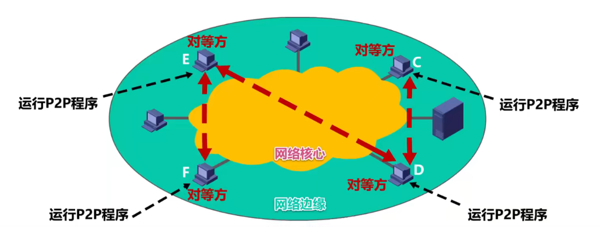
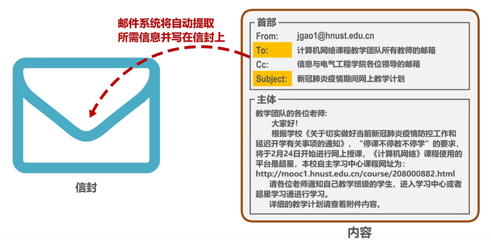
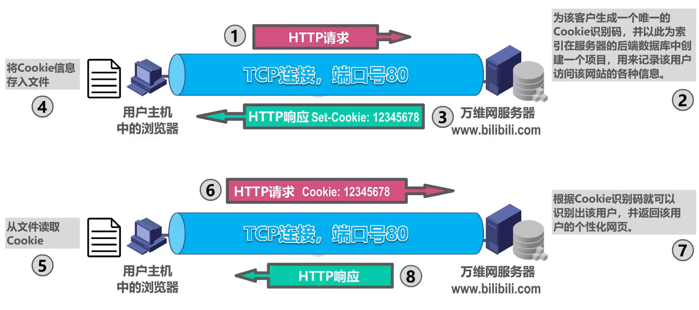

# 应用层

应用层是计算机网络体系结构的最顶层，是设计和建立计算机网络的最终目的，也是计算机网络中发展最快的部分。

一些经典的网络应用:
- 万维网 `WWW`
- 域名系统 `DNS`
- 动态主机配置协议 `DHCP`
- 电子邮件
- 文件传送协议 `FTP`
- `P2P` 文件共享
- 多媒体网络应用

## 客户/服务器方式和对等方式

网络应用程序运行在处于网络边缘的不同的端系统上，通过彼此间的通信来共同完成某项任务。

开发一种新的网络应用首先要考虑的问题就是网络应用程序在各种端系统上的组织方式和它们之间的关系。目前流行的主要有以下两种:

- 客户/服务器（`C/S`）方式
- 对等（`P2P`）方式

`C/S` 方式:
- 客户和服务器是指通信中所涉及的两个应用进程
- 客户/服务器方式所描述的是进程之间服务和被服务的关系
- 客户是服务请求方，服务器是服务提供方
- 服务器总是处于运行状态，并等待客户的服务请求。服务器具有固定端口号（例如 `HTTP` 服务器的默认端口号为 `80`），而运行服务器的主机也具有固定的 `IP` 地址
- `C/S` 方式是因特网上传统的、同时也是最成熟的方式，很多我们熟悉的网络应用采用的都是 `C/S` 方式。包括万维网 `WWW`、电子邮件、文件传输 `FTP` 等
- 基于 `C/S` 方式的应用服务通常是服务集中型的，即应用服务集中在网络中比客户计算机少得多的服务器计算机上
  - 由于一台服务器计算机要为多个客户机提供服务，在 `C/S` 应用中，常会出现服务器计算机跟不上众多客户机请求的情况
  - 为此，在 `C/S` 应用中，常用计算机群集（或服务器场）构建一个强大的虚拟服务器

`P2P` 方式
- 在 `P2P` 方式中，没有固定的服务请求者和服务提供者，分布在网络边缘各端系统中的应用进程是对等的，被称为对等方。对等方相互之间直接通信，每个对等方既是服务的请求者，又是服务的提供者
- 目前，在因特网上流行的 `P2P` 应用主要包括 `P2P` `文件共享、即时通信、P2P` 流媒体、分布式存储等
- 基于 `P2P` 的应用是服务分散型的，因为服务不是集中在少数几个服务器计算机中，而是分散在大量对等计算机中，这些计算机并不为服务提供商所有，而是为个人控制的桌面计算机和笔记本电脑，它们通常位于住宅、校园和办公室中
- `P2P` 方式的最突出特性之一就是它的可扩展性。因为系统每增加一个对等方，不仅增加的是服务的请求者，同时也增加了服务的提供者，系统性能不会因规模的增大而降低
- `P2P` 方式具有成本上的优势，因为它通常不需要庞大的服务器设施和服务器带宽

## 动态主机配置 `DHCP`

### `DHCP` 的作用:

在网络中配置一台 `DHCP` 服务器:

### `DHCP` 工作过程

假设网络中有两台 `DHCP` 服务器和多台用户主机，`DHCP` 使用 `C/S` 方式，`DHCP` 服务器上运行 `DHCP` 服务器进程，用户主机上运行 `DHCP` 客户进程。`DHCP` 是 `TCP/IP` 协议体系应用层中的协议，使用传输层 `UDP` 提供的服务。`DHCP` 服务器使用的 `UDP` 端口是 `67`，`DHCP` 客户使用的 `UDP` 端口是 `68`。

`DHCP` 客户广播发送 `DHCP` 发现报文，源 `IP` 地址为 `0.0.0.0`，因为主机目前还未分配 `IP` 地址，目的 `IP` 地址为 `255.255.255.255`，是因为主机现在还不知道网络中有哪几个 `DHCP` 服务器，他们的 `IP` 地址各是什么，网络中所有设备都会收到该 `IP` 数据报，并对其层层解封，解封出装有 `DHCP` 发现报文的 `UDP` 用户数据报。

对于 `DHCP` 客户，其应用层没有监听该 `UDP` 数据报目的的端口 `67` 的进程，无法交付 `DHCP` 发现报文，只能丢弃。对于 `DHCP` 服务器，应用层始终运行 `DHCP` 服务器进程，会接收 `DHCP` 发现报文并作出相应。

`DHCP` 发现报文其内部封装有事务 `ID` 和 `DHCP` 客户端的 `MAC` 地址。`DHCP` 服务器收到 `DHCP` 发现报文，根据其中封装的 `DHCP` 客户端的 `MAC` 地址来查找自己的数据库，看是否有针对该 `MAC` 地址的配置信息，如果有，则使用这些配置信息来构建并发送 `DHCP` 提供报文，如果没有，则采用默认配置信息来构建并发送 `DHCP` 提供报文。

封装该报文的 `IP` 数据报的源 `IP` 地址为 `DHCP` 服务器的 `IP` 地址，目的 `IP` 地址为广播地址，客户主机目前还没有配置 `IP` 地址，为了使主机可以收到，只能广播发送。对于服务器来说，应用层没有监听 `UDP` 用户数据报目的端口 `68` 的进程，丢弃 `DHCP` 提供报文，对于 `DHCP` 客户，应用层运行着 `DHCP` 客户进程，会接受 `DHCP` 提供报文并作出相应处理，根据 `DHCP` 提供报文中的事务 `ID` 来判断是否是自己请求的报文，如果该事务 `ID` 与自己之前发送的 `DHCP` 发现报文中封装的事务 `ID` 相等，就表明是自己请求的报文，接受，否则丢弃。

`DHCP` 提供报文还封装有配置信息，例如 `IP` 地址、子网掩码、地址租期、默认网关、`DNS` 服务器等。`DHCP` 服务器从自己的 `IP` 地址池中挑选待租用给主机的 `IP` 地址时，会使用 `ARP` 确保所选的 `IP` 地址未被网络中其他主机占用。

有多个 `DHCP` 服务器的情况下，`DHCP`客户会收到多个 `DHCP` 服务器发来的 `DHCP` 提供报文，`DHCP` 客户从中选择一个（一般来说选择先到的），并向所选择的 `DHCP` 服务器发送 `DHCP` 请求报文，`IP` 地址仍为 `0.0.0.0`，因为此时 `DHCP` 客户才从多个 `DHCP` 服务器中挑选一个作为自己的 `DHCP` 服务器，它需要征得该服务器的同意后才能正式使用该 `DHCP` 服务器租用的 `IP` 地址。目的地址仍为广播地址，不用向网络中的每一个 `DHCP` 单播发送 `DHCP` 请求报文，来告知它们是否请求它们作为自己的 `DHCP` 服务器。

`DHCP` 请求报文中封装有事务 `ID`、`DHCP` 客户端的 `MAC` 地址，接受的租约中的 `IP` 地址，提供此租约的 `DHCP` 服务器端的 `IP` 地址等信息。

`DHCP` 服务器接收 `DHCP` 该请求，于是发送 `DHCP` 确认报文，源 `IP` 地址为 `DHCP` 服务器的 `IP` 地址，目的地址为广播地址。`DHCP` 客户收到该确认报文后，就可以使用所租用的 `IP` 地址了。

使用 `ARP` 检测所分配到的 `IP` 地址是否已被网络中其他主机占用:
- 若被占用: 给 `DHCP` 服务器发送 `DHCP` 谢绝报文，撤销 `IP` 地址租约，`DHCP`  客户重新发送 `DHCP` 发现报文
- 若未被占用: 可以使用租约中的 `IP` 地址与网络中其他主机通信了。

当租用期过了一半时，`DHCP` 客户向 `DHCP` 服务器发送 `DHCP` 请求报文，请求更新租用期，源地址为 `DHCP` 客户之前租用到的 `IP` 地址，目的地址为 `DHCP` 服务器的地址，`DHCP` 服务器若同意，发回 `DHCP` 确认报文，`DHCP`客户就得到了新的租用期，否则，`DHCP` 服务器发回 `DHCP` 否认报文，这时，`DHCP` 客户必须立即停止使用之前租用的 `IP` 地址，并重新发送 `DHCP` 发现报文申请 `IP` 地址。

若未响应，则在租用期过了 `87.5%` 时，`DHCP` 客户必须重新发送 `DHCP` 请求报文，然后继续等待 `DHCP` 服务器可能做出的反应。

若 `DHCP` 服务器未做出反应，当租用期到期后，`DHCP` 客户必须立即停止之前租用的 `IP` 地址，并重新发送 `DHCP` 发现报文来重新申请 `IP` 地址。

`DHCP` 客户可以随时提前终止 `DHCP` 服务器所提供的租用期，只需要向 `DHCP` 服务器发送 `DHCP` 释放报文即可。

### `DHCP` 中继代理

解决方法是给该路由器配置 `DHCP` 服务器的 `IP` 地址，并使之成为中继代理，这样网络中的各主机，就可以通过  `DHCP` 来自动获取到网络配置信息了。

在每一个网络上都设置一个 `DHCP` 服务器会使 `DHCP` 服务器的数量太多。因此现在是使每一个网络至少有一个 `DHCP` 中继代理（通常是一台路由器），它配置了 `DHCP` 服务器的 `IP` 地址信息，作为各网络中计算机与 `DHCP` 服务器的桥梁。

## 域名系统 `DNS`

域名与 `IP` 地址相比，便于人们记忆。`DNS` 报文使用传输层的 `UDP` 协议进行封装，传输层端口号为 `53`。

在浏览器地址栏中输入某个 `Web` 服务器的域名时:

若未找到:

英特网是否可以只使用一台 `DNS` 服务器呢？

这种做法并不可取。因为因特网的规模很大，这样的域名服务器肯定会因为超负荷而无法正常工作，而且一旦域名服务器出现故障，整个因特网就会瘫痪。

因特网采用层次结构的命名树作为主机的名字（即域名），并使用分布式的域名系统 `DNS`。

`DNS` 使大多数域名都在本地解析，仅少量解析需要在因特网上通信，因此系统效率很高。

由于 `DNS` 是分布式系统，即使单个计算机出了故障，也不会妨碍整个系统的正常运行。

- 因特网采用层次树状结构的域名结构
- 域名的结构由若干个分量组成，各分量之间用点隔开，分别代表不同级别的域名。
  - ... .三级域名.二级域名.顶级域名
- 每一级的域名都由英文字母和数字组成，不超过 `63` 个字符，不区分大小写字母。级别最低的域名写在最左边，而级别最高的顶级域名写在最右边。完整的域名不超过 `255` 个字符
- 域名系统既不规定一个域名需要包含多少个下级域名，也不规定每一级的域名代表什么意思。
- 各级域名由其上一级的域名管理机构管理，而最高的顶级域名则由因特网名称与数字地址分配机构 `ICANN` 进行管理

顶级域名 `TLD` 分为以下三类:
- 国家顶级域名 `nTLD`
  - 采用 `ISO 3166` 的规定，如 `cn` 表示中国，`us` 表示美国，`uk` 表示英国、等等
- 通用顶级域名 `gTLD`
  -  最常见的通用顶级域名有 `7` 个，即: `com`（公司企业）、`net`（网络服务机构）、`org`（非营利性组织）、`int`（国际组织）、`edu`（美国教育结构）、 `gov`（美国政府部门）、`mil`（美国军事部门）
- 反向域 `arpa` 用于反向域名解析，即 `IP` 地址反向解析为域名

- 在国家顶级域名下注册的二级域名均由该国家自行确定
  - 例如，顶级域名为 `jp` 的日本，将其教育和企业机构的二级域名定为 `ac` 和 `co`，而不用 `edu` 和 `com`

- 我国则将二级域名划分为以下两类:
  - 类别域名 共 `7` 个: `ac`（科研机构）、`com`（工、商、金融等企业）、`edu`（教育机构）、`gov`（政府部门）、`net`（提供网络服务的机构）、`mil`（军事机构）和 `org（非营利性组织）`
- 行政区域名 共 `34` 个，适用于我国的各省、自治区、直辖市。例如: `bj` 为北京市、`sh` 为上海市、`js` 为江苏省，等等

名称相同的域名其等级未必相同。

### 英特网域名空间

这种按等级管理的命名方法便于维护名字的唯一性，并且也容易设计出一种高效的域名查询机制。需要注意的是，域名只是个逻辑概念，并不代表计算机所在的物理地点。

域名和 `IP` 地址的映射关系必须保存在域名服务器中，供所有其他应用查询。显然不能将所有信息都储存在一台域名服务器中 `DNS` 使用分布在各地的域名服务器来实现域名到 `IP` 地址的转换。

域名服务器可以划分为以下四种不同的类型:
- 根域名服务器
  - 根域名服务器是最高层次的域名服务器。每个根域名服务器都知道所有的顶级域名服务器的域名及其 `IP` 地址，因特网上共有 `13` 个不同 `IP` 地址的根域名服务器。尽管我们将这 `13` 个根域名服务器中的每一个都视为单个的服务器，但每台服务器实际上是由许多分布在世界各地的计算机构成的服务器群集。当本地域名服务器向根名服务器发查询请求时，路由器就把查询请求报文转发到离这个 `DNS` 客户最近的一个根域名服务器。这就加快了 `DNS` 的查询过程，同时也更合理地利用了因特网的资源。根域名服务器通常并不直接对域名进行解析，而是返回该域名所属顶级域名的顶级域名服务器的 `IP` 地址。
- 顶级域名服务器
  - 这些域名服务器负责管理在该顶级域名服务器注册的所有二级域名。当收到 `DNS` 查询请求时就给出相应的回答（可能是最后的结果，也可能是下一级权限域名服务器的 `IP` 地址）
- 权限域名服务器
  - 这些域名服务器负责管理某个区的域名。每一个主机的域名都必须在某个权限域名服务器处注册登记。因此权限域名服务器知道其管辖的域名与 `IP` 地址的映射关系。另外，权限域名服务器还知道其下级域名服务器的地址
- 本地域名服务器
  - 本地域名服务器不属于上述的域名服务器的等级结构。当一个主机发出 DNS 请求报文时，这个报文就首先被送往该主机的本地域名服务器。本地域名服务器起着代理的作用，会将该报文转发到上述的域名服务器的等级结构中，每一个因特网服务提供者 `ISP`，一个大学，甚至一个大学里的学院，都可以拥有一个本地域名服务器，它有时也称为默认域名服务器。本地域名服务器离用户较近，一般不超过几个路由器的距离，也有可能就在同一个局域网中。本地域名服务器的 `IP` 地址需要直接配置在需要域名解析的主机中

### 域名解析的过程

递归查询:

由于递归查询对于被查询的域名服务器负担太大，通常采用以下模式:
- 从请求主机到本地域名服务器的查询是递归查询
- 而其余的查询是迭代查询

为了提高 `DNS` 的查询效率，并减轻根域名服务器的负荷和减少因特网上的 DNS 查询报文数量，在域名服务器中广泛地使用了高速缓存。高速缓存用来存放最近查询过的域名以及从何处获得域名映射信息的记录:

由于域名到 `IP` 地址的映射关系并不是永久不变，为保持高速缓存中的内容正确，域名服务器应为每项内容设置计时器并删除超过合理时间的项（例如，每个项目只存放两天）。

不但在本地域名服务器中需要高速缓存，在用户主机中也需要。许多用户主机在启动时从本地域名服务器下载域名和 `IP` 地址的全部数据库，维护存放自己最近使用的域成名的高速缓存，并且只在从缓存中找不到域名时才向域名服务器查询。同理，主机也需要保持高速缓存中内内容的正确性。

## 文件传输协议 FTP

将某台计算机中的文件通过网络传送到可能相距很远的另一台计算机中，是一项基本的网络应用，即文件传送。

文件传送协议 `FTP` 是因特网上使用得最广泛的文件传送协议。

`FTP` 提供交互式的访问，允许客户指明文件的类型与格式（如指明是否使用 `ASCII` 码），并允许文件具有存取权限（如访问文件的用户必须经过授权，并输入有效的口令）。

`FTP` 屏蔽了各计算机系统的细节，因而适合于在异构网络中任意计算机之间传送文件。

`FTP` 采用 `C/S` `方式，FTP` 客户计算机可将各种类型的文件上传到 `FTP` 服务器计算机，也可从 `FTP` 服务器计算机下载文件。根据应用需求的不同，`FTP` 服务器可能需要一台高性能和高可靠性的服务器计算机，也可能只需要一台普通的个人计算机即可。

- `FTP` 的常见用途是在计算机之间传输文件，尤其是用于批量传输文件
- `FTP` 的另一个常见用途是让网站设计者将构成网站内容的大量文件批量上传到他们的 `Web` 服务器

### FTP 工作原理

- 控制连接在整个会话期间一直保持打开，用于传送 `FTP` 相关控制命令
- 数据连接用于文件传输，在每次文件传输时才建立，传输结束就关闭
- 

## 电子邮件

电子邮件（`E-mail`）是因特网上最早流行的一种应用，并且仍然是当今因特网上最重要、最实用的应用之一。

- 传统的电话通信属于实时通信，存在以下两个缺点:
  - 电话通信的主叫和被叫双方必须同时在场
  - 一些不是十分紧迫的电话也常常不必要地打断人们的工作或休息
- 而电子邮件与邮政系统的寄信相似
  - 发件人将邮件发送到自己使用的邮件服务器
  - 发件人的邮件服务器将收到的邮件按其目的地址转发到收件人邮件服务器中的收件人邮箱
  - 收件人在方便的时候访问收件人邮件服务器中自己的邮箱，获取收到的电子邮件

电子邮件使用方便、传递迅速而且费用低廉。它不仅可以传送文字信息，而且还可附上声音和图像。

电子邮件系统采用 `C/S` 方式。

电子邮件系统的三个主要组成构件:
- 用户代理
  - 用户代理是用户与电子邮件系统的接口，又称为电子邮件客户端软件
- 邮件服务器
  - 邮件服务器是电子邮件系统的基础设施。因特网上所有的 `ISP` 都有邮件服务器，其功能是发送和接收邮件，同时还要负责维护用户的邮箱
- 电子邮件所需的协议
  - 协议包括邮件发送协议（例如 `SMTP`）和邮件读取协议（例如 `POP3`，`IMAP`）

发送和接收过程:

### SMTP 工作原理

### 电子邮件信息格式

一个电子邮件有信封和内容两部分，而内容又由首部和主体两部分构成。

`SMTP` 协议只能传送 `ASCII` 码文本数据，不能传送可执行文件或其他的二进制对象。

`SMTP` 不能满足传送多媒体邮件（例如带有图片、音频或视频数提据）的需要。并且许多其他非英语国家的文字（例如中文、俄文、甚至带有重音符号的法文或德文）也无法用 `SMTP` 传送。

为解决 `SMTP` 传送非 `ASCII` 码文本的问题，提出了多用途因特网邮件扩展 MIME:
- 增加了 `5` 个新的邮件首部字段，这些字段提供了有关邮件主体的信息
- 定义了许多邮件内容的格式，对多媒体电子邮件的表示方法进行了标准化
- 定义了传送编码，可对任何内容格式进行转换，而不会被邮件系统改变。
- 实际上，`MIME` 不仅仅用于 `SMTP`，也用于后来的同样面向 `ASCII` 字符的 `HTTP`

### 电子邮件读取协议

- 邮局协议 `POP`，`POP3` 是其第三个版本，是因特网正式标准
  - 非常简单，功能有限的邮件读取协议。用户只能以下载并删除方式或下载并保留方式从邮件服务器下载邮件到用户方计算机。不允许用户在邮件服务器上管理自己的邮件。（例如创建文件夹，对邮件进行分类管理等）
- 因特网邮件访问协议 `IMAP`，`IMAP4` 是其第四个版本，目前还只是因特网建议标准
  - 功能比 `POP3` 强大的邮件读取协议。用户在自己的计算机上就可以操控邮件服务器中的邮箱，就像在本地操控一样，因此 `IMAP` 是一个联机协议
- `POP3` 和 `IMAP4` 都采用基于 `TCP` 连接的 `C/S` 方式。`POP3` 使用熟知端口 `110`，`IMAP4` 使用熟知端口 `143`

### 基于万维网的电子邮件

通过浏览器登录（提供用户名和口令）邮件服务器万维网网站站就可以撰写、收发、阅读和管理电子邮件。这种工作模式与 `IMAP` 很类似，不同的是用户计算机无无需安装专门的用户代理程序，只需要使用通用的万维网浏览器。

邮件服务器网站通常都提供非常强大和方便的邮件管理功能，用户可以在邮件服务器网站上管理和处理自己的邮件，而不需要将邮件下载到本地进行管理。

## 万维网 `WWW`

万维网 `WWW` 并非某种特殊的计算机网络。它是是一个大规模的、联机式的信息储藏所，是运行在因特网上的一个分布式应用。

万维网利用网页之间的超链接将不同网站的网页链接成一张逻辑上的信息网。

为了方便地访问在世界范围的文档，万维网使用统一资源定位符 `URL` 来指明因特网上任何种类资源的位置。

`URL` 的一般形式由以下四个部分组成:

<协议>://<主机>:<端口>/<路径>

### 万维网的文档

### 超文本传输协议 HTTP

`HTTP` 定义了浏览器（即万维网客户进程）怎样向万维网服务器请求万维网文档，以及万维网服务器怎样把万维网文档传送给浏览器。

`HTTP/1.0` 采用非持续连接方式。在该方式下，每次浏览器要请求一个文件都要与服务器建立 `TCP` 连接，当收到响应后就立即关闭连接。
- 每请求一个文档就要有两倍的 `RTT` 的开销。若一个网页上有很多引用对象（例如图片等），那么请求每一个对象都需要花费 `2RTT` 的时间
- 为了减小时延，浏览器通常会建立多个并行的 `TCP` 连接同时请求多个对象。但是，这会大量占用万维网服务器的资源，特别是万维网服务器往往要同时服务于大量客户的请求，这会使其负担很重

`HTTP/1.1` 采用持续连接方式。在该方式下，万维网服务器在发送响应后仍然保持这条连接，使同一个客户（浏览器）和该服务器可以继续在这条连接上传送后续的 `HTTP` 请求报文和响应报文。这并不局限于传送同一个页面上引用的对象，而是只要这些文档都在同一个服务器上就行。

为了进一步提高效率，`HTTP/1.1` 的持续连接还可以使用流水线线方式工作，即浏览器在收到 `HTTP` 的响应报文之前就能够连续发送多个请求报文。这样的一个接一个的请求报文到达服务器后，服务器就发回一个接一个的响应报文。这样就节省了很多个 `RTT` 时间，使 `TCP` 连接中的空闲时间减少，提高了下载文档的效率。

### `HTTP` 报文格式

`HTTP` 是面向文本的，其报文中的每一个字段都是一些 `ASCII` 码串，并且每个字段的长度都是不确定的。

### 使用 `Cookie` 在服务器上记录用户信息

早期的万维网应用非常简单，仅仅是用户查看存放在不同服务器上的各种静态的文档。因此 HTTP 被设计为一种无状态的协议。这样可以简化服务器的设计。

现在，用户可以通过万维网实现各种复杂的应用，如网上购物、电子商务等。这些应用往往需要万维网服务器能够识别用户。

`Cookie` 提供了一种机制使得万维网服务器能够记住用户，而无需用用户主动提供用户标识信息。也就是说，`Cookie` 是一种对无状态的 `HTTP` 进行状态化的技术。

### 万维网缓存与代理服务器

在万维网中还可以使用缓存机制以提高万维网的效率。

万维网缓存又称为 `Web` 缓存，可位于客户机，也可位于中间系统上，位于中间系统上的 `Web` 缓存又称为代理服务器。

`Web` 缓存把最近的一些请求和响应暂存在本地磁盘中。当新请求到达时，若发现这个请求与暂时存放的请求相同，就返回暂存的响应，而不需要按 `URL` 的地址再次去因特网访问该资源。

代理服务器与原始文档不一致:

原始服务器会为每个相应的对象设置一个修改时间字段和一个有效日期字段，若代理服务器中的该文档未过期，则封装响应报文发回给主机。

若代理服务器中的该文档已过期，则代理服务器会向英特网上的原始服务器发送请求，判断代理服务器中存储的该文档是否与自己存储的文档一致。

如果一致，则给代理服务器发送不包含实体主体的响应，代理服务器重新更新该文档的有效日期，将该文档封装在响应报文中发回给主机。

如果不一致，则给代理服务器发送封装有该文档的相应报文，代理服务器就跟新了该文档，然后将更新后的该文档封装在相应报文中发回给主机。

