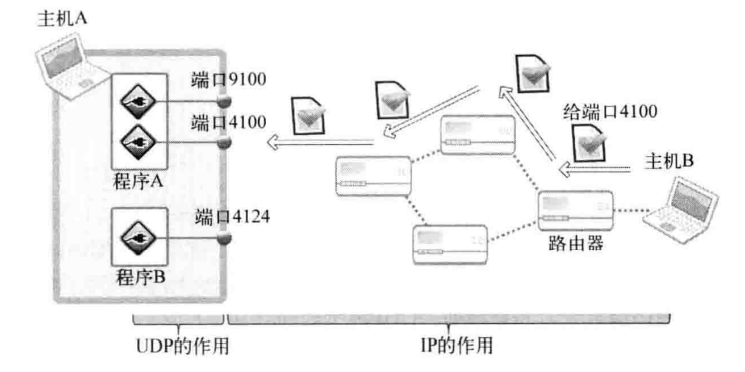
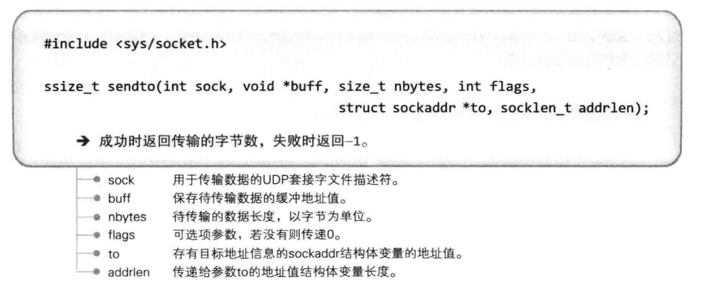
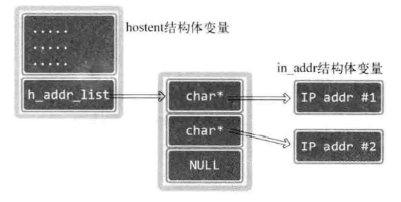
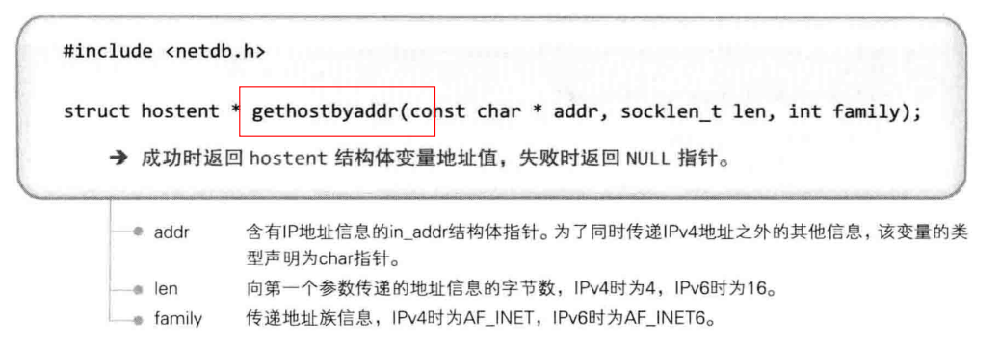
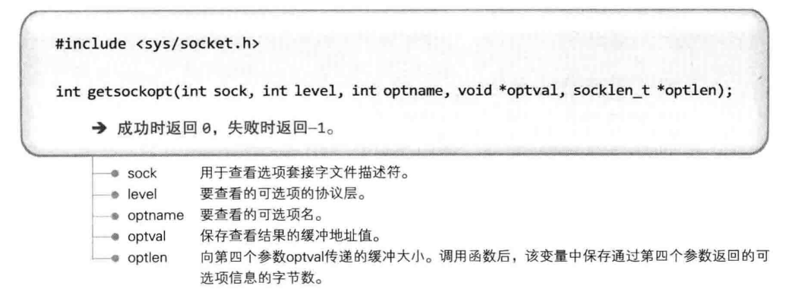
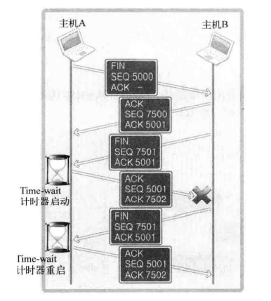

# `TCP/IP` 网络编程

## 第一章: 理解网络编程和套接字

### 理解网络编程和套接字

网络编程就是编写程序使两台连网的计算机相互交换数据。网络编程又称为套接字编程。

套接字大致分为两种，其中，`TCP` 套接字可以比喻成电话机。电话机也是通过固定电话网完成语音数据交换的。因此，我们熟悉的固定电话与套接字实际并无太大区别。

#### 构建接电话套接字

下面利用电话机讲解套接字的创建及使用方法。电话机可以同时用来拨打或接听，但对套接字而言，拨打和接听是有区别的。我们先讨论用于接听的套接字创建过程。

调用 `socket` 函数（安装电话机）时进行的对话:
- 问: 接电话需要准备什么？
- 答: 当然是电话机！

有了电话机才能安装电话，接下来，我们就准备一部的电话机。下列函数创建的就是相当于电话机的套接字。

```c
#include <sys/socket.h>
int socket(int domain, int type, int protocol);
// 成功时返回文件描述符，失败时返回 -1。
```

我们只需购买机器，剩下的安装和分配电话号码等工作都由电信局的工作人员完成。

准备好电话机后要考虑分配电话号码的问题，这样别人才能联系到自己。

调用 `bind` 函数（分配电话号码）时进行的对话:
- 问: 请问您的电话号码是多少？
- 答: 我的电话号码是 `123-1234`。

套接字同样如此。就像给电话机分配电话号码一样（虽然不是真的把电话号码给了电话机），利用以下函数给创建好的套接字分配地址信息（`IP` 地址和端口号）。

```c
#include <sys/socket.h>
int bind(int sockfd, struct sockaddr* myaddr, socklen_t addrlen);
// 成功时返回 0，失败时返回 -1。
```

调用 `bind` 函数给套接字分配地址后，就基本完成了接电话的所有准备工作。接下来需要连接电话线并等待来电。

调用 `listen` 函数（连接电话线）时进行的对话
- 问: 已架设完电话机后是否只需连接电话线？
- 答: 对，只需连接就能接听电话。

一连接电话线，电话机就转为可接听状态，这时其他人可以拨打电话请求连接到该机。同样，需要把套接字转化成可接收连接的状态。

```c
#include <sys/socket.h>
int listen(int sockfd, int backlog);
//成功时返回 0，失败时返回 -1。
```

连接好电话线后，如果有人拨打电话就会响铃，拿起话筒才能接听电话。

调用 `accept` 函数（拿起话筒）时进行的对话
- 问: 电话铃响了，我该怎么办？
- 答: 难道您真不知道？接听啊！

拿起话筒意味着接收了对方的连接请求。套接字同样如此，如果有人为了完成数据传输而请求连接，就需要调用以下函数进行受理。

```c
#include <sys/socket.h>
int accept(int sockfd, struct sockaddr* addr, socklen_t* addrlen);
// 成功时返回文件描述符，失败时返回 -1。
```

网络编程中接受连接请求的套接字创建过程可整理如下:
- 第一步: 调用 `socket` 函数创建套接字。
- 第二步: 调用 `bind` 函数分配 `IP` 地址和端口号。
- 第三步: 调用 `listen` 函数转为可接收请求状态。
- 第四步: 调用 `accept` 函数受理连接请求。

[hello_server](./src/chapter1/hello_server.cpp)

#### 构建打电话套接字

客户端套接字是用于请求连接的套接字。

打电话（请求连接）的函数，其调用的是客户端套接字，如下所示。

```c
#include <sys/socket.h>
int connect(int sockfd, struct sockaddr* serv_addr, socklen_t addrlen);
// 成功时返回 0，失败时返回 -1。
```

客户端程序只有调用 `socket` 函数创建套接字和调用 `connect` 函数向服务器端发送连接请求这两个步骤，因此比服务器端简单。

[hello_client](./src/chapter1/hello_client.cpp)

### 基于 Linux 的文件操作

对 `Linux` 而言，`socket` 也被认为是文件的一种，`socket` 操作与文件操作没有区别，因此在网络数据传输过程中自然可以使用文件 `I/O` 的相关函数。

分配给标准输入输出及标准错误的文件描述符:

|文件描述符|对象|
|-|-|
|0|标准输入: Standard Input|
|1|标准输出: Standard Output|
|2|标准错误: Standard Error|

文件和套接字一般经过创建过程才会被分配文件描述符。而表中的 `3` 种输入输出对象即使未经过特殊的创建过程，程序开始运行后也会被自动分配文件描述符。

#### 打开文件

首先介绍打开文件以读写数据的函数。调用此函数时需传递两个参数: 第一个参数是打开的目标文件名及路径信息，第二个参数是文件打开模式。


下表是此函数第二个参数 `flag` 可能的常量值及含义。如需传递多个参数，则应通过位或运算符组合并传递。

|打开模式|含义|
|-|-|
|O_CREAT|必要时创建文件|
|O_TRUNC|删除全部现有数据|
|O_APPEND|维持现有数据，保存到其后面|
|O_RDONLY|只读打开|
|O_WRONLY|只写打开|
|O_RDWR|读写打开|

#### 关闭文件

使用文件后必须关闭。


此函数不仅可以关闭文件，还可以关闭套接字。

#### 将数据写入文件

`write` 函数用于向文件输出（传输）数据。


此函数定义中，`size_t` 是通过 `typedef` 声明的 `unsigned int` 类型。对 `ssize_t` `来说，size_t` 前面多加的 `s` 代表 `signed`，即 `ssize_t` 是通过 `typedef` 声明的 `signed int` 类型。

[low_open](./src/chapter1/low_open.cpp)

#### 读取数据中的文件

与之前的 `write` 函数相对应，`read` 函数用来输入（接收）数据。


[low_read](./src/chapter1/low_read.cpp)

## 第二章: 套接字类型与与协议设置

### 套接字协议以及其数据传输特性

#### 关于协议

如果相隔很远的两人想展开对话，必须先决定对话方式。如果一方使用电话，那么另一方也只能使用电话，而不是书信。可以说，电话就是两人对话的协议。

协议是对话中使用的通信规则，把上述概念拓展到计算机领域可整理为计算机间对话必备通信规则。

简言之，协议就是为了完成数据交换而定好的约定。

#### 创建套接字


#### 协议簇

奶油意大利面和番茄酱意大利面均属于意大利面的一种，与之类似，套接字通信中的协议也具有一些分类。通过 `socket` 函数的第一个参数传递套接字中使用的协议分类信息。此协议分类信息称为协议族，声明在头文件 `<sys/socket.h>` 中，可分成如下几类:

|名称|协议族|
|-|-|
|PF_INET|IPv4 互联网协议族|
|PF_INET6|IPv6 互联网协议族|
|PF_LOCAL|本地通信的 UNIX 协议族|
|PF_PACKET|底层套接字的协议族|
|PF_IPX|IPX Novell 协议族|

我们主要学习 `PF_INET` 对应的 `IPv4` 互联网协议族，其他协议族并不常用或尚未普及。

另外，套接字中实际采用的最终协议信息是通过 `socket` 函数的第三个参数传递的。在指定的协议族范围内通过第一个参数决定第三个参数。

#### 套接字类型

套接字类型指的是套接字的数据传输方式，通过 `socket` 函数的第二个参数传递，只有这样才能决定创建的套接字的数据传输方式。

决定了协议族并不能同时决定数据传输方式，换言之，`socket` 函数第一个参数 `PF_INET` 协议族中也存在多种数据传输方式。

下面介绍 `2` 种具有代表性的数据传输方式。

#### 面向连接的套接字（`SOCK_STREAM`）

如果向 `socket` 函数的第二个参数传递SOCK_STREAM，将创建面向连接的套接字。


图中 `2` 位工人通过 `1` 条传送带传递物品，这与面向连接的数据传输方式类似。

数据（糖果）传输方式特征整理如下:
- 传输过程中数据不会消失。
- 按序传输数据。
- 传输的数据不存在数据边界。

图中通过独立的传送带传输数据（糖果），只要传送带本身没有问题，就能保证数据不丢失。

同时，较晚传递的数据不会先到达，因为传送带保证了数据的按序传递。最后，下面这句话说明的确不存在数据边界:

**`100` 个糖果是分批传递的，但接收者凑齐 `100` 个后才装袋。**

这种情形可以适用到之前说过的 `write` 和 `read` 函数。

传输数据的计算机通过 `3` 次调用 `write` 函数传递了 `100` 字节的数据，但接收数据的计算机仅通过 `1` 次 `read` 函数调用就接收了全部 `100` 个字节。

收发数据的套接字内部有缓冲（`buffer`） ，简言之就是字节数组。通过套接字传输的数据将保存到该数组。因此，收到数据并不意味着马上调用 `read` 函数。只要不超过数组容量，则有可能在数据填充满缓冲后通过 `1` 次 `read` 函数调用读取全部，也有可能分成多次 `read` 函数调用进行读取。也就是说，在面向连接的套接字中，`read` 函数和 `write` 函数的调用次数并无太大意义。所以说面向连接的套接字不存在数据边界。

如果缓冲被接收的数据填满会发生什么事情？之后传递的数据是否会丢失？

首先调用 `read` 函数从缓冲读取部分数据，因此，缓冲并不总是满的。但如果 `read` 函数读取速度比接收数据的速度慢，则缓冲有可能被填满。此时套接字无法再接收数据，但即使这样也不会发生数据丢失，因为传输端套接字将停止传输。也就是说，面向连接的套接字会根据接收端的状态传输数据，如果传输出错还会提供重传服务。因此，面向连接的套接字除特殊情况外不会发生数据丢失。

还有一点需要说明。上图中传输和接收端各有 `1` 名工人，这说明面向连接的套接字还有如下特点:

**套接字连接必须一一对应。**

面向连接的套接字只能与另外一个同样特性的套接字连接。用一句话概括面向连接的套接字如下:

**可靠的、按序传递的、基于字节的面向连接的数据传输方式的套接字。**

#### 面向消息的套接字（`SOCK_DGRAM`）

如果向 `socket` 函数的第二个参数传递 `SOCK_DGRAM` ，则将创建面向消息的套接字。


面向消息的套接字可以比喻成高速移动的摩托车快递。图中摩托车快递的包裹（数据）传输方式如下:
- 强调快速传输而非传输顺序。
- 传输的数据可能丢失也可能损毁。
- 传输的数据有数据边界。
- 限制每次传输的数据大小。

众所周知，快递行业的速度就是生命。用摩托车发往同一目的地的 `2` 件包裹无需保证顺序，只要以最快速度交给客户即可。这种方式存在损坏或丢失的风险，而且包裹大小有一定限制。因此，若要传递大量包裹，则需分批发送。另外，如果用 `2` 辆摩托车分别发送 `2` 件包裹，则接收者也需要分 `2` 次接收。这种特性就是传输的数据具有数据边界。

以上就是面向消息的套接字具有的特性。即，面向消息的套接字比面向连接的套接字具有更快的传输速度，但无法避免数据丢失或损毁。另外，每次传输的数据大小具有一定限制，并存在数据边界。存在数据边界意味着接收数据的次数应和传输次数相同。面向消息的套接字特性总结如下:

**不可靠的、不按序传递的、以数据的高速传输为目的的套接字。**

另外，面向消息的套接字不存在连接的概念。

#### 协议的最终选择

前面已经通过 `socket` 函数的前两个参数传递了协议族信息和套接字数据传输方式，这些信息还不足以决定采用的协议吗？为什么还需要传递第 `3` 个参数呢？

传递前两个参数即可创建所需套接字。所以大部分情况下可以向第三个参数传递 `0`，除非遇到以下这种情况:

同一协议族中存在多个数据传输方式相同的协议。

数据传输方式相同，但协议不同。此时需要通过第三个参数具体指定协议信息。

`IPv4` 协议族中面向连接的套接字:

参数 `PF_INET` 指 `IPv4` `网络协议族，SOCK_STREAM` 是面向连接的数据传输。满足这 `2` 个条件的协议只有 `IPPROTO_TCP`，因此可以如下调用 `socket` 函数创建套接字，这种套接字称为 `TCP` 套接字:

```c
int tcp_socket = socket(PF_INET, SOCK_STREAM, IPPROTO_TCP);
```

`IPv4` 协议族中面向消息的套接字:

`SOCK_DGRAM` 指的是面向消息的数据传输方式，满足上述条件的协议只有 `IPPROTO_UDP`。

因此，可以如下调用 `socket` 函数创建套接字，这种套接字称为 `UDP` 套接字:

```c
int udp_socket = socket(PF_INET, SOCK_DGRAM, IP PROTO_UDP);
```

#### `TCP` 套接字示例

`TCP` 套接字的如下特性:

**传输的数据不存在数据边界。**

为验证这一点，需要让 `write` 函数的调用次数不同于 `read` 函数的调用次数。因此，在客户端中分多次调用 `read` 函数以接收服务器端发送的全部数据。

[tcp_client](./src/chapter2/tcp_client.cpp)

## 第三章: 地址族与数据序列

### 分配给套接字的 `IP` 地址与端口号

`IP` 是 `Internet Protocol`（网络协议）的简写，是为收发网络数据而分配给计算机的值。

端口号并非赋予计算机的值，而是为区分程序中创建的套接字而分配给套接字的序号。

#### 网络地址

为使计算机连接到网络并收发数据，必需向其分配 `IP` 地址。`IP` 地址分为两类。

- `IPv4`（`Internet Protocol version4`）`4` 字节地址族
- `IPv6`（`Internet Protocol version 6`）`16` 字节地址族

#### 用于区分套接字的端口号

`IP` 用于区分计算机，只要有 `IP` 地址就能向目标主机传输数据，但仅凭这些无法传输给最终的应用程序。假设我们欣赏视频的同时在网上冲浪，这时至少需要 `1` 个接收视频数据的套接字和 `1` 个接收网页信息的套接字。问题在于如何区分二者。简言之，传输到计算机的网络数据是发给播放器，还是发送给浏览器？

计算机中一般配有 `NIC`（`Network Interface Card`，网络接口卡）数据传输设备。通过 `NIC` 向计算机内部传输数据时会用到 `IP`。操作系统负责把传递到内部的数据适当分配给套接字，这时就要利用端口号。也就是说，通过 `NIC` 接收的数据内有端口号，操作系统正是参考此端口号把数据传输给相应端口的套接字。

端口号就是在同一操作系统内为区分不同套接字而设置的，因此无法将 `1` 个端口号分配给不同套接字。另外，端口号由 `16` 位构成，可分配的端口号范围是 `0-65535`。

虽然端口号不能重复，但 `TCP` 套接字和 `UDP` 套接字不会共用端口号，所以允许重复。例如: 如果某 `TCP` 套接字使用 `9190` 号端口，则其他 `TCP` 套接字就无法使用该端口号，但 `UDP` 套接字可以使用。

总之，数据传输目标地址同时包含 `IP` 地址和端口号，只有这样，数据才会被传输到最终的目的应用程序。

### 地址信息的表示

结构体定义为如下形态，此结构体将作为地址信息传递给 `bind` 函数。


该结构体中提到的另一个结构体 `in_addr` 定义如下，它用来存放 `32` 位 `IP` 地址。


数据类型的定义:


#### 结构体 `sockaddr_in` 的成员分析

- `sin_family`
  - 每种协议族适用的地址族均不同。比如，`IPv4` 使用 `4` 字节地址族，`IPv6` 使用 `16` 字节地址族。
  - 
  - 在 `socket` 编程中只能是 `AF_INET`。
- `sin_port`
  - 该成员保存 `16` 位端口号，它以网络字节序保存。
- `sin_addr`
  - 该成员保存 `32` 位 `IP` 地址信息，且也以网络字节序保存。
  - `sin_addr` 的类型为结构体 `in_addr`，其成员 `s_addr` 为 `In_addr_t` 类型，声明为 `uint32_t`，当作 `32` 位整数型即可。
- `sin_zero`。
  - 无特殊含义。只是为使结构体 `sockaddr_in` 的大小与 `sockaddr` 结构体保持一致而插入的成员。必需填充为 `0`，否则无法得到想要的结果。

`bind` 函数的第二个参数期望得到 `sockaddr` 结构体变量地址值，包括地址族、端口号、`IP` 地址等。但是直接向 `sockaddr` 结构体填充这些信息会带来麻烦。


此结构体成员 `sa_data` 保存的地址信息中需包含 `IP` 地址和端口号，剩余部分应填充 `0`。而这对于包含地址信息来讲非常麻烦，继而就有了新的结构体`sockaddr_in`。

为何会使用两个数据结构 `sockaddr` 和 `sockaddr_in` 来表示地址，原因是如 `sa_family` 所指出的，`socket` 设计之初本来就是准备支持多个地址协议的。不同的地址协议由自己不同的地址构造，譬如对于 `IPv4` 就是 `sockaddr_in`，`IPV6` 就是 `sockaddr_in6`，以及对于 `AF_UNIX` 就是 `sockaddr_un`。

`sockaddr` 是对这些地址的上一层的抽象。另外，像 `sockaddr_in` 将地址拆分为 `port` 和 `IP`，对编程也更友好。这样，在将所使用的的值赋值给 `sockaddr_in` 数据结构之后，通过强制类型转换，就可以转换为 `sockaddr`。当然，从 `sockaddr` 也可以强制类型转换为 `sockaddr_in`。


### 网络字节序与地址变换

不同 `CPU` 中，`4` 字节整数型值 `1` 在内存空间的保存方式是不同的。`4` 字节整数型值 `1` 可用 `2` 进制表示如下。

`00000000 00000000 00000000 00000001`

有些 `CPU` 以这种顺序保存到内存，另外一些 `CPU` 则以倒序保存。

`00000001 00000000 00000000 00000000`

若不考虑这些就收发数据则会发生问题，因为保存顺序的不同意味着对接收数据的解析顺序也不同。

#### 字节序与网络字节序

`CPU` 向内存保存数据的方式有 `2` 种，这意味着 `CPU` 解析数据的方式也分为 `2` 种:
- 大端序（`Big Endian`）: 高位字节存放到低位地址。
- 小端序（`Little Endian`）: 高位字节存放到高位地址。

示例，假设在 `0x20` 号开始的地址中保存 `4` 字节 `int` 类型数 `0x12345678`。大端序 `CPU` 保存方式如图所示。


整数 `0x12345678` 中，`0x12` 是最高位字节，`0x78` 是最低位字节。因此，大端序中先保存最高位字节 `0x12`（最高位字节 `0x12` 存放到低位地址）。

小端序保存如图所示。


先保存的是最低位字节 `0x78`。目前主流的 `Intel` 系列 `CPU` 以小端序方式保存数据。

网络传输数据时约定统一方式，这种约定称为网络字节序，统一为大端序。

小端传输系统传输数据时应转换为大端序列排序方式。

#### 字节序转换

```C
unsigned short htons(unsigned short);
unsigned short ntohs(unsigned short);
unsigned long htonl(unsigned long);
unsigned long ntohl(unsigned long);
```

- `h` 代表主机字节序，`n` 代表网络字节序。
- `s` 指的是 `short`，`l` 指的是 `long`（`Linux` 中 `long` 类型占用 `4` 个字节（`32` 位））。

[endian_conv](./src/chapter3/endian_conv.cpp)

数据转换成网络字节序这个过程是自动的。除了向 `sockaddr_in` 结构体变量填充数据外，其他情况无需考虑字节序问题。

#### 将字符信息转换为网络字节序的整数型

对于 `IP` 地址的表示，我们熟悉的是点分十进制表示法，而非整数型数据表示法。


[inet_addr](./src/chapter3/inet_addr.cpp)

`inet_aton` 函数与 `inet_addr` 函数在功能上完全相同，也将字符串形式 `IP` 地址转换为 `32` 位网络字节序整数并返回。只不过该函数利用了 `in_addr` 结构体，且其使用频率更高。


[inet_addr](./src/chapter3/inet_addr.cpp)

`inet_ntoa` 函数正好相反，此函数可以把网络字节序整数型 `IP` 地址转换成我们熟悉的字符串形式。


返回字符串地址意味着字符串已保存到内存空间，但该函数未向程序员要求分配内存，而是在内部申请了内存并保存了字符串。也就是说，调用完该函数后，应立即将字符串信息复制到其他内存空间。因为，若再次调用该函数，则有可能覆盖之前保存的字符串信息。

[inet_ntoa](./src/chapter3/inet_ntoa.cpp)

#### 网络地址初始化

```c
struct sockaddr_in addr;
char* serv_ip = "211.217.168.13"; // 声明 IP 地址字符串
char* serv_port = "9190"; // 声明端口号字符串
memset(&addr, 0, sizeof(addr)); // 结构体变量 addr 的所有成员初始化为 0
addr.sin_family = AF_INET; // 指定地址族
addr.sin_addr.s_addr = inet_addr(serv_ip); // 基于字符串的IP地址初始化
addr.sin_port = htons(atoi(serv_port)); // 基于字符串的端口号初始化
```

`memset` 函数将每个字节初始化为同一值，第一个参数为结构体变量 `addr` 的地址值，即初始化对象为 `addr`，第二个参数为 `0`，因此初始化为 `0`，最后一个参数中传入addr的长度，因此 `addr` 的所有字节均初始化为 `0`。这么做是为了将 `sockaddr_in` 结构体的成员 `sin_zero` 初始化为 `0`。

#### 客户端地址初始化

上述网络地址信息初始化过程主要针对服务器端而非客户端。服务器端的准备工作通过 `bind` 函数完成，而客户端则通过 `connect` 函数完成。

因此函数调用前需准备的地址值类型也不同。服务器端声明 `sockaddr_in` 结构体变量，将其初始化为赋予服务器端 `IP` 和套接字的端口号，然后调用 `bind` 函数，而客户端则声明 `sockaddr_in` 结构体，并初始化为要与之连接的服务器端套接字的 `IP` 和端口号，然后调用 `connect` 函数。

#### `INADDR_ANY`

利用常数 `INADDR_ANY` 分配服务器端的 `IP` 地址，可自动获取运行服务器端的计算机 `IP` 地址，不必亲自输入。而且，若同一计算机中已分配多个 `IP` 地址计算机，则只要端口号一致，就可以从不同 `IP` 地址接收数据。因此，服务器端中优先考虑这种方式。而客户端中除非带有一部分服务器端功能，否则不会采用。

#### 向套接字分配网络


如果此函数调用成功，则将第二个参数指定的地址信息分配给第一个参数中的相应套接字。

## 第四章: 基于 `TCP` 的服务器端/客户端（`1`）

### 理解 `TCP` 和 `UDP`

#### `TCP/IP` 协议栈


`TCP/IP` 协议栈共分 `4` 层，可以理解为数据收发分成了 `4` 个层次化过程。也就是说，面对基于互联网的有效数据传输的命题，并非通过 `1` 个庞大协议解决问题，而是化整为零，通过层次化方案，`TCP/IP` 协议栈解决。

各层可能通过操作系统等软件实现，也可能通过类似 `NIC` 的硬件设备实现。

#### 链路层

链路层是物理链接领域标准化的结果，也是最基本的领域，专门定义 `LAN`、`WAN`、`MAN` 等网络标准。若两台主机通过网络进行数据交换，则需要物理连接，链路层就负责这些标准。

#### `IP` 层

准备好物理连接后就要传输数据。为了在复杂的网络中传输数据，首先需要考虑路径的选择。解决此问题就是 `IP` 层，该层使用的协议就是 `IP`。

`IP` 本身是面向消息的、不可靠的协议。每次传输数据时会帮我们选择路径，但并不一致。如果传输中发生路径错误，则选择其他路径。但如果发生数据丢失或错误，则无法解决。换言之，`IP` 协议无法应对数据错误。

#### `TCP/UDP` 层

`TCP` 和 `UDP` 层以 `IP` 层提供的路径信息为基础完成实际的数据传输，故该层又称传输层。

`UDP` 比 `TCP` 简单，`TCP` 可以保证可靠的数据传输，但它发送数据时以 `IP` 层为基础。

`IP` 层只关注 `1` 个数据包的传输过程。因此，即使传输多个数据包，每个数据包也是由 `IP` 层实际传输的，也就是说传输顺序及传输本身是不可靠的。若只利用 `IP` 层传输数据，则有可能导致后传输的数据包 `B` 比先传输的数据包 `A` 提早到达。另外，传输的数据包 `A`、`B`、`C` 中有可能只收到 `A` 和 `C`，甚至收到的 `C` 可能已损毁。

若添加 `TCP` 协议，如果数据交换过程中可以确认对方已收到数据，并重传丢失的数据，那
么即便 `IP` 层不保证数据传输，这类通信也是可靠的。

总之，`TCP` 和 `UDP` 存在于 `IP` 层之上，决定主机之间的数据传输方式，`TCP` 协议确认后向不可靠的 `IP` 协议赋予可靠性。


#### 应用层

上述内容是套接字通信过程中自动处理的。选择数据传输路径、数据确认过程都被隐藏到套接字内部。

编写软件的过程中，需要根据程序特点决定服务器端和客户端之间的数据传输规则，这便是应用层协议。网络编程的大部分内容就是设计并实现应用层协议。

### 实现基于 `TCP` 的服务器端/客户端

#### `TCP` 服务器端的默认函数调用顺序


#### 进入等待连接请求状态

我们已调用 `bind` 函数给套接字分配了地址，接下来就要通过调用 `listen` 函数进入等待连接请求状态。这时客户端才能调用 `connect` 函数。


服务器端处于等待连接请求状态是指，客户端请求连接时，受理连接前一直使请求处于等待状态。


客户端连接请求本身也是从网络中接收到的一种数据，而要想接收就需要套接字。此任务就由服务器端套接字完成。服务器端套接字是接收连接请求的一名门卫或一扇门。

`listen` 函数的第二个参数决定了等候室的大小。等候室称为连接请求等待队列，准备好服务器端套接字和连接请求等待队列后，这种可接收连接请求的状态称为等待连接请求状态。

`listen` 函数的第二个参数值与服务器端的特性有关，像频繁接收请求的 `Web` 服务器端至少应为 `15`。另外，连接请求队列的大小始终根据实验结果而定。

#### 受理客户端连接请求

调用 listen 函数后，若有新的连接请求，则应按序受理。受理请求意味着进入可接受数据的状态。


`accept` 函数受理连接请求等待队列中待处理的客户端连接请求。函数调用成功时，`accept` 函数内部将产生用于数据 `I/O` 的套接字，并返回其文件描述符。套接字是自动创建的，并自动与发起连接请求的客户端建立连接。

#### `TCP` 客户端的默认函数调用顺序


服务器端调用 listen 函数后创建连接请求等待队列，之后客户端即可请求连接。


客户端调用 connect 函数后，发生以下情况之一才会返回（完成函数调用）:
- 服务器端接收连接请求。
- 发生断网等异常情况而中断连接请求。

需要注意，所谓的接收连接并不意味着服务器端调用 `accept` 函数，其实是服务器端把连接请求信息记录到等待队列。因此 `connect` 函数返回后并不立即进行数据交换。

客户端的 `IP` 地址和端口在调用 `connect` 函数时自动分配，无需调用标记的 `bind` 函数进行分配。

#### 基于 TCP 的服务器端/客户端函数调用关系


服务器端创建套接字后连续调用 `bind`、`listen` 函数进入等待状态，客户端通过调用 `connect` 函数发起连接请求。需要注意的是，客户端只能等到服务器端调用 `listen` 函数后才能调 `connect` 函数。同时要清楚，客户端调用 `connect` 函数前，服务器端有可能率先调用 `accept` 函数。当然，此时服务器端在调用 `accept` 函数时进入阻塞状态，直到客户端调 `connect` 函数为止。

### 实现迭代服务器端/客户端

服务器端将客户端传输的字符串数据原封不动地传回客户端，就像回声一样。

之前讨论的 `Helloworld` 服务器端处理完 `1` 个客户端连接请求即退出，连接请求等待队列实际没有太大意义。但这并非我们想象的服务器端。设置好等待队列的大小后，应向所有客户端提供服务，继续受理后续的客户端连接请求。


调用 `accept` 函数后，紧接着调用 `I/O` 相关的 `read`、`write` 函数，然后调用 `close` 函数。这并非针对服务器端套接字，而是针对 `accept` 函数调用时创建的套接字。

调用 `close` 函数就意味着结束了针对某一客户端的服务。此时如果还想服务于其他客户端，就要重新调用 `accept` 函数。

- 服务器端在同一时刻只与一个客户端相连，并提供回声服务。
- 服务器端依次向 `5` 个客户端提供服务并退出。
- 客户端接收用户输入的字符串并发送到服务器端。
- 服务器端将接收的字符串数据传回客户端，即回声。
- 服务器端与客户端之间的字符串回声一直执行到客户端输入 `Q` 为止。

[echo_server](./Image/../src/chapter4/echo_server.cpp)

[echo_client](./Image/../src/chapter4/echo_client.cpp)

#### 回声客户端存在的问题

下列是 `echo_client.cpp` 中的代码:

```cpp
write(sock, message, strlen(message));
str_len = read(sock, message, BUF_SIZE - 1);
message[str_len] =0;
```

以上代码有个错误假设:

每次调用 `read`、`write` 函数时都会以字符串为单位执行实际的 `I/O` 操作。

当然，每次调用 `write` 函数都会传递 `1` 个字符串，因此这种假设在某种程度上也算合理。

但 `TCP` 不存在数据边界。上述客户端是基于 `TCP` 的，因此，多次调用 `write` 函数传递的字符串有可能一次性传递到服务器端。此时客户端有可能从服务器端收到多个字符串，这不是我们希望看到的结果。还需考虑服务器端的如下情况:

字符串太长，需要分 `2` 个数据包发送。

服务器端希望通过调用 `1` 次 `write` 函数传输数据，但如果数据太大，操作系统就有可能把数据分成多个数据包发送到客户端。另外，在此过程中，客户端有可能在尚未收到全部数据包时就调用 `read` 函数。

所有这些问题都源自 `TCP` 的数据传输特性。那该如何解决呢？

## 第五章: 基于 `TCP` 的服务器端/客户端（`2`）

### 回声客户端的完美实现

```cpp
while (1) {
    cout << "Input message(Q to quit): ";
    fgets(message, BUF_SIZE, stdin);
    // ......
    write(sock, message, strlen(message));
    int str_len = read(sock, message, BUF_SIZE - 1);
    // ......
}
```

回声客户端传输的是字符串，而且是通过调用 `write` 函数一次性发送的。之后还调用一次 `read` 函数，期待着接收自己传输的字符串。这就是问题所在。

既然回声客户端会收到所有字符串数据，过一段时间后再调用 `read` 函数是否可以一次性读取所有字符串数据？的确，过一段时间后即可接收，但需要等多久？

#### 回声客户端问题解决方法

可以提前确定接收数据的大小。若之前传输了 `20` 字节长的字符串，则在接收时循环调用 `read` 函数读取 `20` 个字节即可。


#### 如果问题不在于回声客户端: 定义应用层协议

回声客户端可以提前知道接收的数据长度，但更多情况下不太可能。若无法预知接收数据长度时应如何收发数据？此时需要的就是应用层协议的定义。之前的回声服务器端/客户端中定义了如下协议。

**收到Q就立即终止连接。**

同样，收发数据过程中也需要定好协议以表示数据的边界，或提前告知收发数据的大小。服务器端/客户端实现过程中逐步定义的这些规则集合就是应用层协议。

#### 计算器服务器端/客户端示例

下面编写程序。该程序中，服务器端从客户端获得多个数字和运算符信息。服务器端收到数字后对其进行加减乘运算，然后把结果传回客户端。

- 客户端连接到服务器端后以 `1` 字节整数形式传递待算数字个数。
- 客户端向服务器端传递的每个整数型数据占用 `4` 字节。
- 传递整数型数据后接着传递运算符。运算符信息占用 `1` 字节。
- 选择字符 `+`、`-`、`*` 之一传递。
- 服务器端以 `4` 字节整数型向客户端传回运算结果。
- 客户端得到运算结果后终止与服务器端的连接。

[op_server](./src/chapter5/op_server.cpp)

客户端的数据传送格式:


[op_client](./src/chapter5/op_client.cpp)

### `TCP` 原理

#### `TCP` 套接字中的 `I/O` 缓冲

如前所述，`TCP` 套接字的数据收发无边界。服务器端即使调用 `1` 次 `write` 函数传输 `40` 字节的数据，客户端也有可能通过 `4` 次 `read` 函数调用每次读取 `10` 字节。


实际上，`write` 函数调用后并非立即传输数据，`read` 函数调用后也并非马上接收数据。更准确地说，`write` 函数调用瞬间，数据将移至输出缓冲；`read` 函数调用瞬间，从输入缓冲读取数据。


如图所示，调用 `write` 函数时，数据将移到输出缓冲，在适当的时候（不管是分别传送还是一次性传送）传向对方的输入缓冲。这时对方将调用 `read` 函数从输入缓冲读取数据。这些 `I/O` 缓冲特性如下:
- `I/O` 缓冲在每个 `TCP` 套接字中单独存在。
- `I/O` 缓冲在创建套接字时自动生成。
- 即使关闭套接字也会继续传递输出缓冲中遗留的数据。
- 关闭套接字将丢失输入缓冲中的数据。

不可能发生超过输入缓冲大小的数据传输。

`TCP` 中有滑动窗口协议，用对话方式呈现如下:
- 套接字 `A`: 你好，最多可以向我传递 `50` 字节。
- 套接字 `B`: `OK`!
- 套接字 `A`: 我腾出了 `20` 字节的空间，最多可以收 `70` 字节。
- 套接字 `B`: `OK`!

数据收发也是如此，因此 `TCP` 中不会因为缓冲溢出而丢失数据。

#### `TCP` 内部工作原理

`TCP` 套接字从创建到消失所经过程分为如下 `3` 步:
- 与对方套接字建立连接。
- 与对方套接字进行数据交换。
- 断开与对方套接字的连接。

详情见传输层:

[传输层](./%E4%BC%A0%E8%BE%93%E5%B1%82.md)

## 第六章: 基于 `UDP` 的服务器端/客户端

### 理解 `UDP`

#### `UDP` 套接字的特点

`UDP` 提供的是不可靠的数据传输服务。

如果只考虑可靠性，`TCP` 的确比 `UDP` 好。但 `UDP` 在结构上比 `TCP` 更简洁。`UDP` 不会发送类似 `ACK` 的应答消息，也不会像 `SEQ` 那样给数据包分配序号。因此，`UDP` 的性能有时比 `TCP` 高出很多。

编程中实现 `UDP` 也比 `TCP` 简单。另外，`UDP` 的可靠性虽比不上 `TCP`，但也不会像想象中那么频繁地发生数据损毁。因此，在更重视性能而非可靠性的情况下，`UDP` 是一种很好的选择。

为了提供可靠的数据传输服务，`TCP` 在不可靠的 `IP` 层进行流控制，而 `UDP` 就缺少这种流控制机制。流控制是区分 `UDP` 和 `TCP` 的最重要的标志。

#### `UDP` 内部工作原理



`IP` 的作用就是让离开主机 `B` 的 `UDP` 数据包准确传递到主机 `A`。但把 `UDP` 包最终交给主机 `A` 的某一 `UDP` 套接字的过程则是由 `UDP` 完成的。`UDP` 最重要的作用就是根据端口号将传到主机的数据包交付给最终的 `UDP` 套接字。

#### `UDP` 的高效使用

`UDP` 也具有一定的可靠性。网络传输特性导致信息丢失频发，可若要传递压缩文件（发送 `1万` 个数据包时，只要丢失 `1个` 就会产生问题），则必须使用 `TCP`，因为压缩文件只要丢失一部分就很难解压。

但通过网络实时传输视频或音频时的情况有所不同。对于多媒体数据而言，丢失一部分也没有太大问题，这只会引起短暂的画面抖动，或出现细微的杂音。但因为需要提供实时服务，速度就成为非常重要的因素，此时需要考虑使用 `UDP`。

但 `UDP` 并非每次都快于 `TCP`，`TCP` 比 `UDP` 慢的原因通常有以下两点:
- 收发数据前后进行的连接设置及清除过程。
- 收发数据过程中为保证可靠性而添加的流控制。

如果收发的数据量小但需要频繁连接时，`UDP` 比 `TCP` 更高效。

### 实现基于 `UDP` 的服务器端/客户端

#### UDP 中的服务器端和客户端没有连接

`UDP` 服务器端/客户端不像 `TCP` 那样在连接状态下交换数据，因此与 `TCP` 不同，无需经过连接过程。也就是说，不必调 `TCP` 连接过程中调用的 `listen` 函数和 `accept` 函数。`UDP` 中只有创建套接字的过程和数据交换过程。

#### `UDP` 服务器端和客户端均只需 `1` 个套接字

`TCP` 中，套接字之间应该是一对一的关系。若要向 `10` 个客户端提供服务，则除了守门的服务器套接字外，还需要 `10` 个服务器端套接字。但在 `UDP` 中，不管是服务器端还是客户端都只需要 `1` 个套接字，只需 `1` 个 `UDP` 套接字就可以向任意主机传输数据。

#### 基于 `UDP` 的数据 `I/O` 函数

创建好 `TCP` 套接字后，传输数据时无需再添加地址信息。因为 `TCP` 套接字将保持与对方套接字的连接。换言之，`TCP` 套接字知道目标地址信息。但 `UDP` 套接字不会保持连接状态，因此每次传输数据都要添加目标地址信息。



上述函数与之前的 `TCP` 输出函数最大的区别在于，此函数需要向它传递目标地址信息。

来介绍接收 `UDP` 数据的函数。`UDP` 数据的发送端并不固定，因此该函数定义为可接收发送端信息的形式，也就是将同时返回 `UDP` 数据包中的发送端信息。


#### 基于 `UDP` 的回声服务器端/客户端

下面结合之前的内容实现回声服务器。需要注意的是，`UDP` 不同于 `TCP`，不存在请求连接和受理过程，因此在某种意义上无法明确区分服务器端和客户端。只是因其提供服务而称为服务器端。

[uecho_server](./src/chapter6/uecho_server.cpp)
[uecho_client](./src/chapter6/uecho_client.cpp)

#### `UDP` 客户端套接字的地址分配

如果仔细观察 `UDP` 客户端会发现，它缺少把 `IP` 和端口分配给套接字的过程。`TCP` 客户端调 `connect` 函数自动完成此过程，`UDP` 在何时分配 `IP` 和端口号呢？

`UDP` 程序中，调用 `sendto` 函数传输数据前应完成对套接字的地址分配工作，因此调用 `bind` 函数。

另外，如果调用 `sendto` 函数时发现尚未分配地址信息，则在首次调用 `sendto` 函数时给相应套接字自动分配 `IP` 和端口。而且此时分配的地址一直保留到程序结束为止，`IP` 用主机 `IP`，端口号选尚未使用的任意端口号。

综上所述，调用 `sendto` 函数时自动分配 `IP` 和端口号，因此，`UDP` 客户端中通常无需额外的地址分配过程。

### `UDP` 的数据传输特性和调用 `connect` 函数

#### 存在数据边界的 `UDP` 套接字

前面说过 `TCP` 数据传输中不存在边界，这表示**数据传输过程中调用 `I/O` 函数的次数不具有任
何意义。**

相反，`UDP` 是具有数据边界的协议，传输中调用 `I/O` 函数的次数非常重要。因此，输入函数的调用次数应和输出函数的调用次数完全一致，这样才能保证接收全部已发送数据。例如，调用 `3` 次输出函数发送的数据必须通过调用 `3` 次输入函数才能接收完。

[bound_host1](./src/chapter6/bound_host1.cpp)

[bound_host2](./src/chapter6/bound_host2.cpp)

`bound_host2.cpp` 程序 `3` 次调用 `sendto` 函数以传输数据，`bound_hostl.cpp` 则调用 `3` 次 `recvfrom` 函数以接收数据。`recvfrom` 函数调用间隔为 `5` 秒，因此，调用 `recvfrom` 函数前已调用了 `3` 次 `sendto` 函数。也就是说，此时数据已经传输到 `bound_host1.cpp`。如果是 `TCP` 程序，这时只需调用 `1` 次输入函数即可读入数据。`UDP` 则不同，在这种情况下也需要调用 `3` 次 `recvfrom` 函数。

#### 已连接 `UDP` 套接字与未连接 `UDP` 套接字

`TCP` 套接字中需注册待传输数据的目标 `IP` 和端口号，而 `UDP` 中则无需注册。因此，通过 `sendto` 函数传输数据的过程大致可分为以下 `3` 个阶段:
- 第 `1` 阶段: 向 `UDP` 套接字注册目标 `IP` 和端口号。
- 第 `2` 阶段: 传输数据。
- 第 `3` 阶段: 删除 `UDP` 套接字中注册的目标地址信息。

每次调用 `sendto` 函数时重复上述过程。每次都变更目标地址，因此可以重复利用同一 `UDP` 套接字向不同目标传输数据。这种未注册目标地址信息的套接字称为未连接套接字，反之，注册了目标地址的套接字称为连接 `connected` 套接字。

显然，`UDP` 套接字默认属于未连接套接字。但 `UDP` 套接字在下述情况下显得不太合理:

`IP` 为 `211.210.147.82` 的主机 `82` 号端口共准备了 `3` 个数据，调用 `3` 次 `sendto` 函数进行传输。此时需重复 `3` 次上述三阶段。因此，要与同一主机进行长时间通信时，将 `UDP` 套接字变成已连接套接字会提高效率。上述三个阶段中，第一个和第三个阶段占整个通信过程近 `1/3` 的时间，缩短这部分时间将大大提高整体性能。

[uecho_con_client](./src/chapter6/uecho_con_client.cpp)

## 第七章: 优雅地断开套接字连接

### 基于 `TCP` 的半关闭

#### 单方面断开连接带来的问题

`Linux` 的 `close` 函数意味着完全断开连接。完全断开不仅指无法传输数据，而且也不能接收数据。

因此，在某些情况下，通信一方调用 `close` 函数断开连接就显得不太优雅。


图中描述的是 `2` 台主机正在进行双向通信。主机 `A` 发送完最后的数据后，调用 `close` 函数断开了连接，之后主机 `A` 无法再接收主机 `B` 传输的数据。实际上，是完全无法调用与接收数据相关的函数。最终，由主机 `B` 传输的、主机 `A` 必须接收的数据也销毁了。

为了解决这类问题，只关闭一部分数据交换中使用的流的方法应运而生。断开一部分连接是指，可以传输数据但无法接收，或可以接收数据但无法传输。顾名思义就是只关闭流的一半。

#### 套接字和流

两台主机通过套接字建立连接后进入可交换数据的状态，又称流形成的状态。也就是把建立套接字后可交换数据的状态看作一种流。

此处的流可以比作水流。水朝着一个方向流动，同样，在套接字的流中，数据也只能向一个
方向移动。因此，为了进行双向通信，需要 `2` 个流。


一旦两台主机间建立了套接字连接，每个主机就会拥有单独的输入流和输出流。其中一个主机的输入流与另一主机的输出流相连，而输出流则与另一主机的输入流相连。

#### 针对优雅断开的 `shutdow` n函数


调用上述函数时，第二个参数决定断开连接的方式，其可能值如下所示:
- `SHUT_RD`: 断开输入流。
- `SHUT_WR`: 断开输出流。
- `SHUT_RDWR`: 同时断开 `I/O` 流。

若向 `shutdown` 的第二个参数传递 `SHUT_RD`，则断开输入流，套接字无法接收数据。即使输入缓冲收到数据也会抹去，而且无法调用输入相关函数。

如果向 `shutdown` 函数的第二个参数传递 `SHUT_WR`，则中断输出流，也就无法传输数据。但如果输出缓冲还留有未传输的数据，则将传递至目标主机。

若传入 `SHUT_RDWR`，则同时中断 `I/O` 流。这相当于分 `2` 次调用 `shutdown`，一次以 `SHUT_RD` 为参数，一次以 `SHUT_WR` 为参数。

#### 为何需要半关闭

**究竟为什么需要半关闭？是否只要留出足够长的连接时间，保证完成数据交换即可？只要不急于断开连接，好像也没必要使用半关闭。**

如果保持足够的时间间隔，完成数据交换后再断开连接，这时就没必要使用半关闭。考虑如下情况:

**一旦客户端连接到服务器端，服务器端将约定的文件传给客户端，客户端收到后发送字符串 `Thank you` 给服务器端。**

此处字符串 `Thank you` 的传递实际是多余的，这只是用来模拟客户端断开连接前还有数据需要传递的情况。

程序实现的难度并不小，因为传输文件的服务器端只需连续传输文件数据即可，而客户端则无法知道需要接收数据到何时。客户端也没办法无休止地调用输入函数，因为这有可能导致程序阻塞。

**是否可以让服务器端和客户端约定一个代表文件尾的字符？**

这种方式也有问题，因为这意味着文件中不能有与约定字符相同的内容。为解决该问题，服务器端应最后向客户端传递 `EOF` 表示文件传输结束。客户端通过函数返回值接收 `EOF`，这样可以避免与文件内容冲突。

剩下最后一个问题：服务器如何传递 `EOF`？

断开输出流时向对方主机传输 `EOF`。

当然，调用 `close` 函数的同时关闭 `I/O` 流，这样也会向对方发送 `EOF`。但此时无法再接收对方传输的数据。换言之，若调用close函数关闭流，就无法接收客户端最后发送的字符串 `Thank you`。

这时需要调用 `shutdown` 函数，只关闭服务器的输出流。这样既可以发送 EOF，同时又保留了输入流，可以接收对方数据。

#### 基于半关闭的文件传输程序


[file_server](./src/chapter7/file_server.cpp)

[file_client](./src/chapter7/file_client.cpp)

## 第八章: 域名及网络地址

### 域名系统

`DNS` 是对 `IP` 地址和域名进行相互转换的系统，其核心是 `DNS` 服务器。

#### 什么是域名

提供网络服务的服务器端也是通过 `IP` 地址区分的，但几乎不可能以非常难记的 `IP` 地址形式交换服务器端地址信息。因此，将容易记、易表述的域名分配并取代 `IP` 地址。

#### `DNS` 服务器

域名是赋予服务器端的虚拟地址，而非实际地址。因此，需要将虚拟地址转化为实际地址。可以向DNS服务器请求转换地址。所有计算机中都记录着默认 `DNS` 服务器地址，就是通过这个默认 `DNS` 服务器得到相应域名的 `IP` 地址信息。在浏览器地址栏中输入域名后，浏览器通过默认 `DNS` 服务器获取该域名对应的 `IP` 地址信息，之后才真正接入该网站。

详情见应用层:

[应用层](/%E5%BA%94%E7%94%A8%E5%B1%82.md)

### `IP` 地址和域名之间的转换

### 程序中有必要使用域名吗

`IP` 地址比域名发生变更的概率要高，所以利用 `IP` 地址编写程序并非上策。一旦注册域名可能永久不变，因此利用域名编写程序会好一些。这样，每次运行程序时根据域名获取 `IP` 地址，再接入服务器，这样程序就不会依赖于服务器 `IP` 地址了。所以说，程序中也需要 `IP` 地址和域名之间的转换函数。

#### 利用域名获取 `IP` 地址

使用以下函数可以通过传递字符串格式的域名获取 `IP` 地址:


只要传递域名字符串，就会返回域名对应的 IP 地址。只是返回时，地址信息装入 hostent 结构体。此结构体定义如下:

```c
struct hostent {
char* h_name; // official name
char** h_aliases; // alias list
int h_addr type; // host address type
in th_length; // address length
char** h_addr_list; // addresslist
```

从上述结构体定义中可以看出，不只返回 `IP` 信息，同时还连带着其他信息。

- `h_name`
  - 该变量中存有官方域名。官方域名代表某一主页，但实际上，一些著名公司的域名并未用官方域名注册。
- `h_aliases`
- 可以通过多个域名访问同一主页。同一 `IP` 可以绑定多个域名，因此，除官方域名外还可指定其他域名。这些信息可以通过 `h_aliases` 获得。
- `h_addrtype`
  - `gethostbyname` 函数不仅支持 `IPv4`，还支持 `IPv6`。因此可以通过此变量获取保存在 `h_addr_list` 的 `IP` 地址的地址族信息。若是 `IPv4`，则此变量存有 `AF_INET`。
- `h_length`
  - 保存 `IP` 地址长度。若是 `IPv4` 地址，因为是 `4` 个字节，则保存 `4`；`IPv6` 时，因为是 `16` 个字节，故保存 `16`。
- `h_addr_list`
  - 这是最重要的成员。通过此变量以整数形式保存域名对应的 `IP` 地址。另外，用户较多的网站有可能分配多个 `IP` 给同一域名，利用多个服务器进行负载均衡。此时同样可以通过此变量获取 `IP` 地址信息。


[gethostbyname](./src/chapter8/gethostbyname.cpp)

若只看 `hostent` 结构体的定义，结构体成员 `h_addr_list` 指向字符串指针数组（由多个字符串地址构成的数组）。但字符串指针数组中的元素实际指向的是（实际保存的是）`in_addr` 结构体变量地址值而非字符串。



`hostent` 结构体的成员 `h_addr_list` 指向的数组类型并不是 `in_addr` 结构体的指针数组，而是采用了 `char` 指针。`hostent `结构体并非只为 `IPv4` 准备。`h_addr_list` 指向的数组中也可以保存 `IPv6` 地址信息。因此，考虑到通用性，声明为 `char` 指针类型的数组。

#### 利用 `IP` 地址获取域名

而 `gethostbyaddr` 函数利用 `IP` 地址获取域相关信息。



[gethostbyaddr](./src/chapter8/gethostbyaddr.cpp)

## 第九章: 套接字的多种可选项

### 套接字可选项和 `I/O` 缓冲大小

#### 套接字多种可选项

之前都是创建好套接字后直接使用的，通过默认的套接字特性进行数据通信。


套接字可选项是分层的。`IPPROTO_IP` 层可选项是 `IP` 协议相关事项，`IPPROTO_TCP` 层可选项是 `TCP` 协议相关的事项，`SOL_SOCKET` 层是套接字相关的通用可选项。

#### `getsockopt` & `setsockopt`

可选项的读取和设置通过如下 `2` 个函数完成:




[sock_type](./src/chapter9/sock_type.cpp)

用于验证套接字类型的 `SO_TYPE` 是典型的只读可选项，套接字类型只能在创建时决定，以后不能再更改。

#### `SO_SNDBUF` & `SO_RCVBUF`

创建套接字将同时生成 `I/O` 缓冲。

`SO_SNDBUF` 是输入缓冲大小相关可选项，`SO_RCVBUF` 是输出缓冲大小相关可选项。用这 `2` 个可选项既可以读取当前 `I/O` 缓冲大小，也可以进行更改。

[get_buf](./src/chapter9/get_buf.cpp)

[set_buf](./src/chapter9/set_buf.cpp)

### `SO_REUSEADDR`

之前实现过的回声服务器端。下通过如下方式终止程序: 在客户端控制台输入 `Q` 消息，或通过 `CTRL+C` 终止程序。

也就是说，让客户端先通知服务器端终止程序。在客户端控制台输入 `Q` 消息时调用 `close` 函数，向服务器端发送 `FIN` 消息并经过四次挥手过程。当然，输入 `CTRL+C` 时也会向服务器传递 FIN 消息。强制终止程序时，由操作系统关闭文件及套接字，此过程相当于调用 `close` 函数，也会向服务器端传递 `FIN` 消息。

由客户端先请求断开连接，所以不会发生特别的事情。重新运行服务器端也不成问题，但按照如下方式终止程序时则不同。

服务器端和客户端已建立连接的状态下，向服务器端控制台输入 `CTRL+C`，即强制关闭服务器端。

这主要模拟了服务器端向客户端发送 `FIN` 消息的情景。但如果以这种方式终止程序，那服务器端重新运行时将产生问题。如果用同一端口号重新运行服务器端，将输出 `bind() error` 消息，并且无法再次运行。但在这种情况下，再过大约 `3` 分钟即可重新运行服务器端。

上述 `2` 种运行方式唯一的区别就是谁先传输 `FIN` 消息，但结果却迥然不同，原因何在呢？

#### `Time-wait` 状态


假设主机 `A` 是服务器端，因为是主机 `A` 向 `B` 发送 `FIN` 消息，故可以想象成服务器端在控制台输入 `CTRL+C`。但问题是，套接字经过四次挥手过程后并非立即消除，而是要经过一段时间的 `Time-wait` 状态。当然，只有先断开连接的（先发送 `FIN` 消息的）主机才经过 `Time-wait` 状态。因此，若服务器端先断开连接，则无法立即重新运行。套接字处在 `Time-wait` 过程时，相应端口是正
在使用的状态。因此，就像之前验证过的，`bind` 函数调用过程中当然会发生错误。

客户端套接字也会有 `Time-wait` 过程。先断开连接的套接字必然会经过 `Time-wait` 过程。但无需考虑客户端 `Time-wait` 状态。因为客户端套接字的端口号是任意指定的。与服务器端不同，客户端每次运行程序时都会动态分配端口号，因此无需过多关注 `Time-wait` 状态。

#### 地址再分配

当系统发生故障从而紧急停止，需要尽快重启服务器端以提供服务，但因处于 `Time-wait` 状态而必须等待几分钟。



在主机 `A` 的四次挥手过程中，如果最后的数据丢失，则主机 `B` 会认为主机 `A` 未能收到自己发送的 `FIN` 消息，因此重传。这时，收到 `FIN` 消息的主机 `A` 将重启 `Time-wait` 计时器。因此，如果网络状况不理想，`Time-wait` 状态将持续。

解决方案就是在套接字的可选项中更改 `SO_REUSEADDR` 的状态。适当调整该参数，可将 `Time-wait` 状态下的套接字端口号重新分配给新的套接字。`SO_REUSEADDR` 的默认值为 `0`（假），这就意味着无法分配 `Time-wait` 状态下的套接字端口号。因此需要将这个值改成 `1`（真）。

[reuseadr_eserver](./src/chapter9/reuseadr_eserver.cpp)

### `TCP_NODELAY`

`Nagle` 算法

`Nagle` 算法应用于 `TCP` 层，为防止因数据包过多而发生网络过载。


**只有收到前一数据的 ACK 消息时，Nagle 算法才发送下一数据。**

`TCP` 套接字默认使用 `Nagle` 算法交换数据，因此最大限度地进行缓冲，直到收到 `ACK`。

为了发送字符串 `Nagle`，将其传递到输出缓冲。这时头字符 `N` 之前没有其他数据（没有需接收的 `ACK`），因此立即传输。之后开始等待字符 `N` 的 `ACK` 消息，等待过程中，剩下的 `agle` 填入输出缓冲。接下来，收到字符 `N` 的 `ACK` 消息后，将输出缓冲的 `agle` 装入一个数据包发送。也就是说，共需传递 `4` 个数据包以传输 `1` 个字符串。

接下来分析未使用 `Nagle` 算法时发送字符串 `Nagle` 的过程。假设字符 `N` 到 `e` 依序传到输出缓冲。此时的发送过程与 `ACK` 接收与否无关，因此数据到达输出缓冲后将立即被发送出去。

发送字符串 `Nagle` 时共需 `10` 个数据包。由此可知，不使用 `Nagle` 算法将对网络流量产生负面影响。即使只传输 `1` 个字节的数据，其头信息都有可能是几十个字节。因此，为了提高网络传输效率，必须使用 `Nagle` 算法。

但 `Nagle` 算法并不是什么时候都适用。根据传输数据的特性，网络流量未受太大影响时，不使用 `Nagle` 算法要比使用它时传输速度快。最典型的是传输大文件数据。将文件数据传入输出缓冲不会花太多时间，因此，即便不使用 `Nagle` 算法，也会在装满输出缓冲时传输数据包。这不仅不会增加数据包的数量，反而会在无需等待 `ACK` 的前提下连续传输，因此可以大大提高传输速度。

一般情况下，不使用 `Nagle` 算法可以提高传输速度。但如果放弃使用 `Nagle` 算法，就会增加过多的网络流量，反而会影响传输。

#### 禁用 `Nagle` 算法

将套接字可选项 `TCP_NODELAY` 改为 `1` 即可:

```c
int opt_val = 1;
setsockopt(sock, IPPROTO_TCP, TCP_NODELAY, (void*)&opt_val, sizeof(opt_val));
```

可以通过 `TCP_NODELAY` 的值查看 `Nagle` 算法的设置状态。

```c
int opt_val;
socklen_t opt_len;
opt_len = sizeof(opt_val);
getsockopt(sock, IPPROTO_TCP, TCP_NODELAY, (void*)&opt_val, &opt_len);
```

如果正在使用 `Nagle` 算法， `opt_val` 变量中会保存 `0`，如果已禁用 `Nagle` 算法，则保存 `1`。


