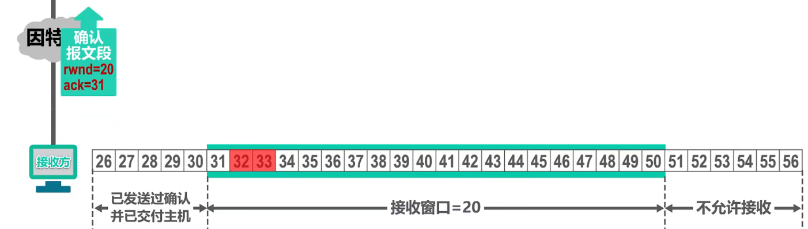

# 传输层

传输层为应用层提供了两种不同的传输协议，面向连接的 `TCP` 和 无连接的 `UDP`。

传输层使用端口号来区分应用层不同的应用进程，端口号使用 `16` 比特表示，取值范围为 `0~65535`。

- 熟知端口号: `0~1023`，例如: `FTP-21/20`，`HTTP-80`，`DNS-53`
- 登记端口号: `1024~49151`，为没有熟知端口号的应用程序使用，使用这类端口号必按照规定的手续等级，以防重复
- 短暂端口号: `49152~65535`，留给客户进程选择暂时使用

端口号只具有本地意义。

## 发送方的复用和接收方的分用

## 熟知端口号

## `UDP` 和 `TCP` 的对比

|UDP|TCP|
|-|-|
|无连接|面向连接|
|支持一对一、一对多、多对一和多对多交互通信|只能是一对一通信|
|对应用层交付的报文直接打包|面向字节流|
|不可靠、无流量控制和拥塞控制|可靠、使用流量控制和拥塞控制|
|首部开销小，仅8字节|首部最小 20 字节，最大 60 字节|

## `TCP` 流量控制

如果数据发送过快，接收方可能来不及接收，会造成数据的丢失。

流量控制就是让发送方的发送速率不要太快，接收方来得及接收，利用**滑动窗口**机制可以在 TCP 连接上实现对发送方的流量控制。

举例:

假设主机 `A` 发送的每个 `TCP` 数据报文段可携带 `100字节` 数据，主机 `A` 和 `B` 建立 `TCP` 连接时，`B` 告诉 `A` 接收窗口为 `400`，主机 `A` 将自己的发送窗口也设置为 `400`，主机 `A` 可将落入发送窗口中的全部数据发送出去。

主机 `A` 收到累积确认后，滑动窗口向前滑动，使已发送并收到确认的数据序号移出发送窗口，由于主机 `B` 在该累计确认中调整接收窗口为 `300`，主机 `A` 将自己的发送窗口调整为 `300`

当前，主机 `A` 发送窗口内的序号为 `201~500`，主机 `A` 还可以发送这 `300` 字节，其中 `201~300` 号字节是已发送的数据，若重传计时器超时，它们会被重传。主机 `A` 可将发送缓存中序号 `1~200` 的字节数据删除。`301~400` 号字节以及 `401~500` 号字节还未被发送，可被分别封装在 `TCP` 报文段中发送，此时，发送窗口内的数据全部发送出去了，不能发送新数据了。

此时，`201~300` 这 `100` 个字节数据的触发了超时重传，主机 `A` 将它们重新封装成一个 `TCP` 报文段发送出去，但不能发送新数据，主机 `B` 收到该重传的报文段后，对主机 `A` 发送的 `501` 号以前的数据累计确认，并将接收窗口调整为 `100`。

此时，滑动窗口向前滑动，使已发送并收到确认的数据序号移出发送窗口，主机 `A` 的发送窗口也调整为 `100`，可将发送缓存中数据全部删除了。

发送 `501~600`，此时不能在发送新数据了，主机 `B` 进行确认，窗口调整为 `0`。主机 `A` 收到累计确认后，滑动窗口前移，发送窗口调整为 `0`，不能再发送一般的 `TCP` 报文段，删除发送缓存中数据。

一段时间后，主机 `B` 的接收缓存又有一些存储空间，主机 `B` 调整接收窗口为 `300`，但是改报文段丢失，有可能造成死锁。

`TCP` 为每个连接设有一个持续计时器，只要 `TCP` 连接的一方收到对方的零窗口通知，启动持续计时器，若超时，发送一个零窗口探测报文，携带一字节数据，对方收到后，给出自己的现在的接收窗口值，若仍然是 `0`，重启持续计时器，如果不是 `0`，打破死锁。

注: 即使接收窗口为 0，也必须接受零窗口探测报文段、确认报文段、携带紧急数据的报文段，零窗口探测报文段也有重传计时器，防止丢失。

## `TCP` 拥塞控制

在某段时间，若对网络中某一资源的需求超过该资源的需求超过了该资源所能提供的可用部分，网络性能就要变坏，这种情况就叫拥塞。

假定如下条件:
- 数据是单方向传送，另一个方向只确认传送
- 接收方总是有足够大的缓存空间，发送方发送窗口大小由拥塞程度确认
- 以最大报文段 `MSS` 的个数为讨论问题的单位，而不是以字节为单位

### 慢开始

最初的 `TCP` 在连接建立成功后会向网络中发送大量的数据包，这样很容易导致网络中路由器缓存空间耗尽，从而发生拥塞。因此新建立的连接不能够一开始就大量发送数据包，而只能根据网络情况逐步增加每次发送的数据量，以避免上述现象的发生。

具体来说，当新建连接时，`cwnd` 初始化为 `1` 个报文段（`MSS`）大小，发送端开始按照拥塞窗口大小发送数据，每当有一个报文段被确认，`cwnd` 就增加 `1` 倍。这样 `cwnd` 的值就随着网络往返时间 `RTT` 呈指数级增长。

### 拥塞避免

拥塞避免是在慢开始的基础上，由于慢开始到后面数据传输量依然很大，增长非常快，网络拥塞概率增高，故设置一个门限 `ssthresh`。当 `cwnd > ssthresh` 时，每个轮次结束都让 `cwnd` 增加一个，而不是一倍，增加的更加缓慢。

不论是慢开始还是拥塞避免只要网络出现拥塞（触发超时重传）时，就把 `ssthresh` 的值置为出现拥塞时的**拥塞窗口**的一半，以及 `cwnd` 置为 `1`，进行慢开始。

### 快重传

有时，个别报文段丢失但实际网络并未发送拥塞，错误地启动了慢开始，降低了传输效率，可以采用快重传算法。

快重传算法就是使发送方尽快进行重传，而不是等超时重传计时器超时再重传，可以让发送方尽早知道发生了个别报文段的丢失。

- 要求接收方不要等待自己发送数据时才进行捎带确认，而是要立即发送确认
- 即使收到了失序的报文段也要立即发出对已经收到的报文段的重复确认
- 发送方接收到三个重复确认就立即重传对方尚未收到的报文段，而不是等待超时重传。
- 使用快重传可以使网络的吞吐量提高约 `20%`

### 快恢复

发送方一旦收到三个重复确认，就知道现在只是丢失个别的报文段，于是不启动慢开始，而执行快恢复。

慢开始门限 `ssthresh` 减半，然后 拥塞窗口 `cwnd` 设置为 `ssthresh` 减半后的数值，执行拥塞避免算法。

也有的快恢复是把快恢复开始时的拥塞窗口 `cwnd` 值再增大一些，即等于新的 `ssthresh + 3`。因为收到了三个重复确认，就表明三个数据报文离开了网络不在消耗网络资源，即网络中不是堆积了报文而是减少了三个报文，因此可以适当扩大拥塞窗口。

## `TCP` 超时重传时间的选择

超时重传时间小于 `RTT` 的一半:

超时重传时间远远大于 `RTT`:

超时重传时间 `RTO` 应该略大于往返时间 `RTT`:

但是，每个报文段的 `RTT` 时间不确定:

`RFC6298` 建议使用如下公式计算:

但是 `RTT` 的测量比较复杂:

针对出现超时重传时无法测准往返时间 `RTT` 的问题，`Karn` 提出了一个算法: 在计算加权平均往返时间 `RTTs` 时，只要报文段重传了，就不采用其往返时间 `RTT` 样本。也就是出现重传时，不重新计算 `RTTs`，进而超时重传时间 `RTO` 也不会重新计算。

这又引起了新的问题。假设报文段的时延突然增大了很多，并且之后很长一段时间都会保持这种时延。因此在原来得出的重传时间内，不会收到确认报文段。于是就重传报文段。但根据 `Karn` 算法，不考虑重传的报文段的往返时间样本。这样，超时重传时间就无法更新。这会导致报文段反复被重传。

因此，要对 `Karn` 算法进行修正。方法是: 报文段每重传一次，就把超时重传时间 `RTO` 增大一些。典型的做法是将新RTO的值取为旧 `RTO` 值的 `2` 倍。

## `TCP` 可靠传输的实现

`TCP` 基于以字节为单位的滑动窗口来实现可靠传输

假设发送方发送窗口大小为 `20`:

发送方发送字节 `31~41` 号

接收方收到字节 `32~33` 号

但是 `31` 号字节还未到达，接收方发送确认报文段只能是 `31`:

此时，接收方收到 `31` 号字节:

接收方发送确认 `34` 号字节，滑动窗口前移:

接收方收到 `37`、`38`、`39` 号字节，但是是未按序到达，只能暂存:

确认报文到达发送方，滑动窗口移动，有新序号落入发送窗口:

可从缓存中删除 `31~33`，可封装到几个报文段中发送 `42~53`:

如果发送方此时一直没收到确认，则会触发超时重传

- 虽然发送方的发送窗口是根据接收方的接收窗口设置的，但在同一时刻，发送方的发送窗口并不总是和接收方的接收窗口一样大
  - 网络传送窗口值需要经历一定的时间滞后，并且这个时间还是不确定的
  - 发送方还可能根据网络当时的拥塞情况适当减小自己的发送窗口尺寸
- 对于不按序到达的数据应如何处理，`TCP` 并无明确规定
  - 如果接收方把不按序到达的数据一律丢弃，那么接收窗口的管理将会比较简单，但这样做对网络资源的利用不利因为发送方会重复传送较多的数据
  - `TCP` 通常对不按序到达的数据是先临时存放在接收窗口中，等到字节流中所缺少的字节收到后，再按序交付上层的应用进程

- `TCP` 要求接收方必须有累积确认和捎带确认机制，这样可以减小传输开销。接收方可以在合适的时候发送确认，也可以在自己有数据要发送时把确认信息顺便带上
  - 接收方不应过分推迟发送确认，否则会导致发送方不必要的超时重传，这反而浪费了网络的资源。`TCP` 标准规定，确认推迟的时间不应超过 `0.5` 秒。若收到一连串具有最大长度的报文段，则必须每隔一个报文段就发送一个确认。
  - 捎带确认实际上并不经常发生，因为大多数应用程序很少同时在两个方向上发送数据。
- `TCP` 的通信是全双工通信。通信中的每一方都在发送和接收报文段，因此，每一方都有自己的发送窗口和接收窗口。在谈到这些窗口时，一定要弄清楚是哪一方的窗口。

## `TCP` 传输管理

### `TCP` 连接的建立

- `TCP` 的连接建立要解决以下三个问题:
  - 使 `TCP` 双方能够确知对方的存在
  - 使 `TCP` 双方能够协商一些参数（如最大窗口值、是否使用窗口扩大选项和时间戳选项以及服务质量等）
  - 使 `TCP` 双方能够对运输实体资源（如缓存大小、连接表中的项目等）进行分配

### `TCP` 三报文握手建立连接:

为什么需要三次握手？两次握手可以吗？

### `TCP` 的连接释放

为什么需要等待 `2MSL`？

### `TCP` 保活计时器

- `TCP` 服务器进程每收到一次 `TCP` 客户进程的数据，就重新设置并启动保活计时器（`2`小时定时）。

若保活计时器定时周期内未收到 `TCP` 客户进程发来的数据，则当保活计时器到时后，`TCP` 服务器进程就向 `TCP` 客户进程发送一个探测报文段，以后则每隔75秒钟发送一次。若一连发送 `10` 个探测报文段后仍无 `TCP` 客户进程的响应，`TCP` 服务器进程就认为 `TCP` 客户进程所在主机出了故障，接着就关闭这个连接。

## `TCP` 报文段的首部格式

- 为了实现可靠传输，`TCP` 采用了面向字节流的方式。
- 但 `TCP` 在发送数据时，是从发送缓存取出一部分或全部字节并给其添加一个首部使之成为 `TCP` 报文段后进行发送
  - 一个 `TCP` 报文段由首部和数据载荷两部分构成
  - `TCP` 的全部功能都体现在它首部中各字段的作用

在 `TCP` 协议字段有:
- 源端口: 占 `16` 比特
  - 写入源端口号，用来标识发送该 `TCP` 报文段的应用进程
- 目的端口: 占 `16` 比特
  - 写入目的端口号，用来标识接收该 `TCP` 报文段的应用进程
- 序号: 占 `32` 比特，取值范围为 `[0, 2^32 -1]`
  - 由于 `TCP` 是面向字节流的，在一个 `TCP` 连接中传送的字节流中的每一个字节都按顺序编号
  - 首部中的序号字段则是指本报文段所发送的数据的第一个字节的序号，整个要传送的字节流的起始序号必须在连接建立时设置
  - 序号是循环使用的，当序号增加到最大值时，下一个序号就又回到了 `0`
- 确认号: 占 `32` 比特，取值范围为 `[0, 2^32 -1]`
  - 表示期望收到对方下一个报文段的第一个数据字节的序号，同时也是对之前所有收到的数据的确认
  - 当确认号增加到最大值时，下一个确认号就又回到了 `0`
- 数据偏移: 占 `4` 比特，并以 `4` 字节为单位
  - 用来指出 `TCP` 报文段的数据载荷部分的起始处距离 `TCP` 报文段的起始处有多远，实际上是指出了 `TCP` 报文段的首部长度
  - 首部固定长度为 `20` 字节，因此数据偏移字段的最小值为`(0101)2`
  - 首部最大长度为 `60` 字节，因此数据偏移字段的最大值为`(1111)2`
- 标志位:
  - `URG:` 该位设为 `1`，表示包中有需要紧急处理的数据，对于需要紧急处理的数据，与后面的紧急指针有关
  - `ACK`: 该位设为 `1`，确认应答的字段有效，`TCP` 规定除了最初建立连接时的 `SYN` 之外该位必须设为 `1`
  - `PSH`: 该位设为 `1`，表示需要将收到的数据立刻传给上层应用协议，若设为 `0`，则先将数据进行缓存
  - `RST`: 该位设为 `1`，表示 `TCP` 连接出现异常必须强制断开连接再重新建立连接，还用来拒绝一个非法的报文段或拒接打开一个 `TCP` 连接；
  - `SYN`: 用于建立连接，该位设为 `1`，表示希望建立连接，并在其序列号的字段进行序列号初值设定
  - `FIN`: 该位设为 `1`，表示今后不再有数据发送，希望断开连接。
- 保留: 占 `6` 比特，保留为今后使用，目前应置为 `0`
- 窗口: 该字段长 `16` 比特，以字节为单位
  - 指出发送本报文段的一方的接收窗口
  - 窗口值作为接受方让发送方设置其发送窗口的依据
  - 这是以接收方的接收能力来控制发送方的发送能力，称为流量控制（取决于拥塞窗口和接收窗口的最小值）
- 校验和: 占 `16` 比特
  - 检查范围包括 `TCP` 报文段的首部和数据载荷两部分，
  - 在计算校验和时，要在 `TCP` 报文段的前面加上 `12` 字节的伪首部
- 紧急指针 占 `16` 比特，以字节为单位
  - 用来指明紧急数据的长度
  - 当发送方有紧急数据时，可将紧急数据插队到发送缓存的最前面并立即封装到一个 `TCP` 报文段发送，紧急指针会指出本报文段数据载荷部分包含了多长的紧急数据，紧急数据之后是普通数据
- 选项: 长度可变，目前有以下选项:
  - 最大报文段长度 `MSS` 选项: `TCP` 报文段数据载荷部分的最大长度
  - 窗口扩大选项: 为了扩大窗口（提高吞吐率）
  - 时间戳选项:
    -  用来计算往返时间 `RTT`
    - 用于处理序号超范围的情况，又称为防止序号绕回 `PAWS`
  - 选择确认选项
- 填充: 长度可变
  - 由于选项的长度可变，因此使用填充来确保报文段首部能被 `4` 整除（因为数据偏移字段，也就是首部长度字段，是以 `4` 字节为单位的）。