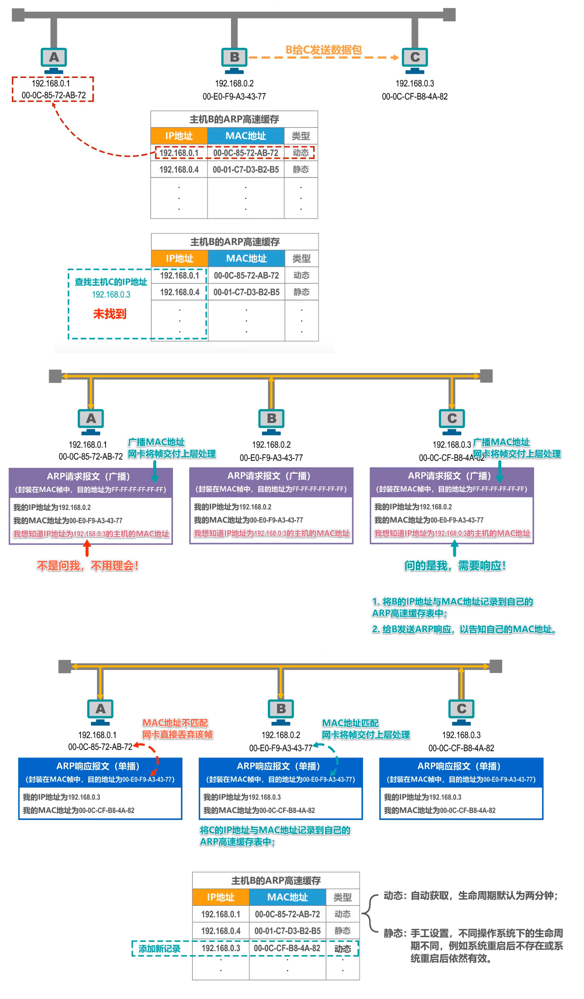

# 数据链路层

- 链路就是从一个结点到相邻结点的一段物理线路，而中间没有任何其他的交换结点
- 数据链路是指把实现通信协议的硬件和软件加到链路上，就构成了数据链路
- 数据链路层以帧为单位传输和处理数据

数据链路层的三个重要问题:

- 封装成帧
  - 对网络层交付的数据协议单元添加帧头和帧尾
  - 
- 差错检测
  - 发送方在发送帧之前，基于待发送的数据和检错算法计算出检错码，并将其封装在帧尾
  - 
  - 接收方主机收到帧后，通过检错码和检错算法可以判断出帧在传输过程中是否出现了误码
  - 
- 可靠传输
  - 接收方收到有误码的帧后，将其丢弃
  - 如果数据链路层向上层提供不可靠服务，直接丢弃
  - 如果数据链路层向上层提供可靠服务，需要保证可以重新收到被丢弃的这个帧的正确副本

以上使用点对点信道的数据链路层举例的，对于广播信道的数据链路层，除了上面三个问题外，还需要解决其他的一些问题。

## 封装成帧

封装成帧是指数据链路层给上层交付的协议数据单元添加帧头和帧尾使之成为帧
- 帧头和帧尾中包含有重要的控制信息
  - 
- 帧头和帧尾的作用之一就是帧定界
  - 
- 并不是每一种数据链路层协议的帧都包含帧定界标志
  - `MAC` 帧在物理层添加 `8` 字节的前导码
    - 
    - 前同步码，使接收方的时钟同步
    - 帧开始定界符，表面其后紧接着的就是 `MAC` 帧
    - 以太网规定了帧间间隔时间为 `96` 比特的发送时间，`MAC` 帧不需要帧结束定界符
      - 

透明传输是指数据链路层对上层交付的传输数据没有任何限制，就好像数据链路层不存在一样:
- 面向字节的物理链路使用字节填充（或称字符填充）的方法实现透明传输
- 面向比特的物理链路使用比特填充的方法实现透明传输

面向字节的物理链路:

帧定界标志是一个特定数值，如果上层交付的协议数据单元中，恰好也包含了这个特定数值，接收方不能正确接收该帧。也就是说，数据链路层对上层交付的协议数据单元有限制，其内容不能包含帧定界符。

插入转义字符:

但是如果上层交付给数据链路层的协议数据单元中既包含帧界定符，又包含转义字符时，对转义字符前也要插入转义字符:

转义字符是一种特殊的控制字符，长度为 `1` 字节，十进制值为 `27`。

面向比特的物理链路:

每 `5` 个连续比特 `1` 后面插入一个比特 `0`，确保了帧定界在整个帧中的唯一性，接收方将帧的数据部分中每 `5` 个连续比特 `1` 后面那个比特 `0` 剔除即可:

此外，为了提高帧的传输效率，应当使帧的数据部分的长度尽可能大些。同时，考虑到差错控制等多种因素，每一种数据链路层协议都规定了帧的数据部分的长度上限，即最大传送单元 `MTU`（`Maximum Transfer Unit`）。

## 差错检测

实际的通信链路都不是理想的，比特在传输过程中可能会产生差错: `1` 可能会变成 `0`，`0` 也可能变成 `1`。这称为比特差错。

在一段时间内，传输错误的比特占所传输比特总数的比率称为误码率 `BER`。

使用差错检测码来检测数据在传输过程中是否产生了比特差错，是数据链路层所要解决的重要问题之一。

### 奇偶效验

在待发送的数据后面添加 `1` 位奇偶校验位，使整个数据（包括所添加的校验位在内）中 `1` 的个数为奇数（奇校验）或偶数（偶校验）。

- 如果有奇数个位发生误码，则奇偶性发生变化，可以检查出误码
- 如果有偶数个位发生误码，则奇偶性不发生变化，不能检查出误

数据链路层一般不会使用这种方法。

### 循环冗余校验 `CRC`

- 收发双方约定好一个生成多项式 `G(x)`
- 发送方基于待发送的数据和生成多项式计算出差错检测码，将其添加到待传输数据的后面一起传输
- 接收方通过生成多项式来计算收到的数据是否产生了误码

生成多项式举例:

常用的生成多项式:

待发送信息为 `101001`，生成多项式为 `G(X) = x^3 + x^2 + 1`，计算余数:

接收到的信息为 `101101001`，生成多项式为` G(x) = x^3 + x^2 + 1`，判断传输是否误码:

检错码只能检测出帧在传输过程中出现了差错，但并不能定位错误，因此无法纠正错误。

要想纠正传输中的差错，可以使用冗余信息更多的纠错码进行前向纠错。但纠错码的开销
比较大，在计算机网络中较少使用。

循环冗余校验 `CRC` 有很好的检错能力，虽然计算比较复杂，但非常易于用硬件实现，因此被广泛应用于数据链路层。

在计算机网络中通常采用检错重传方式来纠正传输中的差错，或者仅仅是丢弃检测到差错的帧，这取决于数据链路层向其上层提供的是可靠传输服务还是不可靠传输服务。

## 可靠传输

使用差错检测技术（例如循环冗余校验 `CRC`），接收方的数据链路层就可检测出帧在传输过程中是否产生了误码（比特错误）。

数据链路层向上层提供的服务类型:
- 不可靠传输服务: 仅仅丢弃有误码的帧，其他什么也不做
- 可靠传输服务: 想办法实现发送端发送什么，接收端就收到什么

- 般情况下，有线链路的误码率比较低，为了减小开销，并不要求数据链路层向上提供可靠传输服务。即使出现了误码，可靠传输的问题由其上层处理
- 无线链路易受干扰，误码率比较高，因此要求数据链路层必须向上层提供可靠传输服务

比特差错只是传输差错中的一种。从整个计算机网络体系结构来看，传输差错还包括分组丢失、分组失序以及分组重复。

分组丢失、分组失序以及分组重复这些传输差错，一般不会出现在数据链路层，而会出现在其上层。可靠传输服务并不仅局限于数据链路层，其他各层均可选择实现可靠传输。

可靠传输的实现比较复杂，开销也比较大，是否使用可靠传输取决于应用需求。

可靠传输的实现协议:
- 停止-等待协议 `SW`
- 回退 `N` 帧协议 `GBN`
- 选择重传协议 `SR`

这三种可靠传输实现机制的基本原理并不仅限于数据链路层，可以应用到计算机网络体系结构的各层协议中。

### 停止-等待协议 `SW`

接收方收不到数据分组，就不会发送 `ACK` 或 `NAK`。如果不采取其他措施，发送方就会一直处于等待接收方 `ACK` 或 `NAK` 的状态。

为解决该问题，可以在发送方发送完一个数据分组时，启动一个超时计时器。若到了超时计时器所设置的重传时间而发送方仍收不到接收方的任何 `ACK` 或 `NAK`，则重传原来的数据分组，这就叫做超时重传。

一般可将重传时间选为略大于从发送方到接收方的平均往返时间。

接收方发送的确认或否认分组也有可能丢失。为避免分组重复这种传输错误，必须给每个分组带上序号。

对于停止-等待协议，由于每发送一个数据分组就停止等待，只要保证每发送一个新的数据分组，其发送序号与上次发送的数据分组的序号不同就可以了，因此用一个比特来编号就够了。

确认分组也需要编号。

注意事项:
- 接收端检测到数据分组有误码时，将其丢弃并等待发送方的超时重传。但对于误码率较高的点对点链路，为使发送方尽早重传，也可给发送方发送 `NAK` 分组
- 为了让接收方能够判断所收到的数据分组是否是重复的，需要给数据分组编号。由于停止-等待协议的停等特性，只需 `1` 个比特编号就够了，即编号 `0` 和 `1`
- 为了让发送方能够判断所收到的 `ACK` 分组是否是重复的，需要给 `ACK` 分组编号，所用比特数量与数据分组编号所用比特数量一样。数据链路层一般不会出现 `ACK` 分组迟到的情况，因此在数据链路层实现停止-等待协议可以不用给 `ACK` 分组编号
- 超时计时器设置的重传时间应仔细选择。一般可将重传时间选为略大于从发送方到接收方的平均往返时间
  - 在数据链路层点对点的往返时间比较确定，重传时间比较好设定
  - 然而在运输层，由于端到端往返时间非常不确定，设置合适的重传时间有时并不容易

停止等待协议的信道利用率:

当往返时延 `RTT` 远大于数据帧发送时延 `TD` 时，信道利用率非常低。

若出现重传，则对于传送有用的数据信息来说，信道利用率还要降低。

为了克服停止-等待协议信道利用率很低的缺点，就产生了另外两种协议，即回退 `N` 帧协议 `GBN` 和选择重传协议 `SR`。

### 回退 `N` 帧协议 `GBN` 

该协议在流水线传输的基础上，利用发送窗口来限制发送方可连续发送数据分组的个数。

无差错情况:

累计确认:

接收方不一定要对收到的数据分组逐个发送确认，而是可以在收到几个数据分组后（由具体实现决定）对按序到达的最后一个数据分组发送确认。`ACKn` 表示序号为 `n` 及以前的所有数据分组都已正确接收。

即使确认分组丢失，发送方也可能不必重传。

有差错情况:

若 `Wr` 超过取值范围，例如 `Wr=8`，会出现什么情况？

总结:

### 选择重传协议 `SR`

回退 `N` 帧协议的接收窗口尺寸 `WR` 只能等于 `1`，因此接收方只能按序接收正确到达的数据分组。

一个数据分组的误码就会导致其后续多个数据分组不能被接收方按序接收而丢弃（尽管它们无乱序和误码）。这必然会造成发送方对这些数据分组的超时重传，显然这是对通信资源的极大浪费。

为了进一步提高性能，可设法只重传出现误码的数据分组。因此，接收窗口的尺寸 `WR` 不应再等于 `1`，以便接收方先收下失序到达但无误码并且序号落在接收窗口内的那些数据分组，等到所缺分组收齐后再一并送交上层。这就是选择重传协议。

注意:选择重传协议为了使发送方仅重传出现差错的分组，接收方不能再采用累积确认，而需要对每个正确接收到的数据分组进行逐一确认!

发送方的发送窗口尺寸 `WT` 必须满足: `1 < WT <= 2^(n-1)`，其中 `n` 是构成分组序号的比特数量
- 若 `WT = 1`: 与停止-等待协议相同
- 若 `WT > 2^(n-1)`: 造成接收方无法分辨新、旧数据分组的问题

接收方的接收窗口尺寸 `WR` 必须满足: `1 < WR <= WT`
- 若 `WR = 1`: 与回退 `N` 帧协议相同
- 若 `WR > WT`: 无意义

总结:

## 点对点协议 `PPP`

点对点协议 `PPP` 是目前使用最广泛的点对点数据链路层协议。

`PPP` 协议为在点对点链路传输各种协议数据报提供了一个标准方法，主要由以下三部分构成:
- 对各种协议数据报的封装方法（封装成帧）
- 链路控制协议 `LCP`，用于建立、配置以及测试数据链路的连接
- 一套网络控制协议 `NCPs`，其中的每一个协议支持不同的网络层协议

### 帧格式

- 标志（`Flag`）字段: `PPP` 帧的定界符，取值为 `0x7E`
- 地址（`Address`）字段: 取值为 `0xFF`，预留（目前没有什么作用）
- 控制（`Control`）字段: 取值为 `0x03`，预留（目前没有什么作用）
- 协议（`Protocol`）字段指明帧的数据部分送交哪个协议处理
  - 取值 `0x0021` 表示: 帧的数据部分为 `IP` 数据报
  - 取值 `0xC021` 表示: 帧的数据部分为 `LCP` 分组
  - 取值 `0x8021` 表示: 帧的数据部分为 `NCP` 分组
- 帧检验序列（`Frame Chneck Sequence`）字段: `CRC` 计算出的校验位

### 透明传输

字节填充法:

发送方的处理:
- 出现的每一个`7E`（`PPP` 帧的定界符）字节转变成 `2` 字节序列（`7D`, `5E`）
- 出现的每一个`7D`（转义字符）字节转变成 `2` 字节序列（`7D`, `5D`）
- 出现的每一个 `ASCII` 码控制字符（数值小于 `0x20` 的字符），则在该字符前面插入一个 `7D` 字节，同时将该字符的编码加上 `0x20`

接收方的处理: 进行反变换即可恢复出原来的帧的数据部分。

比特填充法:

发送方的处理:
- 对帧的数据部分进行扫描（一般由硬件实现）。只要发现 `5` 个连续的比特 `1`，则立即填充 `1` 个比特 `0`

接收方的处理:
- 对帧的数据部分进行扫描（一般由硬件实现）。只要发现 `5` 个连续的比特 `1`，就把其后的 `1` 个比特 `0` 删除

### 差错检测

### 工作状态

## 媒体接入控制

共享信道要着重考虑的一个问题就是如何协调多个发送和接收站点对一个共享传输媒体的占用，即媒体接入控制 `MAC`。

随着技术的发展，交换技术的成熟和成本的降低，具有更高性能的使用点对点链路和链路层交换机的交换式局域网在有线领域已完全取代了共享式局域网，但由于无线信道的广播天性，无线局域网仍然使用的是共享媒体技术。

### 静态划分信道

信道复用:
- 复用是通信技术中的一个重要概念。复用就是通过一条物理线路同时传输多路用户的信号
- 当网络中传输媒体的传输容量大于多条单一信道传输的总通信量时，可利用复用技术在一条物理线路上建立多条通信信道来充分利用传输媒体的带宽

- 频分复用 `FDM`
  - 
- 时分复用 `TDM`
  - 
- 波分复用 `WDM`
  - 
- 码分复用 `CDM`
  - 与 `FDM` 和 `TDM` 不同，`CDM` 的每一个用户可以在同样的时间使用同样的频带进行通信
  - 由于各用户使用经过特殊挑选的不同码型，因此各用户之间不会造成干扰
  - 在 `CDMA` 中， 每一个比特时间再划分为 `m` 个短的间隔， 称为码片。通常 `m` 的值是 `64` 或 `128`
  - 使用 `CDMA` 的每一个站被指派一个唯一的 `m` 比特的码片序列
    - 一个站如果要发送比特 `1`，则发送它自己的 `m` 比特码片序列
    - 一个站如果要发送比特 `0`， 则发送它自己的 `m` 比特码片序列的二进制反码
  - 码片序列的挑选原则如下：
    - 分配给每个站的码片序列必须各不相同，实际常采用伪随机码序列
    - 分配给每个站的码片序列必须相互正交
    - 

码分复用 `CDM` 是另一种共享信道的方法。实际上，由于该技术主要用于多址接入，人们更常用的名词是码分多址 `CDMA`。同理，频分复用 `FDM` 和时分复用 `TDM` 同样可用于多址接入，相应的名词是频分多址 `FDMA` 和时分多址 `TDMA`。

- 复用是将单一媒体的频带资源划分成很多子信道，这些子信道之间相互独立，互不干扰。从媒体的整体频带资源上看，每个子信道只占用该媒体频带资源的一部分。
- 多址（更确切地应该称为多点接入）处理的是动态分配信道给用户。这在用户仅仅暂时性地占用信道的应用中是必须的，而所有的移动通信系统基本上都属于这种情况。相反，在信道永久性地分配给用户的应用中，多址是不需要的（对于无线广播或电视广播站就是这样）。
- 某种程度上，`FDMA`、`TDMA`、`CDMA` 可以分别看成是 `FDM`、`TDM`、`CDM` 的应用。

### 动态接入控制

#### 载波监听多址接入/碰撞检测 `CSMA/CD`

争用期:

最小帧长:

最大帧长:

截断二进制指数退避算法:

信道利用率:

帧发送流程图:

帧接收流程图:

#### 载波监听多址接入/碰撞避免` CSMA/CA`

帧间间隔 `IFS`:

工作原理:

- 源站为什么在检测到信道空闲后还要再等待一段时间 `DIFS`？
  - 考虑到可能有其他的站有高优先级的帧要发送。若有就要让高优先级帧先发送
- 目的站为什么正确接收数据帧后还要等待一段时间 `SIFS` 才能发送 `ACK` 帧？
  - `SIFS` 是最短的帧间间隔， 用来分隔开属于一次对话的各帧。在这段时间内，一个站点应当能够从发送方式切换到接收方式
- 信道由忙转为空闲且经过 `DIFS` 时间后，还要退避一段随机时间才能使用信道？
  - 防止多个站点同时发送数据而产生碰撞。

退避算法:

信道预约和虚拟载波监听:

## `MAC` 地址、`IP` 地址以及 `ARP` 协议

### `MAC` 地址

`MAC` 地址格式:

举例:

单播 `MAC` 地址:

广播 `MAC` 地址:

多播 `MAC` 地址:

### `IP` 地址

从网络体系结构看 `IP` 地址与 `MAC` 地址:

数据包转发过程中 `IP` 地址与 `MAC` 地址变化情况:

对于本例，主机 `H1`、路由器 `R1` 和 `R2` 都存在一个共同的问题: 知道 `IP` 地址，不知道其相应的 `MAC` 地址。

### `ARP` 协议

`ARP` 高速缓存表:

## 集线器和交换机的区别

### 集线器

使用集线器在物理层扩展以太网:

### 交换机

对比:

### 以太网交换机自学习和转发帧

### 以太网交换机的生成树协议 `STP`

## 虚拟局域网 `VLAN` 概述

## 虚拟局域网 `VLAN` 实现

### `IEEE 802.1Q` 帧

### 交换机的端口类型

