# 物理层

物理层考虑的是怎样才能在连接各种计算机的传输媒体上传输数据比特流。

物理层为数据链路层屏蔽了各种传输媒体的差异，使数据链路层只需要考虑如何完成本层的协议
和服务，而不必考虑网络具体的传输媒体是什么。

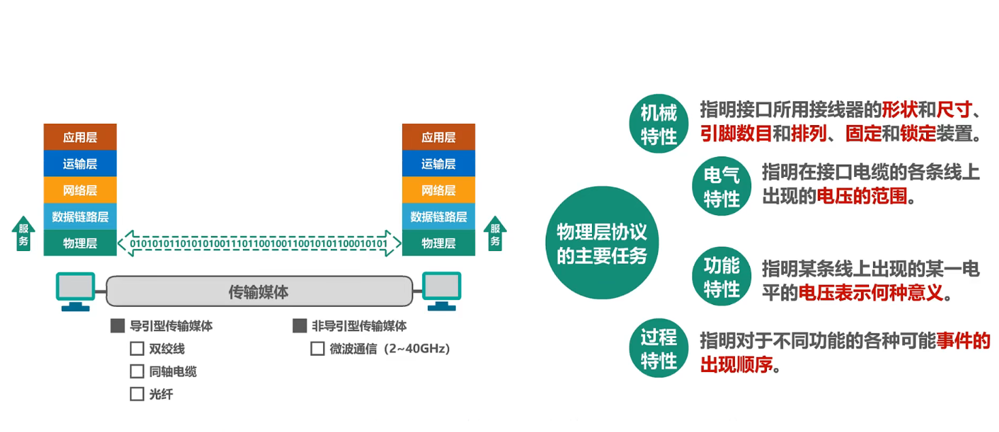

## 物理层下面的传输媒体

传输媒体不属于计算机网络体系结构的任何一层。

|导引型传输媒体|非导引型传输媒体|
|-|-|
|同轴电缆、双绞线、光纤、电力线|无线电波、微波、红外线、可见光|

同轴电缆:

- 基带同轴电缆（`50Ω`）
  - 数字传输，过去用于局域网
- 宽带同轴电缆（`75Ω`）
  - 模拟传输，目前主要用于有线电视

同轴电缆价格较贵且布线不够灵活和方便，随着集线器的出现，在局域网领域基本上都是采用双绞线作为传输媒体。

双绞线:

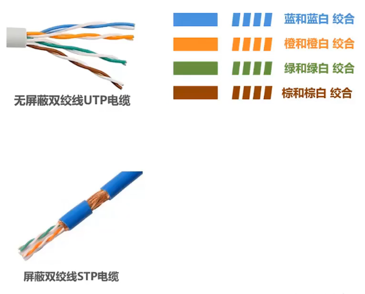

绞合的作用:
- 抵御部分来自外界的电磁波干扰
- 减少相邻导线的电磁干扰

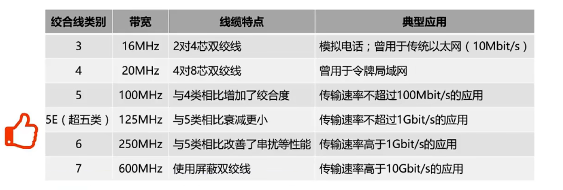

光纤:

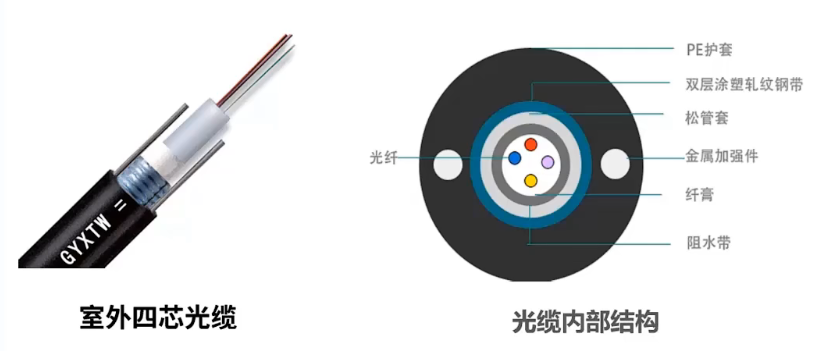

- 纤芯直径:
  - 多模光纤: `50` 微米，`62.5` 微米
  - 单模光纤: `9` 微米
- 包层直径 `125` 微米
- 工作波长:
  - `0.85` 微米（衰减较大）
  - `1.30` 微米（衰减较小）
  - `1.55` 微米（衰减较小）
- 光纤的优点:
  - 通信容量大（`25000~30000GHz` 的带宽）
  - 传输损耗小，远距离传输时更加经济
  - 抗雷电和电磁干扰性能好。这在大电流脉冲干扰的环境下尤为重要
  - 无串音干扰，保密性好，不易被窃听
  - 体积小，重量轻
- 光纤的缺点:
  - 割接需要专用设备
  - 光电接口价格较贵

当光从高折射率的媒体射向低折射率的媒体时，其折射角将大于入射角，因此，如果入射角足够大，就会出现全反射，即光碰到包层时，就会反射回纤芯。

多模光纤:

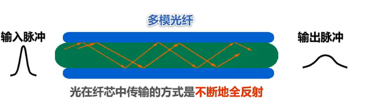

- 由于色散（模式、材料、波导色散）光在多模光纤中传输一定距离后必然产生信号失真（脉冲展宽）
- 因此，多模光纤只适合近距离传输（建筑物内）
- 发送光源: 发光二极管；接收检测: 光电二极管

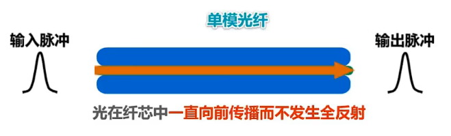

- 没有模式色散，在 `1.31` 微米波长附近材料色散和波导色散大小相等符号相反，两者正好抵消
- 单模光纤适合长距离传输且衰减小，但其制造成本高，对光源要求高
- 发送光源: 激光发生器；接收检测: 激光检波器

电力线:

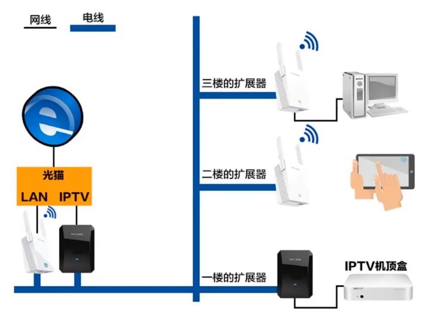

无线电波和微波:

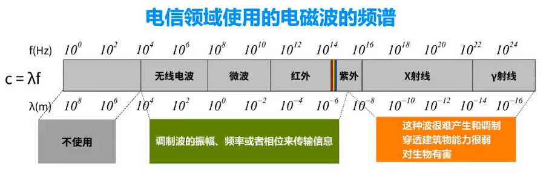

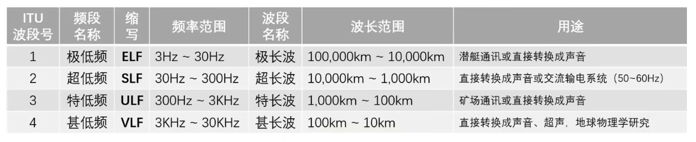

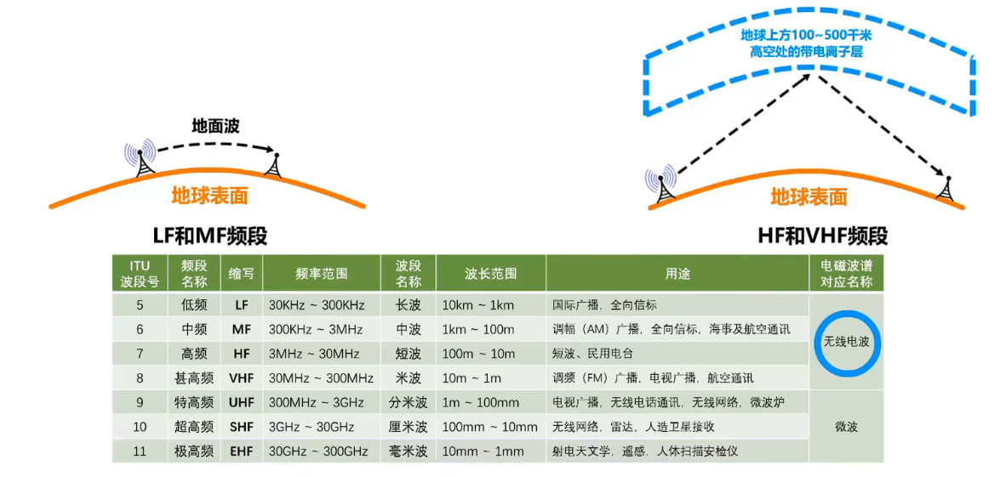

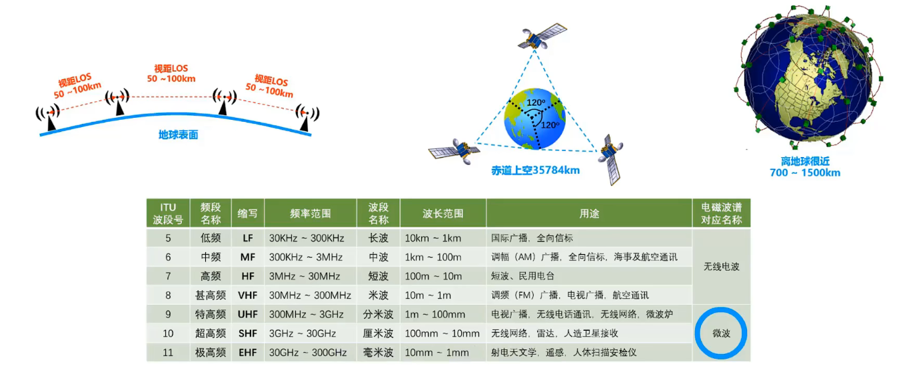

红外线:

- 点对点无线传输
- 直线传输，中间不能有障碍物，传输距离短
- 传输速率低（`4Mb/s`~`16Mb/s`）

可见光:

还处于实验阶段。

## 传输方式

串行传输和并行传输:

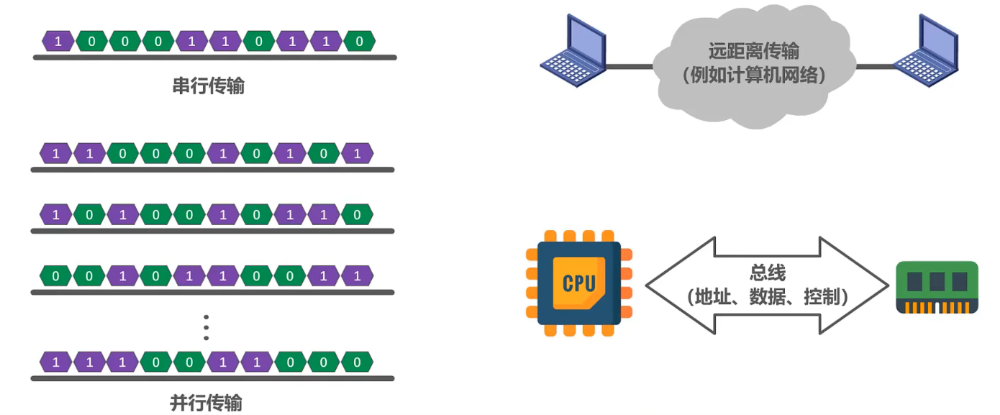

同步传输和异步传输:

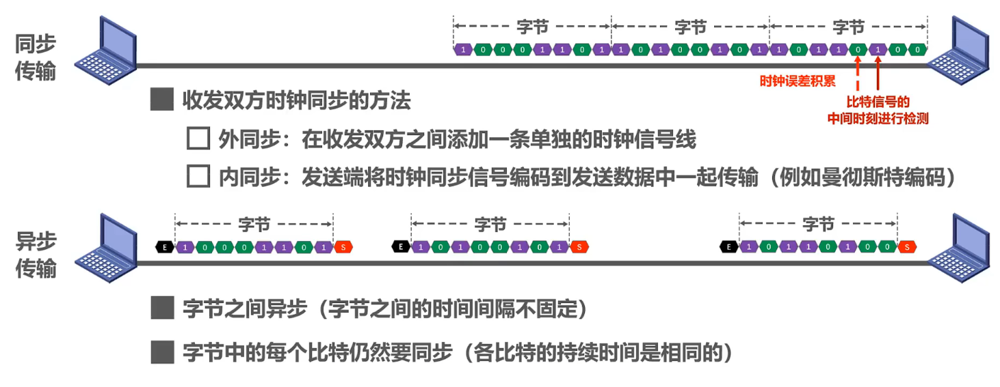

单工、半双工和全双工:

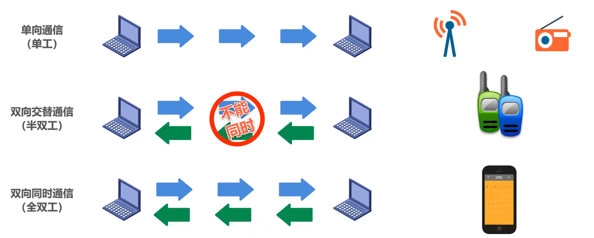

## 编码与调制

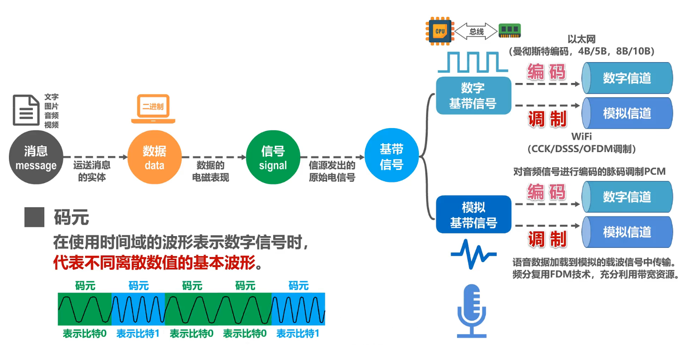

### 常用编码

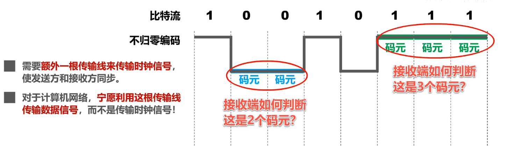

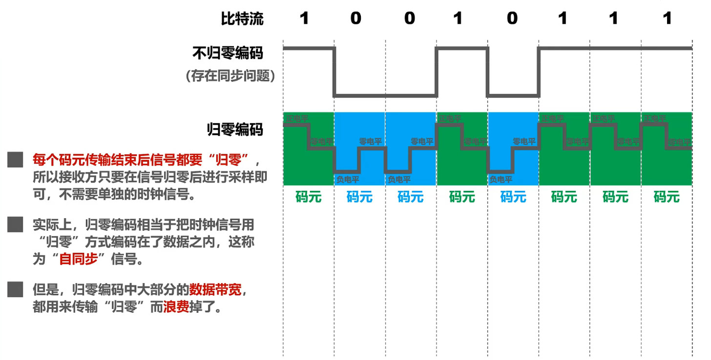

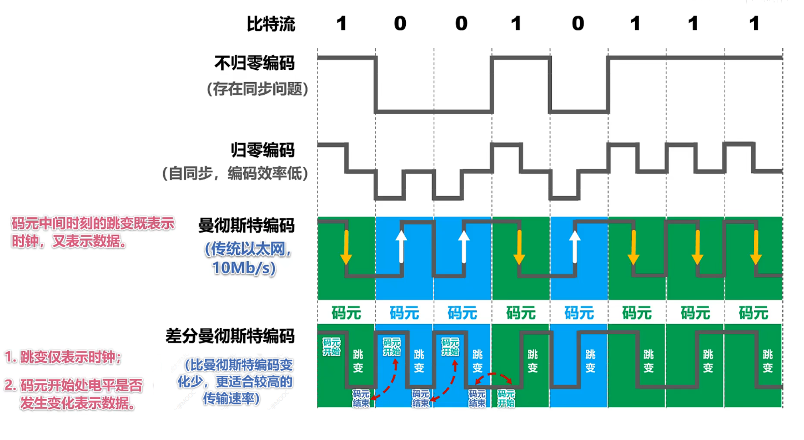

### 基本调制方法

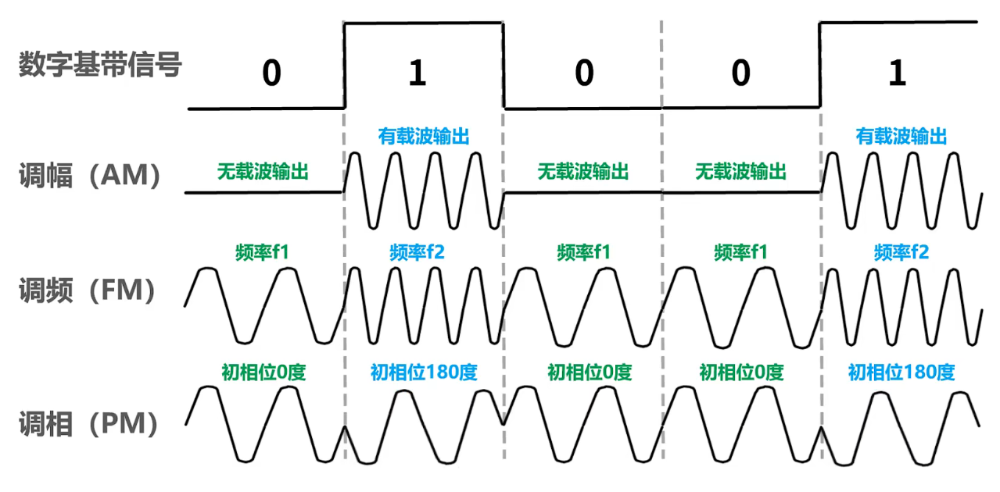

使用基本调制方法，`1` 个码元只能包含 `1` 个比特信息。如何能使 `1` 个码元包含更多的比特呢？

正交振幅调制 `QAM`:

- `QAM-16`
  - `12` 种相位
  - 每种相位有 `1` 或 `2` 种振幅可选
  - 可以调制出 `16` 种码元（波形）
  - 每种码元可以对应表示 `4` 个比特
  - 码元与 `4` 个比特的对应关系采用格雷码
    - 任意两个相邻码元只有 `1` 个比特不同

## 信道极限容量

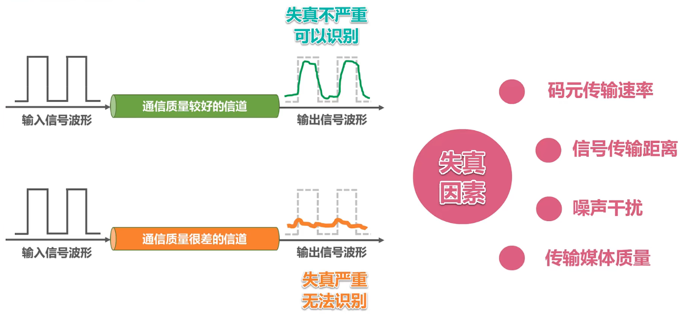

只要采用更好的调制方法，让码元可以携带更多的比特，岂不是可以无限制地提高信息的传输速率？

答案是否定的。因为信道的极限信息传输速率还要受限于实际的信号在信道中传输时的信噪比。

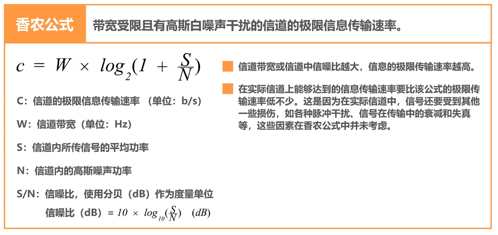

在信道带宽一定的情况下，根据奈氏准则和香农公式，要想提高信息的传输速率就必须采用多元制（更好的调制方法）和努力提高信道中的信噪比。

自从香农公式发表后，各种新的信号处理和调制方法就不断出现，其目的都是为了尽可能地接近香农公式给出的传输速率极限。