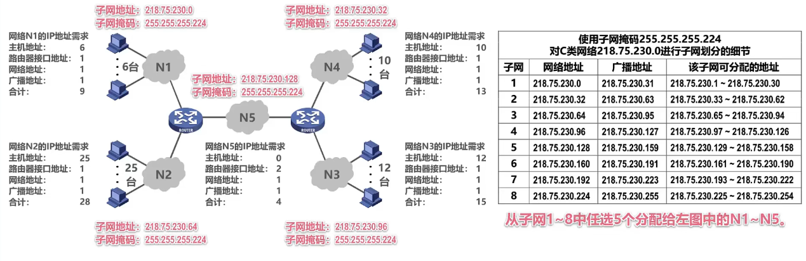

# 网络层

网络层的主要任务是实现网络互连，进而实现数据包在各网络之间的传输

要实现网络层任务，需要解决以下主要问题:
 - 网络层向运输层提供怎样的服务（“可靠传输”还是“不可靠传输”）
 - 网络层寻址问题
 - 路由选择问题

## 网络层提供的两种服务


虚电路服务与数据报服务的比较

|对比方面|虚电路服务|数据报服务|
|-|-|-|
|思路|可靠通信应当由网络来保证|可靠通信应当由用户主机来保证|
|连接的建立|必须建立网络层连接|不需要建立网络层连接|
|终点地址|仅在连接建立阶段使用，每个分组使用短的虚电路号|每个分组都有终点的完整地址|
|分组的转发|属于同一条虚电路的分组均按照同一路由进行转发|每个分组可走不同的路由|
|当结点出故障时|所有通过出故障的结点的虚电路均不能工作|出故障的结点可能会手失分组，一些路由可能会发生变化|
|分组的顺序|总是按发送顺序到达终点|到达终点时不一定按发送顺序|
|服务质量保证|可以将通信资源提前分配给每一个虚电路，容易实现|很难实现|

## `IP` 地址

`IPv4` 地址就是给因特网上的每一台主机（或路由器）的每一个接口分配一个在全世界范围内是唯一的 `32` 比特的标识符。

`32` 比特的 `IPv4` 地址不方便阅读。记录以及输入等，因此 `Pv4` 地址采用点分十进制表示方法以方便用户使用。


## `IPv4` 的编址方法


### 分类编址


- 只有 `A` 类、`B` 类和 `C` 类地址 可分配给网络中的主机或路由器的各接口
- 主机号为“全 `0`”的地址是网络地址，不能分配给主机或路由器的各接口
- 主机号为“全 `1`”的地址是广播地址，不能分配给主机或路由器的各接口

`A` 类地址:


`B` 类地址:


`C` 类地址:


注意:
- 地址 `0.0.0.0 `是一个特殊的 `IPv4` 地址，只能作为源地址使用，表示“在本网络上的本主机”。封装有 `DHCPDiscovery` 报文的 `IP` 分组的源地址使用 `0.0.0.0 `
- 以 `127` 开头且后面三个字节非“全 `0`”或“全 `1`”的 `IP` 地址是一类特殊的 `IPv4` 地址，既可以作为源地址使用，也可以作为目的地址使用，用于本地软件环回测试，例如常用的环回测试地址 `127.0.01`
- 地址 `255.255.255.255` 是一个特殊的 `IPv4` 地址，只能作为目的地址使用，表示只在本网络上进行广播（各路由器均不转发）


### 划分子网

从主机号部分借用一部分作为子网号。

计算机如何知道分类地址中主机号有多少比特被用作子网号？

子网掩码:

`32` 比特的子网掩码可以表明分类 `IP` 地址的主机号部分被借用了几个比特作为子网号:
- 子网掩码使用连续的比特 `1` 来对应网络号和子网号
- 子网掩码使用连续的比特 `0` 来对应主机号
- 将划分子网的 `IPv4` 地址与其相应的子网掩码进行逻辑与运算就可得到 `IPv4` 地址所在子网的网络地址


举例:

网络地址为 `218.75.230.0`，子网掩码为 `255.255.255.192` 对其进行子网划分:


默认子网掩码:

指的是在未划分子网的情况下使用的子网掩码:


### 无分类编址

无分类域间路由选择协议:

- `CIDR` 消除了传统的 `A` 类、`B` 类和 `C` 类地址，以及划分子网的概念
- `CIDR` 可以更加有效地分配 `IPv4` 的地址空间，并且可以在新的 `IPv6` 使用之前允许因特网的规模继续增长

`CIDR` 使用“斜线记法”，或称 `CIDR` 记法。即在 `IPv4` 地址后面加上斜线“/”，在斜线后面写上网络前缀所占的比特数量，例如:


我们只要知道 `CIDR` 地址块中的任何一个地址，就可以知道该地址块的全部细节:
- 地址块的最小地
- 址地址块的最大地址
- 地址块中的地址数量
- 地址块聚合某类网络（`A` 类、`B` 类或 `C` 类）的数量
- 地址掩码（也可继续称为子网掩码）

举例，给出 `128.14.32.7/20` 的全部细节:


聚合 `C` 类网的数量是指: 转化为 `C` 类网络地址的数量有多少个，因为 `C` 类网络的主机号是 `8` 位，剩余的是网络号，所以除去主机号就是能转化的网络数量。

## 路由聚合（构造超网）

举例:


为了减少路由表的占用，将 `5` 条路由记录聚合成 `1` 条:


- 网络前缀越长，地址块越小，路由越具体
- 若路由器查表转发分组时发现有多条路由可选，则选择网络前缀最长的那条，这称为最长前缀匹配，因为这样的路由更具体

## `IPv4` 地址的应用规划


定长的子网掩码:

假设申请到的 `C` 类网络为 `218.75.230.0` 使用定长的子网掩码给下图所示的小型互联网中的各设备分配 `IP` 地址:


需求: 将 `C` 类网络为 `218.75.230.0` 划分成 `5` 个子网，每个子网上可分配的 `IP` 地址数量不得少于各自的需求。


子网划分细节:


定长的子网掩码划分，只能划分出 `2^n` 个子网，n 是从主机号部分借用的用来作为子网号的比特数量，每个子网分配 `IP` 地址数相同，容易造成 `IP` 地址的浪费，例如网络 `N5` 需要 `4` 个 `IP` 地址，但分配了 `32` 个:



变长的子网掩码:

假设申请到的地址块为 `218.75.230.0/24` 使用变长的子网掩码给下图所示的小型互联网中的各设备分配 `IP` 地址:


需求: 从地址块 `218.75.230.0/24` 中取出 `5` 个地址块（`1个/27地址块`，`3个/28地址块`，`1个/30地址块`），按需分配给 `5` 个网络。

在该地址块中给网络 `N1~N5` 分配子块，分配原则是“每个子块的起点位置不能随意选取，只能选取块大小整数倍的地址作为起点”。建议先给大的子块分配。


`VLSM` 是把一个网络分成几个子网（小网络）
`CIDR` 是把几个网络合并成一个网络

## `IP` 数据报的发送和转发过程

`IP` 数据报的发送和转发过程包含以下两部分:
- 主机发送 `IP` 数据报
- 路由器转发 `IP` 数据报

为了将重点放在 `TCP/IP` 协议栈的网络层发送和转发 `IP` 数据报的过程上，忽略使用 `ARP` 协议来获取目的主机或路由器接口的 `MAC` 地址的过程以及以太网交换机自学习和转发帧的过程。


源主机如何知道目的主机是否和自己在同一个网络中呢？


主机 `C` 如何知道路由器 `R` 的存在呢？

默认网关:


路由器收到 `IP` 数据报后如何转发呢？


给本网络发送广播 `IP` 数据报:


路由器不会转发广播数据报:


## 静态路由

静态路由配置是指用户或网络管理员使用路由器的相关命令给路由器人工配置路由表:
- 这种人工配置方式简单、开销小。但不能及时适应网络状态（流量、拓扑等）的变化
- 一般只在小规模网络中采用

使用静态路由配置可能出现以下导致产生路由环路的错误:
- 配置错误
- 聚合了不存在的网络
- 网络故障


### 默认路由


### 特定主机路由


- 特定主机路由的网络前缀最长，路由最具体
- 默认路由的网络前缀最短，路由最模糊
- 多条路由可选，最长前缀匹配

## 路由环路

### 配置错误


为了防止 `IP` 数据报在路由环路中永久兜圈，在 `IP` 数据报首部设有生存时间 `TTL` 字段，`IP` 数据报进入路由器后，`TTL` 字段的值减 `1`。若 `TTL` 的值不等于 `0`，则被路由器转发，否则被丢弃。

### 聚合了不存在的网络


添加黑洞路由，进入黑洞路由，路由器丢弃该 `IP` 数据报:


### 网络故障导致


添加黑洞路由:


一段时间后故障消失，`R1` 自动得出接口 `0` 的直连网络路由条目，需要设置黑洞路由为失效状态。

## 动态路由

|静态路由选择|动态路由选择|
|-|-|
|由人工配置的网络路由、默认路由、特定主机路由、黑洞路由等都属于静态路由|路由器通过路由选择协议自动获取路由信息|
这种人工配置方式简单、开销小|比较复杂、开销比较大|
|不能及时适应网络状态（流量、拓扑等）的变化|能较好地适应网络状态的变化|
|一般只在小规模网络中采用|适用于大规模网络|

英特网所采用的路由选择协议的主要特点:
- 自适应: 动态路由选择，能较好地适应网络状态的变化
- 分布式: 路由器之间交换路由信息
- 分层次: 将整个因特网划分为许多较小的自治系统 `AS`

### 分层次


- 域间路由选择协议: 外部网关（路由）协议 `EGP`（`ERP`）
- 域内路由选择协议: 内部网关（路由）协议 `IGP`（`IRP`）
- `EGP`、`IGP` 仅是分类名称，而不是具体的协议
- 在一个自治系统内部使用的具体内部网关协议与英特网中其他自治系统中使用何种内部网关协议无关


常见路由选择协议:


## 路由器的基本结构


信号从某个输入端口进入路由器:

物理层将信号转换成比特流 => 数据链路层从比特流中识别出为帧，去掉帧头帧尾 => 普通代转发的数据分组 => 分组转发（或丢弃） => 更新数据分组某些字段的值（生存时间减一） => 数据链路层将数据分组封装成帧 => 将帧看作比特流。变换成相应的电信号发送

物理层将信号转换成比特流 => 数据链路层从比特流中识别出为帧，去掉帧头帧尾 => 路由报文 => 路由选择处理机 => 更新路由表

路由选择处理机除了处理收到的路由报文外，还会还会给其他路由器发送自己所知道的路由信息。

- 路由表一般仅包含从目的网络到下一跳的映射
- 路由表需要对网络拓扑变化的计算最优化
- 转发表是从路由表得出的
- 转发表的结构应当查找过程最优化

路由器的各端口还有输入缓冲区和输出缓冲区，用来暂存新进入还来不及处理的分组和处理完没来得及发送的分组。

每个端口同时具有输入输出功能。

## 路由信息协议 `RIP`

- `RIP` 要求自治系统 `AS` 内的每一个路由器都要维护从它自己到 `AS` 内其他每一个网络的距离记录。这是一组距离，称为“距离向量 `D-V`”
- `RIP` 使用跳数作为度量来衡量到达目的网络的距离。路由器到直连网络的距离定义为 `1`
  - 路由器到非直连网络的距离定义为所经过的路由器数加 `1`
  - 允许一条路径最多只能包含 `15` 个路由器。“距离”等于 `16` 时相当于不可达。因此，`RIP` 只适用于小型互联网


`RIP` 认为好的路由就是“距离短”的路由，也就是所通过路由器数量最少的路由:


当到达同一目的网络有多条“距离相等”的路由时，可以进行等价负载均衡:


`RIP` 包含以下三个要点:
和谁交换信息 仅和相邻路由器交换信息
交换什么信息 自己的路由表
何时交换信息 周期性交换（例如每 `30` 秒）

### `RIP` 的工作过程:

- 路由器刚开始工作时，只知道自己到直连网络的距离为 `1`
- 每个路由器仅和相邻路由器周期性地交换并更新路由信息
- 若干次交换和更新后，每个路由器都知道到达本 `AS` 内各网络的最短距离和下一跳地址，称为收敛


### `RIP` 路由条目更新规则


### 坏消息传得慢


“坏消息传播得慢”又称为路由环路或距离无穷计数问题，这是距离向量算法的一个固有问题，可以采取多种措施减少出现该问题的概率或减小该问题带来的危害:
- 限制最大路径距离为 `15`（`16` 表示不可达）
- 当路由表发生变化时就立即发送更新报文（即“触发更新”），而不仅是周期性发送
- 让路由器记录收到某特定路由信息的接口，而不让同一路由信息再通过此接口向反方向传送（即“水平分割”）

## 开放最短路径优先 `OSPF`

- `OSPF` 是基于链路状态的，而不像 `RIP` 那样是基于距离向量的
- `OSPF` 采用 `SPF` 算法计算路由，从算法上保证了不会产生路由环路
- `OSPF` 不限制网络规模，更新效率高，收敛速度快
- 链路状态是指本路由器都和哪些路由器相邻，以及相应链路的“代价”
  - “代价”用来表示费用、距离、时延、带宽，等等。这些都由网络管理人员来决定

思科路由器中 `OSPF` 计算代价的方法:
- `100Mbps` / 链路带宽
- 计算结果小于 `1` 的值仍记为 `1`
- 大于 `1` 且有小数的，舍去小数


### `OSPF` 的工作过程

- `OSPF` 相邻路由器之间通过交互问候（`Hello`）分组，建立和维护邻居关系
- `Hello` 分组封装在 `IP` 数据报中，发往组播地址 `224.0.0.5`，协议号字段为 `89`
- 发送周期为 `10` 秒
- `40` 秒未收到来自邻居路由器的 `Hello` 分组，则认为该邻居路由器不可达

- 使用 `OSPF` 的每个路由器都会产生链路状态通告 `LSA`。`LSA` 中包含以下内容:
  - 直连网络的链路状态信息
  - 邻居路由器的链路状态信息
- `LSA` 被封装在链路状态更新分组 `LSU` 中，采用洪泛法发送
- 使用 `OSPF` 的每个路由器都有一个链路状态数据库 `LSDB`，用于存储 `LSA`
- 通过各路由器洪泛发送封装有自己 `LSA` 的 `LSU` 分组，各路由器的 `LSDB` 最终将达到一致
- 使用 `OSPF` 的各路由器基于 `LSDB` 进行最短路径优先 `SPF` 计算，构建出各自到达其他各路由器的最短路径，即构建各自的路由表

`OSPF` 有以下五种分组类型:
- 类型` 1`，问候分组
    - 用来发现和维护邻居路由器的可达性
- 类型 `2`，数据库描述分组
    - 向邻居路由器给出自己的链路状态数据库中的所有链路状态项目的摘要信息
- 类型 `3`，链路状态请求
  - 分组向邻居路由器请求发送某些链路状态项目的详细信息
- 类型 `4`，链路状态更新分组
- 路由器使用这种分组将其链路状态进行洪泛发送，即用洪泛法对全网更新链路状态
- 类型 `5`，链路状态确认分组
  - 这是对链路状态更新分组的确认分组


`OSPF` 在多点接入网络中路由器邻居关系的建立:
- 选举指定路由器 `DR` 和备用的指定路由器 `BDR`
- 所有的非 `DR/BDR` 只与 `DR/BDR` 建立邻居关系
- 非 `DR/BDR` 之间通过 `DR/BDR` 交换信息


为了使 `OSPF` 能够用于规模很大的网络，`OSPF` 把一个自治系统再划分为若干个更小的范围，叫做区域:


区域内路由器 `IR`: `R1`、`R2`、`R8`、`R9`
主干路由器 `BBR`: `R3`、`R4`、`R5`、`R6`、`R7`
区域边界路由器 `ABR`: `R3`、`R4`、`R7`
自治系统边界路由器 `ASBR`: `R6`

## 边界网关协议 `BGP`

- 内部网关协议 `IGP`（例如路由信息协议 `RIP` 或开放最短路径优先 `OSPF`）
  - 设法使分组在一个自治系统内尽可能有效地从源网络传输到目的网络
  - 无需考虑自治系统外部其他方面的策略
- 外部网关协议 `EGP`（例如边界网关协议 `BGP`）
  - 在不同自治系统内，度量路由的“代价”（距离，带宽，费用等）可能不同。
  - 因此，对于自治系统之间的路由选择，使用“代价”作为度量来寻找最佳路由是不行的
  - 自治系统之间的路由选择必须考虑相关策略（政治，经济，安全等）
  - BGP 只能是力求寻找一条能够到达目的网络且比较好的路由（不能兜圈子），而并非要寻找一条最佳路由


- 在配置 `BGP` 时，每个自治系统的管理员要选择至少一个路由器作为该自治系统的“`BGP` 发言人”
- 不同自治系统的 `BGP` 发言人要交换路由信息，首先必须建立 `TCP` 连接，端口号为 `179`
  - 在此 `TCP` 连接上交换 `BGP` 报文以建立 `BGP` 会话
  - 利用 `BGP` 会话交换路由信息（例如，增加新的路由，或撤销过时的路由，以及报告出错的情况等）
  - 使用 `TCP` 连接交换路由信息的两个 `BGP` 发言人，彼此称为对方的邻站或对等站
- `BGP` 发言人除了运行 `BGP` 外，还必须运行自己所在自治系统所使用的内部网关协议 `IGP`，例如 `OSPF` 或 `RIP`


- `BGP` 发言人交换网络可达性的信息（要到达某个网络所要经过的一系列自治系统）
- 当 `BGP` 发言人互相交换了网络可达性的信息后，各 `BGP` 发言人就根据所采用的策略从收到的路由信息中找出到达各自治系统的较好的路由。也就是构造出树形结构，不存在回路的自治系统连通图
- `BGP` 适用于多级结构的因特网


`BGP-4` 有以下四种报文:
- `OPEN` 报文: 用来与相邻的另一个BGP发言人建立关系，使通信初始化
- `UPDATE` 报文: 用来通告某一路由的信息，以及列出要撤销的多条路由
- `KEEPALIVE` 报文: 用来周期性地证实邻站的连通性
- `NOTIFICATION` 报文: 用来发送检测到的差错

## `IPv4` 数据报首部格式


每一行都由 `32` 个比特构成

- 版本: 占 `4` 比特
  - 表示 `IP` 协议的版本
  - 通信双方使用的IP协议的版本必须一致。目前广泛使用的 `IP` 协议版本号为 `4`
- 首部长度: 占 `4` 比特，该字段的取值以 `4` 字节为单位
  - 表示 `IP` 数据报首部的长度
  - 最小十进制取值为 `5`，表示 `IP` 数据报首部只有 `20` 字节固定部分
  - 最大十进制取值为 `15`，表示 `IP` 数据报首部包含 `20` 字节固定部分和最大 `40` 字节可变部分
- 区分服务: 占 `8` 比特
  - 用来获得更好的服务
  - 该字段在旧标准中叫作服务类型，但实际上一直没有被使用过
  - 利用该字段的不同数值可提供不同等级的服务质量
  - 只有在使用区分服务时，该字段才起作用。一般情况下都不使用该字段
- 总长度: 占 `16` 比特
  - 表示 `IP` 数据报的总长度（首部 + 数据载荷）
  - 最大取值为十进制的 `65535`，以字节为单位
- 标识、标志、片偏移:
  - 这三个字段共同作用于 `IP` 数据报分片，网络层封装出的 `IP` 数据报，在数据链路层封装成帧，每一种数据链路层协议都规定了帧的数据载荷的最大长度，称为最大传输单元 `MTU`，以太网的数据链路层规定 `MTU` 的值为 `1500` 字节，IP 数据报总长度超过 `MTU` 时，无法封装，需要分片，再将各分片 `IP` 数据报封装成帧
  - 标识: 占 `16` 比特
    - 属于同一个数据报的各分片应具有相同的标识
    - `IP` 软件维持一个计数器，每产生一个数据报，计数器值加 `1`，并将此值赋给标识字段
  - 标志: 占 `3` 比特，各比特含义如下:
    - `DF` 位:
      - `1` 表示不允许分片
      - `0` 表示允许分片
    - `MF` 位:
      - `1` 表示后面还有分片
      - `0` 表示这是最后一个分片
    - 保留位:
      - 必须为 `0`
  - 片偏移: 占 `13` 比特
    - 指出分片数据报的数据载荷部分偏移其在原数据报的位置有多少个单位
    - 片偏移以 `8` 个字节为单位
  - 举例:


- 生存时间 `TTL` : 占 `8` 比特
  - 最初以秒为单位，最大生存周期为 `255` 秒: 路由器转发 `IP` 数据报时，将 `IP` 数据报首部中的该字段的值减去 `IP` 数据报在本路由器上所耗费的时间，若不为 `0` 就转发，否则就丢弃
  - 现在以跳数为单位，路由器转发 `IP` 数据报时，将 `IP` 数据报首部中的该字段的值减 `1`，若不为 `0` 就转发，否则就丢弃
- 协议: 占 8 比特
  - 指明 IPv4 数据报的数据部分是何种协议数据单元。常用的一些协议和相应的协议字段值如下:

|协议名称|ICMP|IGMP|TCP|UDP|IPv6|OSPF|
|-|-|-|-|-|-|-|
|协议字段值|1|2|6|17|41|89|

- 首部检验和: 占 `16` 比特
  - 用来检测首部在传输过程中是否出现差错。比 `CRC` 检验码简单，称为因特网检验和
  - `IP` 数据报每经过一个路由器，路由器都要重新计算首部检验和，因为某些字段（生存时间、标志、片偏移等）的取值可能发生变化
  - 由于 `IP` 层本身并不提供可靠传输的服务，并且计算首部校验和是一项耗时的操作，因此在 `IPv6` 中路由器不再计算首部校验和，从而更快转发 `IP` 数据报
- 源 `IP` 地址和目的 `IP` 地址: 各占 `32` 比特
  - 用来填写发送该 `IP` 数据报的源主机的 `IP` 地址和接收该 `IP` 数据报的目的主机的 `IP` 地址
- 可选字段: 长度从 `1` 个字节到 `40` 个字节不等
  - 用来支持排错、测量及安全等措施
  - 可选字段增加了 `IP` 数据报的功能，但这同时也使得 `IP` 数据报的首部长度成为可变的。这就增加了每一个路由器处理IP数据报的开销。实际上可选字段很少被使用
- 填充字段: 长度可变
  - 确保首部长度为 `4` 字节的整数倍。使用全 `0` 进行填充

## 网际控制报文 `ICMP`

为了更有效地转发 `IP` 数据报和提高交付成功的机会，在网络层使用了网际控制报文协议 `ICMP`。

主机或路由器使用 `ICMP` 来发送差错报告报文和询问报文
 `ICMP` 报文被封装在 `IP` 数据报中发送。

`ICMP` 差错报告报文共有以下五种:
- 终点不可达
  - 当路由器或主机不能交付数据报时，就向源点发送终点不可达报文。具体可再根据 `ICMP` 的代码字段细分为目的网络不可达目的主机不可达、目的协议不可达、目的端口不可达、目的网络未知、目的主机未知等 `13` 种错误


- 源点抑制
  - 当路由器或主机由于拥塞而丢弃数据报时，就向源点发送源点抑制报文，使源点知道应当把数据报的发送速率放慢


- 时间超过
  - 当路由器收到一个目的 `IP` 地址不是自己的 `IP` 数据报，会将其生存时间 `TTL` 字段的值减 `1`
    - 若结果不为 `0`，则将该 `IP` 数据报转发出去
    - 若结果为 `0`，除丢弃该 `IP` 数据报外，还要向源点发送时间超过报文
  - 当终点在预先规定的时间内不能收到一个数据报的全部数据报片时，就把已收到的数据报片都丢弃，也会向源点发送时间超过报文


- 参数问题
  - 当路由器或目的主机收到 `IP` 数据报后，根据其首部中的检验和字段发现首部在传输过程中出现了误码，就丢弃该数据报，并向源点发送参数问题报文


- 改变路由（重定向）
  - 路由器把改变路由报文发送给主机，让主机知道下次应将数据报发送给另外的路由器（可通过更好的路由）


以下情况不应发送 `ICMP` 差错报告报文:
- 对 `ICMP` 差错报告报文不再发送 `ICMP` 差错报告报文
- 对第一个分片的数据报片的所有后续数据报片都不发送 `ICMP` 差错报告报文
- 对具有多播地址的数据报都不发送 `ICMP` 差错报告报文
对具有特殊地址（如 `127.0.0.0` 或 `0.0.0.0`）的数据报不发送 `ICMP` 差错报告报文

常用的 `ICMP` 询问报文有以下两种:
- 回送请求和回答
  - `ICMP` 回送请求报文是由主机或路由器向一个特定的目的主机发出的询问
  - 收到此报文的主机必须给源主机或路由器发送 `ICMP` 回送回答报文
  - 这种询问报文用来测试目的站是否可达及了解其有关状态
- 时间戳请求和回答
  - `ICMP` 时间戳请求报文是请某个主机或路由器回答当前的日期和时间
  - 在 `ICMP` 时间戳回答报文中有一个 `32` 位的字段，其中写入的整数代表从 `1900` 年 `1` 月 `1` 日起到当前时刻一共有多少秒
  - 这种询问报文用来进行时钟同步和测量时间

`ICMP` 应用:


## `VPN` 与 `NAT`

虚拟专用网（`VPN`）:


利用公用的因特网作为本机构各专用网之间的通信载体，这样的专用网又称为虚拟专用网。


由于 `IPv4` 地址的紧缺，一个机构能够申请到的 `IPv4` 地址数量往往远小于本机构所拥有的主机数量。

因此，虚拟专用网中的各主机所分配的地址应该是本机构可自由分配的专用地址而不是需要申请的、在因特网上使用的公有地址。

专用（私有）地址:
```
10.0.0.0~10.255.255.255（10/8地址块）
172.16.0.0~172.31.255.255（172.16/12地址块）
192.1680.0~192168.255.255（192.168/16地址块）
```

私有地址只能用作本地地址而不能用作全球地址，路由器对目的地址是私有地址的 `IP` 数据报一律不进行转发。

如下图所示，同一机构内不同部门的内部网络所构成的虚拟专用网 `VPN` 又称为内联网 `VPN`:


有时一个机构的 VPN 需要有某些外部机构（通常就是合作伙伴）参加进来。这样的 VPN 就称为外联网 VPN。

在外地工作的员工需要访问公司内部的专用网络时，只要在任何地点接入到因特网，运行驻留在员工 `PC` 中的 `VPN` 软件，在员工的 `PC` 和公司的主机之间建立 `VPN` 隧道，即可访问专用网络中的资源。这种 `VPN` 称为远程接入 `VPN`。

网络地址转换（`NET`）

虽然因特网采用了无分类编址方式来减缓 `IPv4` 地址空间耗尽的速度，但由于因特网用户数目的激增，特别是大量小型办公室网络和家庭网络接入因特网的需求不断增加，`IPv4` 地址空间即将面临耗尽的危险仍然没有被解除。

网络地址转换 `NAT` 再次缓解了 `IPv4` 地址空间即将耗尽的问题。

`NAT` 能使大量使用内部专用地址的专用网络用户共享少量外部全球地址来访问因特网上的主机和资源。


该转换方法存在一个问题:

如果 `NAT` 路由器具有 `N` 个全球 `IP` 地址，那么至多只能有 `N` 个内网主机能够同时和因特网上的主机通信。

由于绝大多数的网络应用都是使用运输层协议 `TCP` 或 `UDP` 来传送数据，因此可以利用运输层的端口号和 `IP` 地址一起进行转换。

这样，用一个全球 `IP` 地址就可以使多个拥有本地地址的主机同时和因特网上的主机进行通信。这种将端口号和 `IP` 地址一起进行转换的技术叫作网络地址与端口号转换 `NAPT`。


外网主机不能向内网主机首先发起通信。`NAPT` 路由器收到外网的 `IP` 数据报后，转换表中找不到相应的记录。

所以，私有地址主机不能充当英特网服务器。